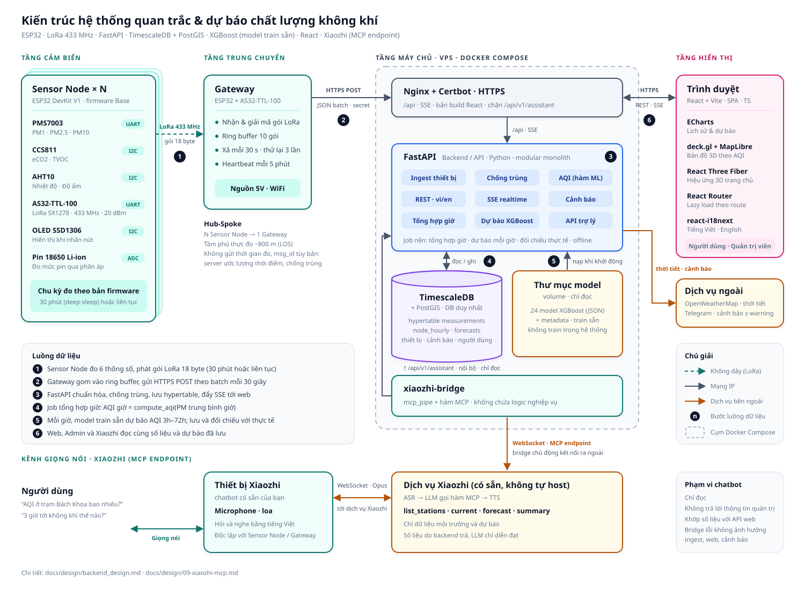

# ARCHITECTURE.md

## Hệ thống IoT quan trắc và dự báo chất lượng không khí (AQI)

Hệ thống thu thập số liệu từ mạng cảm biến LoRa, lưu trữ, tính AQI (US EPA, từ PM2.5/PM10), dự báo AQI 3–72 giờ bằng model XGBoost đã train sẵn, hiển thị trên web (người dùng và quản trị). Có thêm kênh hỏi đáp bằng giọng nói qua chatbot Xiaozhi.

Phần cứng và firmware giữ nguyên từ đồ án Base ([`Base.pdf`](Base.pdf), mã nguồn trong `base_code.zip`). Backend và frontend viết mới. Thiết kế chi tiết nằm trong [`docs/design/`](design/README.md).

---

### 1. Sơ đồ



```text
Sensor Node ×N ──LoRa 433 MHz──▶ Gateway ──HTTPS POST──▶ nginx ──▶ api (FastAPI)
Trình duyệt    ◀──HTTPS · REST · SSE──▶ nginx ──▶ api
api ◀──▶ db (TimescaleDB + PostGIS)          api ◀── thư mục model theo phiên bản (chỉ đọc)
api ──▶ OpenWeatherMap (thời tiết)   api ──▶ Telegram (thông báo cảnh báo)
xiaozhi-bridge ──▶ api /api/v1/assistant (mạng nội bộ)
xiaozhi-bridge ──WebSocket (MCP endpoint)──▶ dịch vụ Xiaozhi ◀──WebSocket──▶ loa Xiaozhi
(nginx, certbot, api, db, xiaozhi-bridge: Docker Compose trên một VPS)
```

---

### 2. Thành phần hệ thống

#### 2.1. Sensor Node

| Mục | Mô tả |
|---|---|
| Vai trò | Đo môi trường, gửi qua LoRa |
| Phần cứng | ESP32 DevKit V1; PMS7003 (PM1, PM2.5, PM10, UART); CCS811 (eCO2, TVOC, I2C, giá trị ước lượng); AHT10 (nhiệt độ, độ ẩm, I2C); AS32-TTL-100 (LoRa SX1278, 433 MHz); OLED SSD1306; pin 18650 |
| Firmware | Bản Base, PlatformIO/Arduino. Có bản deep-sleep 30 phút (pin, khoảng 20,5 giờ) và bản chạy liên tục (cần nguồn ngoài) |
| Dữ liệu ra | Gói nhị phân 18 byte: `nodeId`, `pktType`, `msgId`, PM1/PM2.5/PM10 (×10), CO2, TVOC, nhiệt độ (×10), độ ẩm (×10), pin. Không có thời gian. Cảm biến lỗi đánh dấu bằng `0xFFFF`/`0x7FFF` |

#### 2.2. Gateway

| Mục | Mô tả |
|---|---|
| Vai trò | Nhận LoRa, chuyển tiếp lên server qua WiFi |
| Phần cứng | ESP32 DevKit V1 + AS32-TTL-100 + OLED, nguồn 5V |
| Hoạt động | Ring buffer 10 gói, xả mỗi 30 giây; thử lại 3 lần, chỉ coi HTTP 200 là thành công; heartbeat mỗi 5 phút; tự đăng ký (provisioning) lần đầu |
| Giao tiếp | HTTPS `POST /api/v1/telemetry` (JSON batch kèm `secret` chung), `/api/v1/telemetry/heartbeat`, `/api/v1/provision/*` |
| Lưu ý | Không gửi thời gian đo; bản `gateway-30pin` không gửi `msg_id`; RSSI luôn bằng 0. Tầm phủ thực đo khoảng 800 m (thông thoáng) |

#### 2.3. Reverse proxy — Nginx

| Mục | Mô tả |
|---|---|
| Vai trò | Điểm vào duy nhất từ Internet: HTTPS, phục vụ bản build frontend, chuyển `/api` và SSE tới FastAPI |
| Công nghệ | Nginx + Certbot như Base; chứng chỉ Let's Encrypt, tự gia hạn mỗi 12 giờ |
| Quy tắc | Bắt buộc HTTPS (firmware dùng `WiFiClientSecure`); không định tuyến `/api/v1/assistant` ra Internet; tắt buffering cho SSE; đặt header bảo mật |

#### 2.4. Backend — FastAPI

| Mục | Mô tả |
|---|---|
| Vai trò | Toàn bộ nghiệp vụ: nhận dữ liệu thiết bị, tính AQI, tổng hợp theo giờ, dự báo, cảnh báo, API cho web/Admin/Xiaozhi, realtime |
| Công nghệ | Python 3.12, FastAPI + uvicorn (1 tiến trình; tách được `api`/`worker` bằng `APP_ROLE`), Pydantic v2, SQLAlchemy 2.0 + psycopg 3, GeoAlchemy2, Alembic, APScheduler, sse-starlette, PyJWT, argon2 |
| Kiến trúc | Modular monolith: router → service → repository. Module: ingest, devices, hourly, forecast, alerts, auth, audit, system, weather, assistant. Việc phát sinh từ dữ liệu ghi vào outbox cùng transaction; sự kiện realtime qua `LISTEN/NOTIFY` của PostgreSQL |
| Ingest | Giữ đúng hợp đồng firmware. Chuẩn hóa giá trị lỗi; nhận diện gói heartbeat của node; chống trùng theo nội dung + cửa sổ thời gian, ưu tiên bản qua Gateway đã duyệt; khóa node theo thứ tự cố định, tự thử lại khi xung đột; tự tạo thiết bị lạ ở trạng thái chờ duyệt; dữ liệu qua Gateway chưa duyệt bị cách ly. Ước lượng thời điểm đo (lùi theo chu kỳ node, dùng `msg_id` có điều kiện); batch nghi chứa dữ liệu cũ được lưu nhưng loại khỏi dữ liệu giờ |
| AQI | Dùng hàm `compute_aqi` của pipeline ML. AQI giờ = AQI của PM trung bình giờ, cửa sổ `(h−1, h]` mang nhãn `h` |
| Job nền | Đường ống theo giờ lưu tiến độ trong DB: đóng giờ → cảnh báo giờ → đối chiếu → dự báo, tự chạy bù sau khi khởi động lại. Thêm: tổng hợp giờ đang mở, xử lý outbox, phát hiện offline, gửi Telegram, dọn dữ liệu |
| API | `/api/v1`: cổng thiết bị, công khai, SSE (`/stream`), Admin, trợ lý (chỉ nội bộ). Song ngữ vi/en theo `Accept-Language` |
| Bảo mật | Admin: access JWT 30 phút + refresh token xoay vòng trong cookie `HttpOnly`; vai trò `admin`/`operator`. Giới hạn tần suất; ghi sự kiện bảo mật; audit log |

#### 2.5. Database — PostgreSQL + TimescaleDB + PostGIS

| Mục | Mô tả |
|---|---|
| Vai trò | Database duy nhất của hệ thống |
| Công nghệ | Image `timescale/timescaledb-ha:pg16` (PostgreSQL 16, có sẵn TimescaleDB và PostGIS) |
| TimescaleDB | Hypertable `measurements` (dữ liệu thô), `ingest_batches` (log), `forecasts` và `forecast_inputs`; nén chunk cũ; tự xóa theo thời hạn; `time_bucket` cho biểu đồ. Số đo và AQI lưu `double precision` |
| PostGIS | Tọa độ node (`geometry(Point, 4326)`); tìm trạm gần nhất; GeoJSON cho bản đồ; vùng phủ Gateway |
| Bảng chính | `lora_networks`, `gateways`, `nodes` (node là trạm; ID nội bộ, mã trạm `ST001`, địa chỉ firmware 1–255 dùng lại được), `node_sensors`, `measurements`, `node_hourly` (dữ liệu giờ do backend tính), `ml_models`, `forecast_runs`, `forecasts`, `alert_rules`, `alerts`, `users`, `audit_logs`, `security_events` |

#### 2.6. Model dự báo (ML runtime)

| Mục | Mô tả |
|---|---|
| Vai trò | Dự báo AQI cho từng trạm ở 24 mốc 3–72 giờ |
| Model | XGBoost, một model cho mỗi mốc; 48 file `xgb_AQI_h*.json` + `.meta.json` (khoảng 20 MB), train sẵn bằng pipeline `ml/ml_xgb` |
| Cách chạy | Nạp một lần khi khởi động từ thư mục model; mỗi phiên bản một thư mục, không ghi đè (volume chỉ đọc). Mỗi lần dự báo lưu đầu vào và phiên bản model để tái hiện được. Mỗi giờ đọc 73+ giờ dữ liệu giờ của trạm và gọi đúng hàm tạo feature của pipeline ML (import trực tiếp; matplotlib chỉ import khi vẽ biểu đồ). **Không train trong hệ thống** |
| Đầu vào | PM2.5, PM10, nhiệt độ, độ ẩm, AQI theo giờ, chỉ từ cảm biến. eCO2, TVOC, PM1 chỉ để hiển thị |
| Thư viện | xgboost 3.4.1, pandas 3.0.6, numpy 2.5.3 (ghim đúng như lúc train) |
| Giới hạn | Cần 73 giờ dữ liệu liên tục; công khai đủ 24 mốc nhưng mốc ≥ 27 giờ độ tin cậy thấp; chưa kiểm chứng trên dữ liệu PMS7003 nên backend lưu và đối chiếu mọi dự báo với thực tế; quy ước giờ của nguồn dữ liệu train cũ chưa xác minh |

#### 2.7. Frontend

| Mục | Mô tả |
|---|---|
| Vai trò | Giao diện người dùng (không đăng nhập) và quản trị, trong một SPA |
| Công nghệ | React + Vite + TypeScript, React Router (lazy load theo route), ECharts (biểu đồ lịch sử, dự báo), deck.gl + MapLibre (bản đồ 3D theo AQI, có fallback 2D), React Three Fiber + drei (hiệu ứng 3D trang chủ), react-i18next (vi/en) |
| Trang người dùng | Trạm gần bạn (trang chủ), Bản đồ, Chi tiết trạm (hiện tại, lịch sử, dự báo, thời tiết), Xếp hạng, Lịch sử |
| Trang quản trị | Tổng quan, Thiết bị chờ duyệt, Trạm/Node, Gateway, Cảnh báo, AI/Dự báo, Dữ liệu, Nhật ký telemetry, Người dùng, Nhật ký hệ thống, Hệ thống, Cấu hình |
| Giao tiếp | REST + SSE tới backend, cùng origin qua proxy; không truy cập DB hay dịch vụ ngoài trực tiếp |
| Build | File tĩnh do proxy phục vụ, không có server Node.js |

#### 2.8. Xiaozhi

| Mục | Mô tả |
|---|---|
| Vai trò | Hỏi đáp bằng giọng nói tiếng Việt về số liệu môi trường và dự báo |
| Thiết bị, dịch vụ | Chatbot Xiaozhi có sẵn, dịch vụ Xiaozhi không tự host (ASR → LLM gọi hàm → TTS) |
| `xiaozhi-bridge` | Container Python nhỏ (`mcp_pipe` + hàm FastMCP), chủ động mở WebSocket tới MCP endpoint của Xiaozhi, gọi API trợ lý chỉ đọc `/api/v1/assistant` trong mạng nội bộ |
| Hàm | `list_stations`, `get_current_air_quality`, `get_forecast`, `get_history_summary`, `explain_metric` |
| Phạm vi | Chỉ dữ liệu môi trường và dự báo, không trả lời thông tin quản trị; số liệu khớp với API web |

#### 2.9. Dịch vụ bên ngoài

| Dịch vụ | Dùng để |
|---|---|
| OpenWeatherMap | Thẻ "Thời tiết hiện tại" trên web. Backend gọi theo tọa độ trạm, có cache, API key chỉ nằm ở backend. Không dùng cho dự báo |
| Dịch vụ Xiaozhi | Nhận dạng giọng nói, LLM, tổng hợp giọng nói |
| Telegram Bot API | Gửi cảnh báo mức ≥ warning tới nhóm vận hành khi cảnh báo mở và đóng. Token chỉ nằm ở backend |

---

### 3. Luồng dữ liệu

1. Sensor Node đo, phát gói LoRa 18 byte (30 phút một lần hoặc liên tục).
2. Gateway gom vào ring buffer, gửi HTTPS POST theo batch mỗi 30 giây.
3. FastAPI chuẩn hóa, chống trùng, gán thời điểm đo; ghi dữ liệu và outbox trong một transaction; đẩy SSE tới web qua `LISTEN/NOTIFY`.
4. Job tổng hợp giờ tính trung bình và AQI giờ cho từng trạm.
5. Đầu mỗi giờ, model dự báo AQI 3–72 giờ cho các trạm đủ dữ liệu; kết quả được lưu, sau đó đối chiếu với thực tế.
6. Web, Admin và Xiaozhi đọc cùng số liệu và dự báo đã lưu.

---

### 4. Triển khai

| Container | Image / mã nguồn | Ghi chú |
|---|---|---|
| `db` | `timescale/timescaledb-ha:pg16` | Không mở cổng ra ngoài; volume dữ liệu; sao lưu `pg_dump` hằng ngày |
| `api` | `backend/` + `ml/ml_xgb/src` | Mount thư mục model chỉ đọc |
| `nginx` | `nginx:alpine` | Cổng 80/443; phục vụ `frontend/dist`; chuyển `/api` và SSE tới `api` |
| `certbot` | `certbot/certbot` | Gia hạn chứng chỉ Let's Encrypt (webroot) |
| `xiaozhi-bridge` | `xiaozhi-bridge/` | Chỉ kết nối ra ngoài |

Chạy trên một VPS mức trung bình (tham chiếu 2 vCPU / 4 GB RAM / 80 GB SSD) bằng Docker Compose. Bí mật (DB, JWT, secret thiết bị, key thời tiết, token Telegram, token Xiaozhi) nằm trong `.env`, không commit.

---

### 5. Giới hạn chính

- Firmware giữ nguyên: `secret` và provision key đã công khai cùng mã nguồn Base. Server chỉ giảm thiểu được (cách ly, giới hạn tần suất, phát hiện bất thường), không chặn hoàn toàn dữ liệu giả.
- Không có thời gian đo từ thiết bị: thời điểm đo do server ước lượng. Dữ liệu bị giữ trong Gateway sau sự cố mạng không xác định được giờ đo nên bị loại khỏi dữ liệu giờ; gói phát sinh khi buffer Gateway đầy đã mất tại firmware.
- Node chạy pin không đủ 73 giờ liên tục để dự báo; trạm cần dự báo phải có nguồn ngoài.
- Cảm biến giá rẻ chưa hiệu chuẩn; PMS7003 đo cao khi độ ẩm cao; eCO2 của CCS811 là giá trị ước lượng.
- Model học trên dữ liệu quan trắc/Open-Meteo, chạy trên dữ liệu PMS7003 (lệch miền dữ liệu).
- Tầm LoRa thực tế khoảng 800 m.

---

### 6. Tài liệu chi tiết

| Tài liệu | Nội dung |
|---|---|
| [design/README.md](design/README.md) | Chỉ mục, sổ quyết định |
| [design/01-danh-gia-kien-truc.md](design/01-danh-gia-kien-truc.md) | Hợp đồng firmware thực tế, ràng buộc ML, lý do các lựa chọn |
| [design/backend_design.md](design/backend_design.md) | Ingest, dự báo, cảnh báo, API, UI flow, bảo mật, triển khai, lộ trình |
| [design/database_design.md](design/database_design.md) | Schema DB đầy đủ: DDL, index, TimescaleDB, migration, vai trò DB |
| [design/backend_modules.md](design/backend_modules.md) | 18 module backend, phụ thuộc, cấu trúc thư mục, thứ tự dev |
| [design/frontend_design.md](design/frontend_design.md) | Cấu trúc frontend, tầng dữ liệu, i18n, quy ước hiển thị |
| [design/09-xiaozhi-mcp.md](design/09-xiaozhi-mcp.md) | Tích hợp Xiaozhi |
| [FORESCATING.md](FORESCATING.md) | Kết quả và giới hạn của model |
