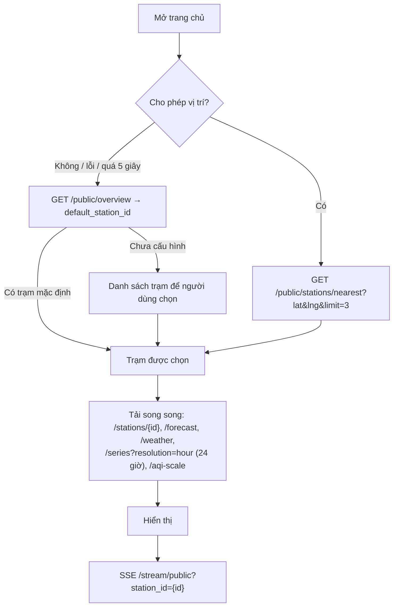

# Thiết kế Backend — cơ sở dữ liệu, API và các thành phần liên quan

**Trạng thái:** bản thiết kế để bắt đầu code (04/10/2026).
**Phạm vi:** backend FastAPI, PostgreSQL + TimescaleDB + PostGIS, ingest từ firmware, tổng hợp theo giờ, dự báo bằng model đã train sẵn, cảnh báo, API cho Web/Admin/Xiaozhi, triển khai.
**Tài liệu liên quan:** [01 — Đánh giá kiến trúc](01-danh-gia-kien-truc.md) (hợp đồng firmware, ràng buộc ML), [database_design.md](database_design.md) (schema đầy đủ), [backend_modules.md](backend_modules.md) (chia module, thứ tự dev), [09 — Xiaozhi](09-xiaozhi-mcp.md).

**Ký hiệu:**
- ✅ đã được bạn chốt.
- P*n*: mã quyết định, tra ở [mục 21](#21-quyết-định-p1p14-và-điểm-còn-chờ).
- ⏳: chưa chốt; tài liệu ghi phương án tạm và nêu rõ phần sẽ đổi.
- R*n*: điểm sửa theo rà soát `PLAN_REVIEW.md` (mục 22).

---

## 1. Tóm tắt quyết định

| Chủ đề | Nội dung | Trạng thái |
|---|---|---|
| Firmware | Giữ nguyên firmware Base; backend tuân đúng đường dẫn, mã trả về, tên trường firmware dùng | ✅ Q1 |
| Bản firmware đang chạy | Chưa biết. Backend hỗ trợ cả `gateway` (có `msg_id`) và `gateway-30pin` (không có), mọi chu kỳ đo | Ràng buộc thiết kế |
| Nguồn dữ liệu dự báo | Chỉ dữ liệu cảm biến | ✅ Q2 |
| Model | Dùng file model đã train sẵn; backend chỉ nạp model và dùng dữ liệu lịch sử để dự báo; không train | ✅ |
| Chính sách giờ thiếu | Backend đọc `nan_policy` từ metadata (chạy được với model `no_fill` hiện tại và bộ `ffill3h` sau này) | ✅ Q3 |
| Triển khai | VPS mức trung bình, tham chiếu **2 vCPU / 4 GB RAM / 80 GB SSD**, Docker Compose; bỏ ràng buộc tối giản cấu hình (04/10) | ✅ Q4, Q4b |
| Tiến trình backend | Một container `api` (1 tiến trình uvicorn) chạy cả API và job nền; tách `worker` sau nếu cần | ✅ 04/10 |
| Database | PostgreSQL 16 + **TimescaleDB** (time-series) + **PostGIS** (không gian) | ✅ 04/10 |
| Dữ liệu giờ | Bảng giờ do backend tính bằng hàm Python của ML; **không dùng continuous aggregate** | ✅ D1 |
| Nhãn giờ | Vận hành: cửa sổ `(h−1, h]` mang nhãn `h`; tạm cho phép ≥ 1 mẫu hợp lệ/biến, kèm số mẫu và độ phủ. Quy ước cho đầu vào ML: tạm dùng nhãn này, chốt sau khi xác minh nguồn dữ liệu train cũ | ✅ P1 · ⏳ P1b |
| Giờ đầu vào thiếu | Thêm dòng NaN cho giờ `t`, để `nan_policy` của model quyết định | ✅ P3 |
| Dùng code ML | Backend import trực tiếp `ml/ml_xgb/src`; matplotlib chuyển sang import muộn trong phần vẽ biểu đồ | ✅ P4 |
| Mốc dự báo công khai | Đủ 24 mốc 3–72 giờ, luôn kèm nhãn độ tin cậy | ✅ P6 |
| Dự báo cũ | Dự báo thành công gần nhất còn trong 6 giờ thì hiện với `status: stale`, chỉ các mốc tương lai; quá 6 giờ thì ẩn số, hiện lý do | ✅ R23 |
| Đầu vào dự báo | 184 feature giữ lâu dài; các dòng giờ đã dùng giữ 90 ngày | ✅ R29 |
| Trạm mô phỏng | Có: cờ `is_simulated`, nạp CSV, luôn gắn nhãn "Mô phỏng" | ✅ P10 |
| Mô hình trạm | **Node là trạm** (như Base); tọa độ PostGIS nằm trên node | ✅ D2 |
| Định danh node | ID nội bộ `nodes.id` tách khỏi địa chỉ firmware 1–255; địa chỉ duy nhất trong một mạng LoRa và trong các node chưa `retired`; mã trạm công khai `ST001` | ✅ P15 = B |
| Xóa node | Chuyển trạng thái ngưng hoạt động, giữ dữ liệu; chỉ xóa hẳn node chưa có dữ liệu | ✅ D2b |
| Thiết bị lạ | Tự tạo ở trạng thái **chờ duyệt**, vẫn lưu dữ liệu, chưa công khai | ✅ D3 |
| Chống trùng | Theo nội dung + cửa sổ thời gian | ✅ D4 |
| Thời điểm đo | Firmware không gửi thời điểm: lùi theo chu kỳ node, dùng `msg_id` có điều kiện; lưu riêng thời điểm nhận và thời điểm ước lượng; không cộng thời gian để tránh trùng khóa. Batch nghi chứa dữ liệu cũ gắn `TIME_UNRELIABLE`, không vào dữ liệu giờ (mục 6.6) | ✅ P2 |
| Provisioning | Thiết bị đăng ký qua provisioning ở trạng thái chờ duyệt (như D3) | ✅ P13 |
| Xóa Gateway | Ngưng hoạt động, giữ dữ liệu (như D2b) | ✅ P14 |
| Secret firmware (đã công khai cùng mã nguồn Base) | Giữ nguyên; bù bằng cách ly dữ liệu qua Gateway chưa duyệt, giới hạn tần suất, phát hiện bất thường | ✅ S1 |
| Quy tắc bảo mật | Mức cơ bản (mục 14) | ✅ S2 |
| Realtime | SSE | ✅ |
| Vai trò | `admin` + `operator` | ✅ P7 |
| Phiên đăng nhập | Access JWT 30 phút mang `sid`; mỗi request Admin kiểm tra phiên nên thu hồi có hiệu lực ngay. Refresh token xoay vòng trong cookie `HttpOnly`, có khoảng ân hạn 30 giây cho refresh đồng thời; dùng lại token cũ thì thu hồi phiên đó | ✅ P12, R20 |
| Cảnh báo mặc định | Theo AQI giờ, PM2.5 tức thời và trạng thái thiết bị; cảnh báo theo dự báo có sẵn nhưng tắt. AQI giờ là **một** cảnh báo nâng/hạ mức warning ↔ critical | ✅ P9, R26 |
| Thông báo | Telegram: cảnh báo mức ≥ `warning`, gửi khi mở và khi đóng | ✅ P11 |
| Frontend | React + Vite + TypeScript, React Router, ECharts, deck.gl + MapLibre, React Three Fiber, react-i18next (giữ như ARCHITECHTURE) | ✅ 04/10 |
| Trang chủ người dùng | "Trạm gần bạn" như Base: xin vị trí → trạm gần nhất; từ chối thì dùng trạm mặc định | ✅ U1 |
| Ngôn ngữ | Tiếng Việt + English như Base; backend trả mã ổn định + nhãn đã dịch theo `Accept-Language` | ✅ U2 |
| Thời tiết | Thẻ thời tiết như Base, lấy từ OpenWeatherMap, chỉ để hiển thị (không dùng cho dự báo) | ✅ U3 |
| Reverse proxy | Nginx + Certbot như Base (chứng chỉ Let's Encrypt) | ✅ P5 |
| Thời hạn lưu | Dữ liệu thô 90 ngày (nén sau 14 ngày); dữ liệu giờ và dự báo lâu dài; log ingest 14 ngày | ✅ P8 |
| Xiaozhi | MCP endpoint có sẵn, `xiaozhi-bridge`, API trợ lý chỉ đọc, chỉ môi trường và dự báo; câu hỏi không nêu trạm dùng `default_station_id` | ✅ Q10, X5 |
| Sửa theo rà soát | `PLAN_REVIEW.md` đợt 1: R1–R15; đợt 2: R16–R30; đợt 3: R31–R35 (mục 22) | ✅ 04/10 |
| Thiết kế DB và module | [database_design.md](database_design.md), [backend_modules.md](backend_modules.md) | ✅ 04/10 |
| Điểm chưa chốt | Quy ước giờ của nguồn dữ liệu train cũ (P1b); khoảng dự báo hiệu chỉnh (P16, từ R15) | ⏳ P1b, P16 |

---

## 2. Kiến trúc và công nghệ

### 2.1. Thành phần chạy trên VPS

```text
                    Internet (HTTPS)
                          │
                ┌─────────▼──────────┐
                │ nginx (+ certbot)  │  HTTPS; phục vụ file tĩnh SPA; reverse proxy /api
                │                    │  /api/v1/assistant KHÔNG được định tuyến ra ngoài
                └─────────┬──────────┘
                          │ http://api:8000
┌─────────────────────────▼──────────────────────────────────────────────┐
│ api (FastAPI, 1 tiến trình uvicorn, APP_ROLE=all, mục 2.4)              │
│  routers ─▶ services ─▶ repositories ─▶ PostgreSQL                      │
│  ML runtime: import ml/ml_xgb/src (P4), 24 model nạp sẵn                │
│  vai trò worker: đường ống giờ, outbox, Telegram (trạng thái trong DB)  │
└───────────────┬───────────────────────────────▲────────────────────────┘
                │                               │ http://api:8000/api/v1/assistant
   ┌────────────▼──────────────┐        ┌───────┴───────────┐
   │ db                         │        │ xiaozhi-bridge    │──WebSocket──▶ Xiaozhi (MCP endpoint)
   │ timescale/timescaledb-ha   │        │ mcp_pipe + tools  │
   │ PostgreSQL 16 + TimescaleDB│        └───────────────────┘
   │ + PostGIS                  │
   └────────────────────────────┘
SSE giữa các tiến trình: LISTEN/NOTIFY của PostgreSQL (mục 2.4)
Volume: pg_data, models (chỉ đọc), certbot_conf + certbot_www (chứng chỉ Let's Encrypt)
```

### 2.2. Công nghệ (đề xuất kỹ thuật)

| Lớp | Lựa chọn | Ghi chú |
|---|---|---|
| Ngôn ngữ | Python 3.12 | Trùng phiên bản lúc train (`meta.library_versions.python = 3.12.3`) |
| Web | FastAPI + uvicorn | 1 worker, chạy cả job nền (✅ 04/10); tách được thành `api` + `worker` bằng `APP_ROLE` (mục 2.4) |
| Kiểm tra dữ liệu | Pydantic v2, pydantic-settings | |
| DB driver/ORM | SQLAlchemy 2.0 (async) + psycopg 3, GeoAlchemy2 (kiểu `geometry`) | Một driver cho cả app và Alembic. Số đo, AQI, đầu vào ML dùng `double precision` (R9) |
| Migration | Alembic | Hypertable, policy viết bằng `op.execute` |
| ML | xgboost **3.4.1**, pandas **3.0.6**, numpy **2.5.3** | Ghim đúng như lúc train |
| Job nền | APScheduler 3.x (AsyncIOScheduler) | Chỉ là bộ kích hoạt; tiến độ lưu trong DB (`hour_pipeline`, `outbox_events`); khóa theo mục 10 |
| SSE | sse-starlette (3.x có `ping`, `send_timeout`) | Phát sự kiện qua `LISTEN/NOTIFY` (mục 11.6) |
| Bảo mật | PyJWT, argon2-cffi | |
| Reverse proxy | Nginx + Certbot | Như Base (P5); chứng chỉ Let's Encrypt tự gia hạn |
| Xiaozhi | Python MCP SDK (FastMCP), `mcp_pipe.py` | Container riêng |

### 2.3. Nguyên tắc

1. AQI, feature, inference dùng code trong `ml/ml_xgb/src`, không viết lại công thức.
2. Cổng thiết bị giữ đúng hợp đồng firmware; mọi chuẩn hóa nằm ở biên ingest.
3. Không mất dữ liệu: thiết bị chưa duyệt vẫn được lưu dữ liệu (không công khai).
4. Dự báo tính sẵn mỗi giờ, lưu lại, đối chiếu với thực tế khi đến giờ đích.
5. Trạng thái quan trọng nằm trong DB (chống trùng, cảnh báo, job), không nằm trong RAM.
6. Router → service → repository. Web, Admin, trợ lý gọi cùng service.
7. Việc phát sinh từ dữ liệu (cảnh báo, đánh giá lại, thông báo) ghi vào outbox **trong cùng transaction** với dữ liệu; không chạy "sau khi trả 200" trong bộ nhớ (R3).
8. Job chạy theo trạng thái lưu trong DB, không theo giả định "cron đã chạy đúng giờ" (R1, R2).
9. Số đo, giá trị trung bình, AQI và đầu vào ML lưu bằng `double precision`, không dùng `real` (R9).

### 2.4. Chạy nhiều tiến trình (R7: chuẩn bị sẵn, chưa bật)

Mặc định vẫn là một container `api` với `APP_ROLE=all` (✅ 04/10). Cùng một codebase có thể chạy theo vai trò:

| `APP_ROLE` | Chạy gì |
|---|---|
| `all` (mặc định) | HTTP + SSE + ingest + mọi việc nền |
| `api` | HTTP, SSE, ingest. Không chạy scheduler, outbox, Telegram |
| `worker` | Đường ống giờ (mục 7.1), `hourly_rollup`, outbox (mục 6.9), Telegram, các job ở mục 10. Không mở cổng HTTP (trừ `/healthz` nội bộ) |

Quy định để chạy đúng khi có nhiều tiến trình, áp dụng ngay từ bản một tiến trình:

| Thành phần | Quy định |
|---|---|
| SSE | Mọi sự kiện realtime gửi bằng `pg_notify('aqi_events', …)` trong transaction tạo ra nó; PostgreSQL chỉ giao sau khi commit (đã kiểm chứng). Mỗi tiến trình `api` giữ **một** kết nối `LISTEN` riêng, không lấy từ pool, rồi chia sự kiện cho client của mình. Payload < 8000 byte: chỉ gồm mã, loại và tóm tắt; client cần thêm thì gọi REST. Không có đường tắt trong bộ nhớ, nên một hay nhiều tiến trình đều chạy cùng một đường |
| Rate limit | Interface `RateLimiter`, có hai bản: `memory` (chỉ đúng với một tiến trình `api`) và `postgres` (bảng `UNLOGGED rate_counters`, upsert theo `(khóa, cửa sổ)`). `RATE_LIMIT_BACKEND=memory` mà chạy nhiều tiến trình `api` thì ứng dụng từ chối khởi động (`API_PROCESSES > 1`) |
| Khóa đăng nhập | Đếm lần sai trong `users.failed_login_count`, `users.locked_until`, không đếm trong RAM |
| Model | Model đang dùng xác định bằng `ml_models.is_active` trong DB. Đổi model → `pg_notify('model_changed')`; mỗi tiến trình nạp lại theo `bundle_sha256` và báo SHA đang nạp trong `/system/health`. Tiến trình có SHA khác DB thì `predict-csv` trả 503 `MODEL_SYNCING`. Mỗi `forecast_runs` ghi `model_id` |
| Job | Chỉ chạy ở `all`/`worker`. Có cấu hình sai làm hai tiến trình cùng chạy thì khóa ở mục 10 vẫn chặn được việc chạy chồng |
| Cache thời tiết | Theo từng tiến trình; chấp nhận số lần gọi OpenWeatherMap tăng theo số tiến trình |

---

## 3. TimescaleDB và PostGIS

### 3.1. TimescaleDB dùng vào việc gì

| Bảng | Hypertable | Chunk | Nén | Xóa dữ liệu cũ |
|---|---|---|---|---|
| `measurements` | Có, theo `measured_at` | 7 ngày | Sau 14 ngày, `segmentby = node_id` | `add_retention_policy` 90 ngày (P8) |
| `ingest_batches` | Có, theo `received_at` | 1 ngày | Sau 2 ngày (R13) | 14 ngày (P8) |
| `node_hourly` | Không (bảng thường, upsert, giữ lâu dài) | — | — | — |
| `forecasts` | Có, theo `target_hour` (R13) | 30 ngày | Sau 30 ngày, `segmentby = node_id` | Không (giữ lâu dài, P8) |
| `forecast_inputs` | Có, theo `issued_at` (R8) | 30 ngày | Sau 30 ngày | Không (giữ lâu dài, như dự báo) |
| `forecast_runs`, `forecast_accuracy_daily`, `hour_pipeline`, `outbox_events` | Không | — | — | `outbox_events` đã xử lý xóa sau 7 ngày (mục 10) |

- Dùng `time_bucket` cho biểu đồ dữ liệu thô độ phân giải `5min` (mục 11.4).
- **Không dùng continuous aggregate** (D1). Bảng giờ do backend tính để AQI giờ đúng định nghĩa của model, có số mẫu và tính lại được khi dữ liệu đến muộn.

Ràng buộc schema phải tuân theo:
- PK/UNIQUE của hypertable chứa cột thời gian: `measurements (id, measured_at)`, `ingest_batches (id, received_at)`, `forecasts (run_id, horizon_h, target_hour)`, `forecast_inputs (run_id, issued_at)`.
- TimescaleDB ≥ 2.11 cho phép `UPDATE` trên chunk đã nén nhưng chậm; vì vậy `forecasts` chỉ nén sau 30 ngày, khi việc đánh giá lại (mục 8.5) gần như đã xong.
- Không bảng nào có khóa ngoại trỏ vào hypertable.
- Khóa ngoại từ hypertable sang bảng thường (`measurements.node_id → nodes`) được phép.

### 3.2. PostGIS dùng vào việc gì

| Việc | Cách làm |
|---|---|
| Tọa độ node (trạm) | `nodes.geom geometry(Point, 4326)` + index GIST |
| Tọa độ Gateway | `gateways.geom geometry(Point, 4326)` (tùy chọn) |
| Trạm gần nhất | `ORDER BY ST_Distance(geom::geography, p::geography) LIMIT :k` với `p = ST_SetSRID(ST_MakePoint(:lng, :lat), 4326)`; sắp xếp và khoảng cách trả về cùng một công thức (R35). Không dùng `<->` trên `geometry` 4326 vì nó xếp theo độ, lệch thứ tự khi vĩ độ ≠ 0. Chỉ quét các trạm công khai (hàng chục đến vài trăm) nên không cần KNN |
| Bản đồ | Trả GeoJSON `FeatureCollection` cho web (`ST_AsGeoJSON`) |
| Admin | Gợi ý Gateway phủ sóng một node: `ST_DWithin(geography, geography, 800)` (800 m là tầm thực đo trong Base) |

### 3.3. Lưu ý vận hành

- Image: `timescale/timescaledb-ha:pg16`, có sẵn cả TimescaleDB và PostGIS.
- Migration đầu tiên: `CREATE EXTENSION timescaledb; CREATE EXTENSION postgis;`.
- Alembic autogenerate phải bỏ qua bảng của extension (`spatial_ref_sys`, schema `_timescaledb_*`) qua `include_object`.
- Sao lưu/khôi phục bằng `pg_dump`/`pg_restore`. Khi restore phải gọi `timescaledb_pre_restore()` trước và `timescaledb_post_restore()` sau (mục 17.2).

---

## 4. Khái niệm dữ liệu

### 4.1. Node là trạm (D2), định danh tách khỏi địa chỉ firmware (P15 = B)

- **Gateway** (`GW_001`): mã do firmware lưu (cấp qua provisioning), dùng làm khóa chính. Mỗi Gateway thuộc một mạng LoRa (`lora_networks`).
- **Node** chính là **trạm** trên giao diện: có tên, tọa độ PostGIS, khu vực, cờ công khai.
- Node có ba loại định danh:

| Định danh | Ví dụ | Dùng ở |
|---|---|---|
| `nodes.id` (integer nội bộ) | `42` | Mọi khóa ngoại, API Admin, log |
| `station_code` | `ST001` | API công khai, URL web, Xiaozhi. Không đổi và không tái sử dụng |
| `(lora_network_id, lora_addr)`, hiển thị là `device_code` | `(1, 7)` → `NODE_007` | Chỉ ở cổng thiết bị: firmware gửi và nhận chuỗi này. Trang Admin hiển thị để đối chiếu |

- Địa chỉ 1–255 chỉ duy nhất trong một mạng và trong các node chưa `retired`.
  - Node `retired` nhả địa chỉ sau thời gian cách ly (`address_quarantine_days`, mặc định 30 ngày).
  - Chi tiết ở [database_design §9](database_design.md#9-địa-chỉ-lora-xóa-và-ngưng-hoạt-động).
- Bản đầu có một mạng `default`, mọi Gateway thuộc mạng này. Chỉ thêm mạng khi có khu triển khai thứ hai mà Gateway của hai khu không nghe được node của nhau.

Hệ quả đã chấp nhận:
- Di dời node chỉ là sửa tọa độ; dữ liệu trước và sau khi di dời nằm chung một chuỗi. Thay đổi tọa độ vẫn được ghi trong `audit_logs`.
- Thay node hỏng bằng node mới thì có trạm mới (`station_code` mới), phải chờ lại 73 giờ mới có dự báo. Phương án C (tách trạm khỏi thiết bị) đã được xem xét nhưng không chọn.
- Dùng lại địa chỉ không làm lẫn dữ liệu, vì dữ liệu gắn với `nodes.id`.
- Thiết bị đã nạp firmware với server cũ mà chưa từng gửi tới server mới vẫn có thể trùng địa chỉ với node do server mới cấp. Khi đó dữ liệu hai thiết bị bị nhập làm một.
  - Phát hiện qua sự kiện `node_rate_anomaly` và `node_unusual_gateway` (mục 14.3).
  - Cách giảm rủi ro: cho hệ thống chạy vài ngày để thiết bị cũ tự xuất hiện (D3) trước khi provisioning node mới.

### 4.2. Ba lớp dữ liệu

| Lớp | Bảng | Dùng cho |
|---|---|---|
| Thô | `measurements` (hypertable) | Realtime, chi tiết node, cảnh báo theo mẫu, xuất CSV |
| Giờ | `node_hourly` | Biểu đồ lịch sử, **đầu vào ML**, cảnh báo theo giờ, đối chiếu dự báo |
| Dự báo | `forecast_runs`, `forecasts` | Web, Xiaozhi, Admin (độ chính xác) |

### 4.3. Thời gian

- DB lưu `timestamptz` (UTC); phiên DB đặt `TimeZone = 'UTC'`.
- Múi giờ ứng dụng `Asia/Ho_Chi_Minh` (UTC+7, không có giờ mùa hè), nên ranh giới giờ địa phương trùng ranh giới giờ UTC.
- API trả ISO 8601 có offset `+07:00`.
- Khi đưa vào model: đổi giờ sang giờ địa phương rồi bỏ múi giờ (yêu cầu M2 của ML).
- Mỗi bản ghi có hai mốc: `received_at` (server nhận, luôn chính xác, không sửa) và `measured_at` (thời điểm đo; firmware hiện tại không gửi nên server ước lượng, mục 6.6).
- Dữ liệu giờ mang nhãn `h` = cửa sổ `(h−1, h]` theo `measured_at` (mục 7). Các mốc thời gian của một lần dự báo ở mục 8.4.

### 4.4. Hai loại AQI

| Tên | Cách tính | Hiển thị |
|---|---|---|
| `aqi_instant` | `compute_aqi(pm25, pm10)` của **một mẫu** | "AQI tức thời", biến động nhanh |
| `aqi` (giờ) | `compute_aqi(PM2.5 trung bình giờ, PM10 trung bình giờ)` | "AQI giờ": con số chính, dùng cho ML, dự báo, xếp hạng, Xiaozhi |

Cả hai đều gọi `src.aqi.compute_aqi`.

---

## 5. Cơ sở dữ liệu

Toàn bộ schema nằm ở **[database_design.md](database_design.md)**; mục này chỉ là mục lục.

| Nội dung | Ở đâu |
|---|---|
| Quyết định ảnh hưởng tới schema, quy ước đặt tên và kiểu | [database_design §1–2](database_design.md#1-quyết-định-ảnh-hưởng-tới-schema) |
| 32 bảng theo module sở hữu | [§3](database_design.md#3-bảng-theo-module) |
| Sơ đồ quan hệ | [§4](database_design.md#4-sơ-đồ-quan-hệ) |
| DDL đầy đủ | [§5](database_design.md#5-ddl) |
| Truy vấn chính và index | [§6](database_design.md#6-truy-vấn-chính-và-index-dùng) |
| TimescaleDB, dọn dữ liệu | [§7](database_design.md#7-chính-sách-timescaledb-và-dọn-dữ-liệu) |
| `qc_flags`, trạng thái, khóa advisory, mã job, outbox/NOTIFY | [§8](database_design.md#8-mã-dùng-chung) |
| Địa chỉ LoRa, xóa và ngưng hoạt động (D2b, P14, P15) | [§9](database_design.md#9-địa-chỉ-lora-xóa-và-ngưng-hoạt-động) |
| Dung lượng (R13) | [§10](database_design.md#10-dung-lượng-r13) |
| Migration Alembic, dữ liệu khởi tạo | [§11](database_design.md#11-migration-alembic) |
| Vai trò DB, kết nối, phiên | [§12](database_design.md#12-vai-trò-db-kết-nối-phiên) |
| Kiểm thử schema | [§13](database_design.md#13-kiểm-thử-schema) |

---

## 6. Ingest từ firmware

### 6.1. Hợp đồng bắt buộc (không được đổi)

| Endpoint | Body firmware gửi | Server phải trả |
|---|---|---|
| `POST /api/v1/provision/gateway` | `{provision_key, name, location_desc}` | **201** `{"success": true, "data": {"id": "GW_001", ...}}` |
| `GET /api/v1/provision/gateways?provision_key=` | — | **200** `{"success": true, "data": [{"id","name","status","location_desc"}]}` |
| `POST /api/v1/provision/node` | `{provision_key, name, gateway_id, lat?, lng?}` | **201** `{"success": true, "data": {"id": "NODE_007", "node_numeric_id": 7, ...}}` |
| `POST /api/v1/telemetry` | `{gateway_id, secret, data: [ {node_id, pm25, pm10, co2, tvoc, temperature, humidity, battery, rssi, msg_id?} ]}` | **200** cho mọi batch đúng cú pháp |
| `POST /api/v1/telemetry/heartbeat` | `{gateway_id, secret}` | **200** |

Server phải chạy HTTPS (firmware dùng `WiFiClientSecure`, chấp nhận chứng chỉ tự ký). Thời gian xử lý phải dưới 10 giây (timeout của firmware); mục tiêu < 300 ms.

### 6.2. Mã trả về của `POST /api/v1/telemetry`

Firmware coi mọi mã khác 200 là lỗi: thử lại 3 lần rồi đẩy lại cả batch vào buffer. Vì vậy:

| Tình huống | Mã | Lý do |
|---|---|---|
| Batch hợp lệ, kể cả có bản ghi trùng, lỗi, thiết bị lạ, thiết bị đã ngưng | **200** + thống kê | Không để Gateway kẹt buffer |
| Thiếu/sai `secret` | 401 | Chặn nguồn lạ |
| Body không phải JSON, thiếu `gateway_id` hoặc `data` không phải mảng | 400 | Firmware không bao giờ gửi dạng này |
| Body > 32 KB hoặc > 50 bản ghi | 413 | Firmware gửi tối đa 10 bản ghi |
| Lỗi DB | 503 | Gateway giữ dữ liệu và gửi lại; an toàn nhờ chống trùng |

Response 200:

```json
{"success": true, "accepted": 3, "duplicates": 1, "heartbeats": 0, "rejected": 0}
```

Mỗi lần trả mã khác 200 cho telemetry có `secret` đúng (413, 429, 503), server ghi `gateways.telemetry_rejected_since` nếu đang trống. Firmware sẽ gửi lại các bản ghi này trong batch sau, nên batch đó bị coi là nghi chứa dữ liệu cũ (mục 6.6.3).

### 6.3. Thiết bị chưa biết (D3)

Thiết bị đã được nạp firmware và đăng ký với server cũ, nên ID của chúng (vd. `GW_013`, `NODE_076`) có thể chưa có trong DB mới.

| Trường hợp | Xử lý |
|---|---|
| `gateway_id` chưa có, `secret` đúng | Tự tạo Gateway `status = pending`, `registered_via = auto_discovered`; nhận dữ liệu |
| Gateway đang `pending` | Lưu bản ghi với cờ `UNTRUSTED_GATEWAY`; cách ly cho tới khi Gateway được duyệt (S1, mục 14.1) |
| `node_id` đúng mẫu `NODE_\d{3}` (001–255), nhưng trong mạng của Gateway chưa có node chưa `retired` nào dùng địa chỉ này (P15) | Có node `retired` cùng địa chỉ trong thời gian cách ly → bỏ bản ghi (`rejected`, lý do `retired_address`). Không có → tự tạo node `pending`, `auto_discovered`, `station_code` mới, chưa có tọa độ; nhận dữ liệu |
| `node_id` sai mẫu | Bỏ bản ghi (`rejected`), ghi lý do vào `ingest_batches` |
| Gateway `disabled` / `retired` | Bỏ bản ghi (`rejected`) |

Thiết bị `pending`:
- dữ liệu được lưu và tổng hợp giờ;
- không hiện trên web/Xiaozhi, không dự báo, không cảnh báo.

Admin duyệt (đặt tên, tọa độ, chuyển `active`) thì node hiện ngay, kèm toàn bộ lịch sử từ lúc nó bắt đầu gửi. Nhờ đó node sớm đủ 73 giờ cho dự báo hơn. Duyệt Gateway ghi outbox `gateway_approved` để bỏ cờ cách ly, đối soát bản trùng (mục 6.5) và tính lại các giờ liên quan.

### 6.4. Chuẩn hóa từng bản ghi

| Trường | Quy tắc | Cờ `qc_flags` |
|---|---|---|
| Nhận diện heartbeat node | `pm25 = pm10 = temperature = humidity = co2 = tvoc = 0` (tất cả bằng 0, không phải `null`) → **heartbeat**: **không** tạo `measurements`; vẫn tính vào dãy `msg_id`. Cập nhật trạng thái node theo mục 6.4.1 | — |
| `pm25`, `pm10` | `null` giữ `null`; ngoài `[0, 1000]` → `null` | bit 0 `PM_OUT_OF_RANGE` |
| `pm10 < pm25` | Giữ nguyên giá trị (lúc train cũng không lọc) | bit 1 `PM10_LT_PM25` |
| `co2` | `0`, `65535`, `< 400`, `> 8192` → `null`, kéo theo `tvoc = null` | bit 2 `GAS_NOT_READY` (khi = 0) / bit 3 `GAS_INVALID` |
| `tvoc` | ngoài `[0, 1187]` → `null` | bit 3 |
| `temperature` | ngoài `[-40, 85]` → `null` | bit 4 `TH_OUT_OF_RANGE` |
| `humidity` | ngoài `[0, 100]` → `null`; `> 95` giữ nguyên | bit 5 `HIGH_HUMIDITY` (PMS7003 đo cao khi ẩm) |
| `battery` | ngoài `[0, 100]` → `null` | — |
| `rssi` | Luôn 0 → bỏ qua | — |
| `msg_id` | Có thì lưu (0–255), không thì `null`. Dùng có điều kiện để ước lượng thời điểm (mục 6.6.4) và để đếm gói LoRa bị mất | — |
| Thời điểm | Mục 6.6 | bit 6 `TIME_ESTIMATED`, bit 9 `TIME_UNRELIABLE`, bit 10 `INTERVAL_UNKNOWN`, bit 11 `TIME_FROM_MSG_ID` |
| PM tăng đột ngột | `pm25` tăng > 100 µg/m³ so với mẫu đáng tin trước đó (mục 6.4.1) trong vòng 1 giờ | bit 7 `PM_SPIKE` (chỉ đánh dấu) |
| Gateway chưa duyệt | Bản ghi đi qua Gateway `pending` | bit 8 `UNTRUSTED_GATEWAY` (cách ly, mục 14.1) |
| Bị thay bằng bản sao tốt hơn | Mục 6.5 | bit 12 `SUPERSEDED`: loại khỏi mọi tổng hợp, API, cảnh báo |
| Đồng hồ thiết bị chạy nhanh | Thời điểm firmware gửi lớn hơn `T` (mục 6.6.4) | bit 13 `DEVICE_CLOCK_AHEAD` |

`aqi_instant = compute_aqi(pm25, pm10)` nếu cả hai khác `null`.

Trạng thái cảm biến (`node_sensors`) chỉ cập nhật từ bản ghi đáng tin (mục 6.4.1):

| Cảm biến | `ok` | `warming_up` | `error` |
|---|---|---|---|
| `pms7003` | `pm25` và `pm10` hợp lệ | — | Cả hai `null` |
| `aht10` | `temperature` và `humidity` hợp lệ | — | Cả hai `null` |
| `ccs811` | `co2` hợp lệ | `co2 = 0` (chưa sẵn sàng) | `co2 = 65535` hoặc ngoài khoảng |

#### 6.4.1. Bản ghi nào được cập nhật trạng thái vận hành (R18)

Mọi nơi dùng chung một điều kiện, `telemetry.qc.is_state_trusted(bản ghi)`, cho cả số đo và heartbeat node. Một bản ghi **đáng tin** khi:
- Gateway gửi nó đang `active`;
- nó không mang cờ `UNTRUSTED_GATEWAY`, `TIME_UNRELIABLE`, `SUPERSEDED`;
- nó không phải bản trùng (bản trùng không được lưu).

| Thông tin | Bản ghi đáng tin | Qua Gateway chưa duyệt | `TIME_UNRELIABLE` qua Gateway đã duyệt |
|---|---|---|---|
| `measurements` (lưu thô, Admin xem, xuất CSV) | Có | Có, kèm cờ | Có, kèm cờ |
| Truy vết: `node_gateway_links`, `ingest_batches`, `security_events` | Có | Có | Có |
| Trạng thái của chính Gateway gửi (`last_seen_at`, `connectivity`, …) | Có | Có (chỉ của Gateway `pending` đó) | Có |
| `nodes.last_heard_at` | Có | **Không** | Có |
| `nodes.last_seen_at`, `last_measurement_at`, `connectivity`, `battery_pct`, `last_gateway_id`, `last_msg_id`, `lost_packets_24h` | Có | **Không** | **Không** |
| `node_sensors`, `PM_SPIKE`, chu kỳ đo được (mục 6.6.5) | Có | **Không** | **Không** |
| Tổng hợp giờ, ML, số đo hiện tại, SSE `measurement` | Có | **Không** | **Không** |
| Cảnh báo theo mẫu, đóng cảnh báo offline của node | Có | **Không** | **Không** |

- Trạng thái node chỉ đổi theo bản ghi **mới hơn** giá trị đang có. Ví dụ `last_seen_at = max(hiện tại, measured_at)`; `battery_pct` lấy từ bản ghi có `measured_at` mới nhất. Nhờ vậy dữ liệu cũ được gửi lại không ghi đè trạng thái mới.
- Node `pending` (thiết bị lạ) gửi qua Gateway `active` vẫn là bản ghi đáng tin: trạng thái của node đó vẫn cập nhật, chỉ là node chưa được công khai (D3).
- Khi Admin duyệt một Gateway, các bản ghi của nó trở thành đáng tin **kể từ lúc duyệt** (`trusted_at`, mục 7).
  - Trạng thái node chỉ được nâng theo quy tắc "mới hơn" ở trên.
  - Không đánh giá lại cảnh báo theo mẫu cho dữ liệu cũ. Các giờ liên quan được tính lại nên cảnh báo giờ về sau dùng số liệu đúng.

### 6.5. Chống trùng (D4, R4) và khóa (R10)

- `payload_hash` = 64 bit đầu của BLAKE2b trên chuỗi `node_id|pm25|pm10|co2|tvoc|temperature|humidity|battery|msg_id` (giá trị gốc trong JSON).
- Hai bản ghi **khớp nhau** nếu cùng `node_id`, cùng `payload_hash`, và `received_at` cách nhau không quá cửa sổ `W`:
  - có `msg_id`: `W = 3600` giây;
  - không có `msg_id`: `W = clamp(chu_kỳ_hiệu_lực / 2, 60, 900)` giây; chu kỳ chưa xác định thì `W = 60` giây.
- Cửa sổ tính theo `received_at`, không phụ thuộc thời điểm ước lượng.
- Rủi ro đã chấp nhận: hai mẫu thật liên tiếp giống hệt cả 7 giá trị trong cửa sổ `W` bị coi là trùng.

**Chọn bản giữ lại theo thứ hạng (R4).** Hạng của một bản sao xét theo thứ tự ưu tiên:
1. đi qua Gateway `active` > Gateway `pending`;
2. thời điểm tin cậy > `TIME_UNRELIABLE`;
3. nếu bằng nhau thì bản đến trước.

Khi bản mới khớp với bản đã lưu:
- Hạng bản mới không cao hơn: bản mới là **trùng**, không lưu (`duplicates += 1`).
- Hạng bản mới cao hơn: lưu bản mới (`accepted += 1`); bản cũ gắn `SUPERSEDED` (bit 12), `superseded_at = now()` và bị loại như bản trùng; giờ liên quan vào hàng đợi tính lại.
- Nhờ vậy bản sao qua Gateway chưa duyệt hoặc bị giữ lâu, dù đến trước, không chiếm chỗ bản sao từ Gateway đã duyệt.
- Cả hai Gateway đều được ghi vào `node_gateway_links` để biết vùng phủ.
- Khi Admin duyệt một Gateway (outbox `gateway_approved`): bỏ cờ `UNTRUSTED_GATEWAY` khỏi dữ liệu của nó trong thời hạn lưu và đặt `trusted_at` = thời điểm duyệt, rồi áp lại quy tắc trên cho các cặp khớp. Bản có hạng thấp hơn bị `SUPERSEDED`; bằng hạng thì giữ bản đến trước.

**Transaction và khóa (R10).**
- Mỗi batch là một transaction. Ngay đầu transaction:
  1. khóa dòng Gateway (`SELECT … FOR UPDATE`);
  2. lấy `pg_advisory_xact_lock(2, lora_network_id × 256 + lora_addr)` cho **mọi** địa chỉ node trong batch, theo thứ tự khóa tăng dần. Khóa theo địa chỉ nên khóa được cả node sắp tự tạo (P15).

  Cùng thứ tự này được dùng khi chèn hoặc cập nhật `nodes`, `node_sensors`, `node_gateway_links`.
- Mọi đường khác cần khóa nhiều node cũng khóa theo khóa địa chỉ tăng dần, hoặc khóa từng node trong transaction riêng. Ví dụ: duyệt Gateway, tính lại giờ, job thiết bị.
- Khóa advisory dùng dạng hai số `(lớp, khóa)`, không dùng `hashtext`, để các loại khóa không đè nhau:
  - lớp 1: job (mục 10);
  - lớp 2: địa chỉ node (`mạng × 256 + địa chỉ`);
  - lớp 3: đường ống giờ (mục 7.1).

  Danh mục khóa ở [database_design §8.3](database_design.md#83-khóa-advisory-dạng-hai-số-lớp-khóa).
- Giới hạn thời gian: `SET LOCAL lock_timeout = '2s'` và `statement_timeout = '5s'`.
- Gặp lỗi `40P01` (deadlock), `40001` (serialization) hoặc `55P03` (lock timeout):
  - thử lại tối đa 3 lần, nghỉ ngẫu nhiên 50–200 ms; tổng thời gian dưới 8 giây (firmware chờ 10 giây);
  - hết lượt thì trả 503. Gateway giữ batch và gửi lại; chống trùng bảo đảm an toàn.
- Đã kiểm chứng trên PostgreSQL:
  - hai transaction khóa ngược thứ tự thì một bên nhận `40P01`;
  - `pg_advisory_xact_lock` tự nhả khi commit hoặc rollback.

`chu_kỳ_hiệu_lực` của node, theo thứ tự ưu tiên (R24):
1. `expected_interval_s` nếu Admin đã khóa chu kỳ (`interval_locked`);
2. `observed_interval_s` nếu đo được và ổn định (mục 6.6.5);
3. `expected_interval_s` nếu Admin đã nhập;
4. không có thì chu kỳ **chưa xác định**.

### 6.6. Thời điểm đo (P2)

#### 6.6.1. Hành vi firmware liên quan (đã đọc mã nguồn cả hai bản Gateway)

| Hành vi | Hệ quả cho thời điểm đo |
|---|---|
| JSON không có thời điểm đo. Gateway có ghi `millis()` lúc nhận gói nhưng không gửi lên | Server chỉ biết lúc nhận batch |
| Buffer 10 gói, xả theo thứ tự cũ → mới (FIFO). Mỗi lần xả gửi **toàn bộ** buffer trong một POST, xả khi buffer đầy hoặc 30 giây sau lần xả trước, không có WiFi thì không xả | Thứ tự bản ghi trong batch là thứ tự Gateway nhận |
| Một POST thử tối đa 3 lần (timeout 10 giây, nghỉ 1 rồi 2 giây), tức chặn khoảng 33 giây. Trong lúc đó Gateway không đọc LoRa | Gói LoRa đến trong lúc này có thể mất tại firmware |
| Gửi thất bại → đẩy lại cả batch vào buffer. Buffer chỉ được làm rỗng khi nhận 200 | Batch được nhận đầu tiên sau sự cố chứa toàn bộ dữ liệu bị giữ; các batch sau chỉ có gói mới |
| **Buffer đầy thì bỏ gói MỚI, giữ gói cũ** | Mất mạng lâu: batch đầu tiên sau khi có mạng chứa ≤ 10 gói từ đầu sự cố; mọi gói phát sinh khi buffer đầy đã mất tại firmware |
| Heartbeat Gateway 5 phút/lần, chỉ gửi khi có WiFi, không thử lại; độc lập với telemetry | Server trả lỗi cho telemetry thì heartbeat vẫn có thể thành công |
| `msg_id` (chỉ bản `gateway`): bộ đếm 1 byte của node, tăng cho cả gói dữ liệu và heartbeat node, giữ qua deep sleep, về 0 khi mất điện hoặc khởi động lại | Dùng được để biết số gói mất giữa hai bản ghi, nhưng phải kiểm tra điều kiện |

Mất gói chỉ xảy ra trong buffer; buffer không bao giờ chia dữ liệu bị giữ ra nhiều batch. Vì vậy chỉ cần xét **batch được nhận đầu tiên** sau khi Gateway im lặng hoặc bị từ chối. Ngoại lệ: server đã trả 200 nhưng phản hồi không tới Gateway. Khi đó batch bị gửi lại, phần trùng do D4 loại; phần còn lại chỉ chậm khoảng một lần xả và không bị phát hiện (chấp nhận).

#### 6.6.2. Cách lưu

- `received_at`: thời điểm server nhận batch, không bao giờ sửa.
- `measured_at`: lấy từ firmware nếu sau này firmware gửi (`time_source = 'device'`). Chỉ khi không có giá trị này, server mới ước lượng theo mục 6.6.4.
- `seq`: vị trí bản ghi trong batch, giữ thứ tự gửi.
- **Không cộng giây hay micro giây** để tránh trùng: nhiều bản ghi được phép có cùng `measured_at` vì khóa chính là `(id, measured_at)` (P2a). Không ép `measured_at` tăng dần; truy vấn sắp xếp theo `(measured_at, received_at, seq)`.
- Cờ chất lượng (mục 6.4) cho biết thời điểm được tạo ra thế nào.
- **Không đẩy thời điểm đo sang tương lai (R6):** luôn có `measured_at ≤ received_at`.
  - Firmware gửi thời điểm lớn hơn `T` (đồng hồ thiết bị chạy nhanh): dùng `T` và gắn `DEVICE_CLOCK_AHEAD`.
  - Mọi phép ước lượng chỉ lùi về trước.
- **Ghi rõ độ không chắc chắn (R6):** `max_age_s` cho biết thời điểm đo thật nằm trong `[received_at − max_age_s, received_at]`.

  | Trường hợp | `max_age_s` |
  |---|---|
  | Batch bình thường | `(T − g.last_seen_at trước request này) + gateway_flush_interval_s + stale_send_tolerance_s`. Căn cứ: Gateway còn liên lạc và không bị từ chối thì buffer được xả trong một chu kỳ xả. Ví dụ: Gateway có node 15 giây, khoảng 30 + 30 + 45 = 105 giây |
  | Batch nghi chứa dữ liệu cũ (6.6.3) | `T − g.last_telemetry_at trước request này + stale_send_tolerance_s`. Dữ liệu bị giữ đều đến Gateway sau lần xả thành công trước đó |
  | Lần đầu nghe thấy Gateway | `NULL` (không xác định) |
  | Thời điểm do firmware gửi | `NULL` cho tới khi biết đồng hồ thiết bị có được đồng bộ không |

  - Ước lượng được kẹp vào khoảng này: `measured_at = max(ước lượng, T − max_age_s)`.
  - API dữ liệu thô của Admin trả `measured_at`, `time_source`, `max_age_s`. `node_hourly` đếm `n_time_estimated` và `n_time_ambiguous` (mẫu mà khoảng trên vắt qua ranh giới giờ).
  - Giả định cần kiểm chứng ở test hệ thống (mục 18): Gateway không âm thầm mất telemetry trong lúc heartbeat vẫn thành công.

#### 6.6.3. Batch nghi chứa dữ liệu cũ (heuristic, P2b)

Batch telemetry của Gateway `g`, nhận lúc `T`, bị coi là **nghi chứa dữ liệu cũ** khi có một trong hai điều kiện:

1. **Gateway im lặng quá lâu** (`stale_reason = 'gateway_silent'`): `T − g.last_seen_at > ngưỡng_im_lặng(g)`.
   - `nhịp_kỳ_vọng(g) = min(heartbeat, max(chu kỳ xả, c_min))`, trong đó:
     - heartbeat = `gateway_heartbeat_interval_s` (300 giây);
     - chu kỳ xả = `gateway_flush_interval_s` (30 giây);
     - `c_min` = chu kỳ hiệu lực nhỏ nhất trong các node đã xác định chu kỳ mà `g` chuyển tiếp trong 24 giờ qua. Không có node nào như vậy thì `nhịp_kỳ_vọng = heartbeat`.
   - `ngưỡng_im_lặng(g) = stale_gap_factor × nhịp_kỳ_vọng(g) + stale_send_tolerance_s`. Mặc định hệ số là 2; dung sai là 45 giây (3 lần thử × 10 giây + 3 giây nghỉ, làm tròn).
   - Ví dụ: Gateway có node 15 giây → 2 × 30 + 45 = 105 giây. Chỉ có node 30 phút → 2 × 300 + 45 = 645 giây.
2. **Server đã từ chối telemetry trước đó** (`stale_reason = 'after_rejection'`): `g.telemetry_rejected_since` khác NULL (mục 6.2). Heartbeat có thể vẫn thành công trong lúc này, nên điều kiện 1 không bắt được.

Xử lý:
- **Lưu dữ liệu thô** của mọi bản ghi với `time_source = 'unreliable'`, cờ `TIME_UNRELIABLE`. `measured_at = received_at` chỉ để giữ chỗ (hypertable cần cột thời gian), không mang nghĩa thời điểm đo.
- `ingest_batches`:
  - `stale_suspected = true`, `stale_reason`;
  - `possible_age_s = T − g.last_telemetry_at + stale_send_tolerance_s`: tuổi tối đa có thể của dữ liệu, vì dữ liệu bị giữ đều đến sau lần xả thành công trước đó. Giá trị này cũng là `max_age_s` của các bản ghi (mục 6.6.2).
- **Loại khỏi:**
  - `node_hourly` và mọi đầu vào ML;
  - số đo hiện tại: `latest` trên API, SSE `measurement`;
  - series công khai `raw`/`5min`;
  - cảnh báo theo mẫu, `PM_SPIKE`, trạng thái cảm biến.
- **Vẫn cập nhật trạng thái kết nối của Gateway:** `last_seen_at`, `last_telemetry_at`, `connectivity`; đặt `telemetry_rejected_since = NULL`.
- Node: theo mục 6.4.1, chỉ cập nhật `last_heard_at` (và chỉ khi Gateway đã duyệt). Không cập nhật `last_seen_at`, `last_measurement_at`, `battery_pct`, và không đóng cảnh báo offline của node. Node chỉ được coi là trực tuyến lại khi có bản ghi đáng tin.
- Admin thấy số bản ghi `TIME_UNRELIABLE` trong nhật ký telemetry, chi tiết node và heatmap độ phủ. Dữ liệu thô vẫn xem và xuất CSV được, kèm cờ.

Giới hạn (heuristic, không bảo đảm đúng):
- **Báo nhầm:** mọi node của Gateway ngừng gửi một lúc rồi gửi lại thì Gateway trông như im lặng. Batch đầu tiên sau đó (≤ 10 mẫu) bị loại khỏi tổng hợp dù dữ liệu còn mới.
- **Bỏ sót:** chậm trễ ngắn hơn `ngưỡng_im_lặng` không bị phát hiện. Dữ liệu khi đó lệch tối đa khoảng bằng ngưỡng (105 giây hoặc 645 giây trong ví dụ trên).
- Cần phân biệt hai loại mẫu sau một sự cố:
  - **bị loại khỏi tổng hợp:** tối đa 10 bản ghi (sức chứa buffer) trong batch đầu tiên. Chúng vẫn được lưu;
  - **đã mất tại firmware:** mọi gói phát sinh khi buffer đầy, cùng gói LoRa đến lúc Gateway đang gửi. Chúng không bao giờ tới server; server chỉ thấy qua khoảng trống thời gian và khoảng nhảy `msg_id`.
- Dữ liệu sau sự cố mạng **không** được bảo đảm vào đúng giờ.

#### 6.6.4. Gán `measured_at` cho batch bình thường

Với mỗi node, lấy các bản ghi của node trong batch theo `seq`, gồm cả heartbeat node vì heartbeat cũng chiếm một `msg_id`. Gọi `k` là số bản ghi, `i` là thứ tự (0 = cũ nhất), `T` là thời điểm nhận, `c` là `chu_kỳ_hiệu_lực`.

| Trường hợp | `measured_at` | `time_source`, cờ |
|---|---|---|
| Firmware có gửi thời điểm (hiện chưa bản nào gửi) | `min(giá trị firmware, T)`; vượt `T` thì gắn `DEVICE_CLOCK_AHEAD`. Cũ hơn `T − 24 giờ` thì bỏ giá trị firmware, xử lý như không có | `device` |
| `k = 1` | `T` | `received` |
| `k > 1`, chu kỳ **chưa xác định** (P2c) | `T` cho mọi bản ghi; thứ tự giữ bằng `seq`; không lùi | `received` + `INTERVAL_UNKNOWN` |
| `k > 1`, đủ điều kiện dùng `msg_id` (P2d) | `T − d_i × c`, với `d_i` = tổng các bước đếm từ bản `i` tới bản cuối (định nghĩa bước ở dưới) | Bản cuối: `received`. Các bản trước: `estimated` + `TIME_ESTIMATED` + `TIME_FROM_MSG_ID` |
| `k > 1`, còn lại | `T − (k − 1 − i) × c` | Bản cuối: `received`. Các bản trước: `estimated` + `TIME_ESTIMATED` |

Định nghĩa bước đếm (R24): `bước_i = (msg_{i+1} − msg_i) mod 256`, với `mod` cho kết quả trong `0 … 255`. Khoảng của cả dãy là `span = Σ bước_i`; khi dãy hợp lệ thì `span` bằng `(msg_cuối − msg_đầu) mod 256`. Mọi phép so sánh dùng `bước` và `span` đã lấy modulo, **không** dùng phép trừ thường. Ví dụ dãy 250 → 3 có `span = 9`, không phải −247.

Điều kiện dùng `msg_id`. Chỉ dùng khi **tất cả** đều đúng; sai một điều kiện thì lùi theo thứ tự và ghi lý do vào thống kê của batch:
1. Mọi bản ghi của node trong batch có `msg_id`.
2. Chu kỳ `c` đã xác định và `c < 600` giây.
   - Firmware node chỉ phát heartbeat khi 10 phút không có dữ liệu (`LORA_QUEUE_TIMEOUT_MS = 600000`).
   - Với chu kỳ ngắn hơn, mọi bước đếm giữa hai bản dữ liệu đều là gói dữ liệu, nên `bước × c` đúng là thời gian đã trôi qua.
3. Không có heartbeat node nào nằm trong dãy. Heartbeat xuất hiện nghĩa là node đã ngừng gửi dữ liệu ít nhất 10 phút; quãng đó không suy ra được từ bộ đếm.
4. Mỗi `bước_i` nằm trong `1 … max_msg_gap` (mặc định 20). Bước bằng 0 (gói lặp) hoặc quá lớn nghĩa là node đã khởi động lại và bộ đếm về 0.
5. `span < 128`, để không nhầm do quay vòng.
6. Khớp với thời gian đã trôi qua: `span × c ≤ (T − g.last_telemetry_at) + c`.
7. Batch không bị nghi chứa dữ liệu cũ (mục 6.6.3).

Đếm gói mất (`lost_packets_24h`): cộng `bước − 1` cho mỗi bước hợp lệ (điều kiện 4). So với `nodes.last_msg_id` thì chỉ tính khi bản ghi đáng tin (mục 6.4.1) và bước hợp lệ. Bước không hợp lệ được coi là node khởi động lại, không tính là mất gói.

Giới hạn còn lại:
- Bản `gateway-30pin` không gửi `msg_id`. Mỗi gói LoRa mất giữa hai bản ghi trong cùng batch làm các bản cũ hơn lệch thêm `c`.
- Chu kỳ thực của node dao động (thời gian đọc cảm biến, deep sleep), nên sai số tăng theo số bước lùi.
- Bản ghi đơn lẻ (`k = 1`) mang thời điểm nhận dù đã nằm trong buffer tới 30 giây chờ xả, cộng khoảng 33 giây nếu phải thử lại. Lệch tối đa khoảng 1 phút; chấp nhận.
- Bản ghi sát ranh giới giờ có thể rơi sang giờ bên cạnh nếu ước lượng lệch. Số mẫu và độ phủ của giờ (mục 7) giúp nhận ra trường hợp này.

#### 6.6.5. Chu kỳ đo được (`observed_interval_s`)

Job `interval_stats` (mỗi giờ) tính chu kỳ từ các **quan sát độc lập đủ tin cậy** trong 24 giờ (R24). Không bao giờ dùng `measured_at` ước lượng.

Một quan sát là một cặp bản ghi liên tiếp của cùng node, thỏa mọi điều kiện sau:
- cả hai đều đáng tin (mục 6.4.1), đều có `time_source = 'received'` (bản cuối của node trong batch);
- hai bản thuộc hai batch **khác nhau** và **cùng Gateway**. Mỗi Gateway có nhịp xả riêng, nên ghép bản của hai Gateway sẽ cho khoảng sai;
- cả hai batch đều không bị nghi chứa dữ liệu cũ, không có lần thử lại transaction (`attempts = 1`) và không theo sau một lần server từ chối;
- `ΔT = T_j − T_{j−1} ≥ 1` giây (loại bản sao đến sát nhau).

Giá trị của quan sát:
- Có `msg_id` ở cả hai đầu và đoạn giữa thỏa điều kiện 2–5 ở mục 6.6.4: `khoảng = ΔT / span`.
- Không có `msg_id`: `khoảng = ΔT / k_j`, với `k_j` là số bản ghi của node trong batch sau. Cách này kém tin cậy hơn vì không biết có mất gói không; kiểm tra độ ổn định ở dưới sẽ lọc.

Kết quả:
- Cần ≥ 20 quan sát.
- `observed_interval_s` = trung vị; `observed_interval_iqr_ratio` = IQR / trung vị.
- Chỉ dùng làm `chu_kỳ_hiệu_lực` khi tỷ lệ đó ≤ `interval_max_iqr_ratio` (mặc định 0,2). Không ổn định thì `observed_interval_s = NULL` và Admin thấy cảnh báo "chu kỳ không ổn định".
- Admin có thể **khóa chu kỳ** (`interval_locked`, cần `expected_interval_s`). Khi đã khóa, chu kỳ đo được chỉ để hiển thị; lệch quá 50% so với cấu hình thì hiện cảnh báo trên trang node.

### 6.7. Trình tự xử lý một batch

```mermaid
sequenceDiagram
    participant GW as Gateway
    participant API as POST /api/v1/telemetry
    participant DB as PostgreSQL
    participant W as Outbox dispatcher
    GW->>API: {gateway_id, secret, data[]}
    API->>API: kiểm tra secret (so sánh thời gian hằng), chuẩn hóa, tách heartbeat, payload_hash
    API->>DB: BEGIN (lock_timeout 2s, statement_timeout 5s)
    API->>DB: khóa Gateway, rồi khóa địa chỉ node theo thứ tự tăng dần (6.5)
    API->>DB: xét batch nghi chứa dữ liệu cũ (6.6.3), gán measured_at và max_age_s (6.6.4)
    API->>DB: tìm/tạo node (pending nếu lạ), chống trùng theo thứ hạng, INSERT measurements
    API->>DB: cập nhật gateways, node_gateway_links, hourly_recompute_queue; nodes và node_sensors chỉ từ bản ghi đáng tin (6.4.1)
    API->>DB: INSERT ingest_batches, security_events, outbox_events; pg_notify('aqi_events'), pg_notify('outbox')
    API->>DB: COMMIT (lỗi 40P01/40001/55P03 thì thử lại tối đa 3 lần)
    API-->>GW: 200 {accepted, duplicates, heartbeats, rejected}
    DB-->>W: NOTIFY outbox (chỉ giao sau commit)
    W->>DB: lấy sự kiện (FOR UPDATE SKIP LOCKED), xử lý, đánh dấu done trong cùng transaction (6.9)
```

- Không còn bước "sau khi trả 200" chạy trong bộ nhớ (R3). Tiến trình chết ngay sau khi trả 200 thì sự kiện vẫn nằm trong `outbox_events` và được xử lý khi chạy lại.
- Transaction lỗi hẳn: ghi một dòng `ingest_batches` có lỗi trong transaction riêng, rồi trả 503.

### 6.8. Provisioning (P13)

- So khớp `provision_key` với biến môi trường `PROVISION_KEY` (phải bằng hằng số trong firmware).
- Gateway: cấp ID `GW_%03d` tiếp theo, thuộc mạng `default`.
- Node, trong mạng LoRa của Gateway được chọn (P15):
  - cấp địa chỉ nhỏ nhất trong 1–255 chưa thuộc node chưa `retired` nào và không đang cách ly;
  - tạo `station_code` mới;
  - trả `{"id": "NODE_%03d", "node_numeric_id": <địa chỉ>}` đúng hợp đồng firmware;
  - có `lat/lng` thì ghi vào `geom`;
  - hết địa chỉ thì trả 409 ([database_design §9](database_design.md#9-địa-chỉ-lora-xóa-và-ngưng-hoạt-động)).
- Trạng thái sau khi đăng ký: `pending`, giống thiết bị lạ (D3). Dữ liệu được lưu nhưng cách ly cho tới khi Admin duyệt.
- `GET /provision/gateways` chỉ trả Gateway `active` (mục 14.1). Vì vậy thứ tự lắp đặt là: provisioning Gateway → Admin duyệt Gateway → provisioning node (cổng cấu hình của node mới thấy Gateway đó) → Admin duyệt node.
- Node đăng ký với `gateway_id` của một Gateway `pending` (gọi thẳng API) vẫn được nhận, ở trạng thái `pending`.
- Giới hạn 10 request/phút/IP. Ghi `audit_logs` và `ingest_batches(kind='provision')`.

### 6.9. Outbox (R3, R17)

| Sự kiện | `partition_key` | Ghi bởi (cùng transaction) | Dispatcher làm gì |
|---|---|---|---|
| `measurements_ingested` `{batch_id, node_id, measurement_ids, has_trusted}` (một sự kiện cho mỗi node trong batch) | `node:<id>` | Ingest | Cảnh báo theo mẫu (`basis = sample`) theo thứ tự ở mục 9.1; đóng cảnh báo `node_offline` (chỉ khi có bản ghi đáng tin) và `gateway_offline` |
| `hourly_revised` `{node_id, hour_end, revision}` | `node:<id>` | Tính lại một giờ đã đóng (mục 7) | Đánh giá lại các dự báo có `target_hour` đó (chỉ khi `revision` lớn hơn `actual_revision` đã lưu), cập nhật `forecast_accuracy_daily` (mục 8.5) |
| `gateway_approved` `{gateway_id, approved_at}` | `gateway:<id>` | Admin duyệt Gateway | Bỏ cờ cách ly, đặt `trusted_at`, đối soát bản trùng (mục 6.5), xếp hàng tính lại giờ |

- `notifications` (mục 9.4) đóng vai trò outbox riêng cho Telegram: dòng được ghi cùng transaction với sự kiện cảnh báo.
- `security_events` và thay đổi trạng thái thiết bị được ghi thẳng trong transaction ingest, không cần outbox.
- Dispatcher chạy ở vai trò `all`/`worker`, nghe `LISTEN outbox` và quét thêm mỗi 5 giây.
- **Thứ tự có ảnh hưởng tới kết quả (R17).** Ví dụ: mẫu A vượt ngưỡng, rồi mẫu B trở lại bình thường. Xử lý sai thứ tự thì hoặc bỏ sót đợt vượt ngưỡng của A, hoặc mở lại cảnh báo dù hiện tại đã bình thường. `ux_alerts_active` chỉ chống tạo trùng, không giải quyết được thứ tự. Vì vậy:
  - sự kiện cùng `partition_key` được xử lý **tuần tự theo `id`**. Dispatcher chỉ lấy sự kiện **đầu hàng** của mỗi khóa (không còn sự kiện `pending` nào có id nhỏ hơn cùng khóa) đã tới `available_at`, tối đa 100 sự kiện mỗi lượt, `FOR UPDATE SKIP LOCKED`;
  - sự kiện đầu hàng bị lỗi thì các sự kiện sau cùng khóa phải chờ, không được vượt lên;
  - handler cảnh báo dùng mốc đã xử lý và lịch sử (mục 9.1), nên kể cả một sự kiện cũ được chạy lại sau cũng không làm sai trạng thái hiện tại.
- Mỗi sự kiện xử lý trong transaction riêng; `status = 'done'` được ghi cùng transaction với kết quả trong DB, nên kết quả trong DB không bị áp dụng hai lần. Việc ra ngoài DB (gửi Telegram) chỉ bảo đảm **ít nhất một lần** (mục 9.4).
- Lỗi: `attempts += 1`, `available_at = now + 2^attempts giây` (tối đa 10 phút). Sau 10 lần thì `failed`, khóa được mở cho các sự kiện sau. Sự kiện `failed` hiện trên `/admin/system` kèm nút chạy lại; khi chạy lại, mẫu cũ hơn mốc đã xử lý chỉ được ghi vào lịch sử.
- SSE không đi qua outbox mà dùng `pg_notify('aqi_events')` trong transaction. Mất tiến trình thì client chỉ mất sự kiện realtime và tự đồng bộ lại qua REST (mục 11.6).

---

## 7. Tổng hợp theo giờ (D1, P1)

| Quy tắc | Giá trị |
|---|---|
| Khoảng giờ và nhãn | Nhãn `h` (cột `hour_end`) = cửa sổ `(h − 1 giờ, h]` theo `measured_at`. Giờ địa phương trùng ranh giới giờ UTC (mục 4.3) |
| Biến hợp lệ trong giờ | Tạm thời: ≥ `hourly_min_samples` (mặc định 1) mẫu khác `null` cho từng biến. Xem lại khi có dữ liệu thật |
| Số mẫu và độ phủ | Lưu `n_*` cho từng biến và `n_excluded`. Khi chu kỳ đã xác định: `expected_samples = 3600 / c`, không làm tròn (R27), và `coverage = least(1, n_samples / expected_samples)`; chưa xác định thì cả hai là `NULL`. Chu kỳ dài hơn 1 giờ cho `expected_samples < 1`, và nhiều giờ không có mẫu là bình thường; node như vậy không đủ điều kiện dự báo với model `no_fill`. API giờ và Admin luôn trả kèm |
| Giá trị | Trung bình cộng các mẫu hợp lệ; thêm `max` cho PM |
| AQI giờ | `compute_aqi(pm25_avg, pm10_avg)`; thiếu một trong hai → `NULL` |
| Mẫu bị loại | Giá trị `null`; mẫu mang cờ `UNTRUSTED_GATEWAY` (mục 14.1) hoặc `TIME_UNRELIABLE` (mục 6.6.3), đếm vào `n_excluded`; bản `SUPERSEDED` (mục 6.5) bị bỏ như bản trùng, không đếm. Mẫu chỉ mang cờ chất lượng khác thì không loại, giống lúc train |
| Dữ liệu sẵn sàng (đóng giờ) | Giờ `h` đóng khi `now ≥ h + hour_close_grace_s` (mặc định 180 giây: chờ Gateway xả buffer 30 giây và thử lại khoảng 33 giây) |
| Giờ không có mẫu | Không có dòng (khoảng trống) |
| Dữ liệu muộn | Bản ghi rơi vào giờ đã đóng → xếp hàng tính lại; `revision += 1` |

**Quy ước giờ cho đầu vào ML (⏳ P1b).** Model hiện tại được train trên `dataset.csv`, mỗi mốc giờ tròn một giá trị.
- Nguồn từ 01/07/2025 là Open-Meteo. Nguồn cũ (2022–2025, cột `Local Time, UTC Time, City, …`) chưa rõ nhà cung cấp và cách gán nhãn giờ.
- Đã đối chiếu nguồn cũ với Open-Meteo trong 3,5 năm trùng nhau: tương quan PM2.5 0,47, tương quan mức thay đổi theo giờ 0,10, khớp nhất ở độ lệch 1–2 giờ. Tương quan yếu như vậy không đủ để kết luận ở mức 30 phút.
- Trong lúc chờ, ML dùng thẳng nhãn `h` của bảng giờ và ghi `forecast_runs.input_convention = 'end_label_provisional'`.
- Nếu xác minh ra quy ước khác:
  - nguồn cũ dùng "giờ bắt đầu" `[h, h+1)`: ML lấy dòng `hour_end = h + 1` làm giờ `h`. Chỉ đổi adapter ML, không đổi bảng giờ;
  - nguồn cũ là giá trị tức thời tại `h`: cần thêm một phép tổng hợp quanh mốc giờ riêng cho ML. Đây là thay đổi thiết kế, sẽ đưa ra để bạn quyết định.

Job `hourly_rollup` chạy mỗi 5 phút. Mỗi lần chạy, nó tính lại:
- giờ đang mở (`is_closed = false`), chỉ để hiển thị;
- các giờ đã đóng trong hàng đợi tính lại. Giờ nào đổi kết quả thì `revision += 1` và ghi outbox `hourly_revised` trong cùng transaction.

Việc **đóng giờ** không do job này làm mà do đường ống giờ (mục 7.1).

Phép tính chạy trong Python (pandas) để gọi đúng `compute_aqi`. Dữ liệu node `pending` cũng được tổng hợp.

Dự báo đã tạo không bị tính lại khi dữ liệu giờ thay đổi về sau. Mỗi lần dự báo ghi rõ `input_hour`, mốc cắt dữ liệu, độ phủ giờ `t` và phiên bản model (mục 8.4).

**Tổng hợp tại một thời điểm (as-of, R21).** `hourly_as_of(node, khoảng giờ, cutoff)` dùng đúng code tổng hợp ở trên, nhưng chọn bản ghi theo **trạng thái tại `cutoff`**, không theo cờ hiện tại:
- `received_at ≤ cutoff`: đã nhận;
- `trusted_at ≤ cutoff`: đã được phép dùng. Gateway được duyệt sau `cutoff` thì bản ghi bị loại, dù nay đã hết cờ cách ly;
- `superseded_at IS NULL OR superseded_at > cutoff`: bản sao tốt hơn đến sau `cutoff` thì bản cũ vẫn được dùng, vì lúc đó nó còn hiệu lực;
- không có cờ `TIME_UNRELIABLE` (cờ này đặt lúc nhận và không đổi).

Hai cột `trusted_at`, `superseded_at` luôn khớp với bit 8 và bit 12 nhờ CHECK ([database_design §5.3](database_design.md#53-dữ-liệu-thô-telemetry-migration-0003)). Lọc theo thời điểm nhận thôi là chưa đủ. Hàm này dùng cho dự báo chạy bù (mục 8.4), backtest và test không rò rỉ.

### 7.1. Đường ống theo giờ (R1, R2)

Với mỗi nhãn giờ `h`, các bước chạy **theo thứ tự**. Một bước chỉ chạy khi bước trước đã ghi thành công vào `hour_pipeline`:

| Bước | Việc | Điều kiện |
|---|---|---|
| 1. Đóng giờ | Tính `node_hourly` của giờ `h` cho mọi node có dữ liệu, đặt `is_closed = true`, ghi `closed_at` | `now ≥ h + hour_close_grace_s` |
| 2. Cảnh báo giờ | Quy tắc `basis = hourly` trên giờ `h` | Bước 1 xong. Giờ đóng mới nhất: đổi trạng thái cảnh báo hiện tại (mục 9.1). Giờ cũ khi chạy bù: chỉ ghi lịch sử (`late_exceedance`), không đổi trạng thái hiện tại, không gửi Telegram; đặt `alerts_skipped = true` |
| 3. Đối chiếu | Điền `actual_aqi` cho các dự báo có `target_hour = h` (mục 8.5) | Bước 1 xong |
| 4. Dự báo | Dự báo với `t = h` cho mọi node đủ điều kiện (mục 8.4) | Bước 1 xong; loại phát hành theo bảng ở mục 8.4 |
| 5. Cảnh báo dự báo | Quy tắc `kind = forecast` (nếu bật) | Bước 4 xong; chỉ với dự báo `on_time`/`late` |

- **Cron chỉ là bộ kích hoạt.** Job `hourly_pipeline` được gọi mỗi phút và ngay khi tiến trình khởi động; tiến độ thật nằm trong `hour_pipeline`.
- **Bù sau restart hoặc lỗi.** Mỗi lần chạy giữ khóa `(3, 0)` và xử lý lần lượt từ giờ chưa xong cũ nhất tới giờ đóng được mới nhất, không bỏ qua giờ nào.
- **Giới hạn chạy bù.**
  - Bước 1 và 3 bù cho mọi giờ còn dữ liệu thô (≤ 90 ngày).
  - Bước 4 chỉ bù cho `forecast_catchup_max_hours` giờ gần nhất (mặc định 24). Giờ cũ hơn ghi `forecast_kind = 'skipped'`.
- **Idempotent.** Chạy lại không tạo bản ghi trùng (`ux_forecast_runs_schedule`, `ux_alerts_active`); thử lại dự báo theo quy tắc ở mục 8.4.
  - Bước lỗi: `attempts += 1`, ghi `last_error`, thử lại ở lần kích hoạt sau.
  - Một node lỗi không chặn các node khác; lỗi được ghi ở `forecast_runs`.
- Lần chạy đầu trên DB trống bắt đầu từ giờ đóng được mới nhất.
- Admin xem tiến độ (giờ chưa xong, lỗi) ở `/admin/system`.

---

## 8. Dự báo bằng model đã train sẵn

### 8.1. File model (R8: giữ mọi phiên bản)

- `MODEL_DIR` (mặc định `/models/xgb`) được mount chỉ đọc và chứa **mỗi phiên bản một thư mục con**, ví dụ `/models/xgb/v1-no_fill/` và `/models/xgb/v2-ffill3h/`.
  - Mỗi thư mục có 48 file `xgb_AQI_h{h}.json` + `.meta.json`, copy từ `ml/ml_xgb/models/` (khoảng 20 MB).
  - Không copy các thư mục con khác (`legacy_only/`, `metrics/`, ...).
- Thư mục đã dùng **không được sửa hay xóa**, để luôn tái hiện được dự báo cũ.
  - Quét lại mà thấy SHA khác `ml_models.bundle_sha256` thì bản đó thành `invalid`.
  - Thư mục biến mất thì thành `missing`. Dự báo cũ vẫn xem được nhưng không tái hiện được, và Admin hiện cảnh báo.
- Backend **không train**.
- Thêm model mới: chép thư mục mới vào volume → "Quét model" (`POST /admin/models/rescan`) → kiểm tra (mục 8.3) → "Kích hoạt" (`POST /admin/models/{id}/activate`). Quay lại bản cũ cũng bằng "Kích hoạt".

### 8.2. Dùng lại code ML (P4)

Image backend copy `ml/ml_xgb/src` vào `/opt/aqi_ml/src` và đặt `PYTHONPATH=/opt/aqi_ml` (khi dev: `PYTHONPATH=ml/ml_xgb`). Backend import trực tiếp code ML dùng chung, **không sao chép hàm**:

| Hàm | Từ | Dùng cho |
|---|---|---|
| `compute_aqi` | `src.aqi` | AQI tức thời, AQI giờ, AQI ngày |
| `load_model_and_metadata`, `predict_with_model` | `src.train` | Nạp model, dự báo với `n_trees` |
| `build_inference_features`, `InferenceDataError` | `src.predict` | Dựng feature tại t, kiểm tra đủ lịch sử |
| `get_feature_columns` | `src.feature_engineering` | Kiểm tra metadata khớp code |

Package backend tên `app`, không trùng với package `src` của ML.

**Sửa import matplotlib (việc của M3, sửa trong `ml/ml_xgb/src/evaluate.py`).** Chuỗi `src.predict` → `src.train` → `src.evaluate` đang import matplotlib ngay đầu file. Cách sửa:
- Bỏ `import matplotlib`, `matplotlib.use("Agg")` và `import matplotlib.pyplot as plt` ở cấp module.
- Thêm hàm nội bộ `_pyplot()`: import `matplotlib`, gọi `matplotlib.use("Agg")`, **sau đó** mới import `matplotlib.pyplot`, rồi trả về `plt`.
- Rà soát **mọi** chỗ dùng `plt` bằng `grep -n "plt\." ml/ml_xgb/src/*.py`, không giới hạn số dòng sửa. Hiện tại có 3 hàm `plot_error_by_horizon`, `plot_predicted_vs_actual`, `plot_breakdown`; mỗi hàm gọi `plt = _pyplot()` ở đầu.
- Giữ ở cấp module: `_style` (chỉ dùng `ax`) và các hằng số `COLORS`, `LABELS`, `INK`, `INK_MUTED`, `GRID`, `SEASONS`, vì `src/eda.py` và `ml_rf/rf/compare.py` import chúng. Hai file này tự đặt Agg rồi import pyplot nên không cần sửa.
- Không đổi công thức AQI, feature, tiền xử lý hay inference. Không train lại; file model giữ nguyên.
- Image backend không cài matplotlib.

Kiểm tra (điều kiện xong của M3):

| Kiểm tra | Cách làm | Đạt khi |
|---|---|---|
| Inference không cần matplotlib | Trong môi trường không có matplotlib (hoặc chặn bằng `sys.modules["matplotlib"] = None`): `import src.predict` rồi chạy `python -m src.predict` | Không lỗi |
| Kết quả dự báo không đổi | Chạy dự báo 24 mốc cho một tập `t` cố định trên `dataset.csv`, trước và sau khi sửa | Giống hệt từng giá trị |
| Biểu đồ vẫn chạy | `python -m src.evaluate`, `python -m src.eda`, `ml_rf/rf/compare.py` | Tạo đủ các file PNG như trước |

### 8.3. Nạp và kiểm tra model khi khởi động

1. Quét các thư mục con của `MODEL_DIR`. Trong mỗi thư mục, tìm horizon từ tên file và nạp từng cặp file bằng `load_model_and_metadata`.
2. Kiểm tra các điểm dưới đây. Sai điểm nào thì **không kích hoạt** model: dự báo tắt, Admin hiện lỗi, API vẫn chạy.
   - Mọi file cùng `model_version`, `nan_policy`, `feature_columns`, `required_history_hours`.
   - `feature_columns == get_feature_columns(nan_policy, include_extra=include_extra_features)`, tức code và model khớp nhau.
   - `library_versions.xgboost` và `pandas` trùng phiên bản đang cài. Lệch bản nhỏ thì chỉ cảnh báo; lệch phiên bản chính thì từ chối.
3. Tính `bundle_sha256`, ghi hoặc cập nhật `ml_models` (`available`/`invalid`/`missing`). Khi khởi động, nạp lại bản đang `is_active` trong DB. Chưa có bản active và chỉ có một bản hợp lệ thì kích hoạt bản đó. Đổi bản active thì `pg_notify('model_changed')` (mục 2.4).
4. Giữ 24 model trong bộ nhớ. Khi nạp lại, nạp xong bộ mới rồi mới thay con trỏ, nên không có lúc trống.

### 8.4. Bước dự báo (bước 4 của đường ống giờ, mục 7.1)

Chạy cho mỗi node đang `active`, bật `forecast_enabled`, khi đang có model kích hoạt:

1. `t` = `hour_end` của dòng `hour_pipeline` đang xử lý (bước 1 đã xong). Ví dụ giờ `14:00` (cửa sổ `(13:00, 14:00]`) đóng lúc 14:03 và theo kế hoạch được phát hành lúc `scheduled_for = t + hour_close_grace_s + 120 giây` = 14:05.
2. Xác định loại phát hành và nguồn dữ liệu theo bảng dưới, rồi đọc dữ liệu giờ có `hour_end` trong `[t − (required_history_hours + 24) giờ, t]`.

   | `issue_kind` | Khi nào | Dữ liệu đầu vào | Công khai |
   |---|---|---|---|
   | `on_time` | `t` là giờ đóng mới nhất và `now ≤ scheduled_for + forecast_late_after_s` (mặc định 10 phút) | `node_hourly` hiện tại; `input_cutoff_at = effective_now = now` | Có |
   | `late` | `t` là giờ đóng mới nhất nhưng trễ hơn ngưỡng trên (vd. tiến trình vừa khởi động lại) | Như trên | Có, API ghi `issue_kind: "late"` |
   | `catchup` | `t` cũ hơn giờ đóng mới nhất (chạy bù sau sự cố) | `hourly_as_of(…, cutoff = scheduled_for)`; `input_cutoff_at = effective_now = scheduled_for`. Chỉ dùng dữ liệu đã có và đã được phép dùng vào lúc lẽ ra phải phát hành | Không. Chỉ dùng để đối chiếu; Admin xem được |
   | `manual` | Admin bấm "Chạy ngay" (mục 8.7) | Như `on_time` | Có, nếu là `t` mới nhất |

   Dự báo hiện hành và trạng thái `stale` của một trạm: mục 11.5 (R23).
3. Dựng `history` đúng schema ML:
   - `time`: giờ địa phương, bỏ múi giờ;
   - đổi tên cột: `AQI ← aqi`, `pm2_5 ← pm25_avg`, `pm10 ← pm10_avg`, `Temperature ← temperature_avg`, `Humidity ← humidity_avg`.
4. Giờ `t` không có dòng nào (cả giờ không có mẫu): thêm dòng NaN cho `t` (P3) để `nan_policy` của model quyết định. Với `no_fill` thì ra `insufficient_history`; với `ffill3h` thì được lấp nếu khoảng trống ≤ 3 giờ.
5. Gọi `build_inference_features(history, meta, t=t, now=effective_now)` (R16).
   - Hàm này từ chối khi `now − t > 2 giờ` (`max_staleness`, `predict.py`).
   - `on_time`, `late`, `manual`: `effective_now` là thời điểm thực thi. Kiểm tra độ mới được giữ nguyên. Với giờ đóng mới nhất, `now − t` luôn dưới khoảng 1 giờ 3 phút, nên kiểm tra chỉ chặn trường hợp bất thường.
   - `catchup`: `effective_now = scheduled_for`, tức thời điểm phát hành giả lập (`t` + 5 phút). Kiểm tra độ mới vẫn giữ đúng ý nghĩa: dữ liệu có đủ mới **vào lúc lẽ ra phát hành** không. Nếu dùng thời điểm thực thi, chạy lúc 15:05 để bù giờ 10:00 sẽ bị báo "dữ liệu cũ" dù lịch sử đầy đủ.
   - Thời điểm thực thi thực tế được ghi riêng ở `forecast_attempts.started_at`. Không bao giờ tắt kiểm tra độ mới (không truyền `now=None`).
   - `no_fill`: thiếu bất kỳ giờ nào là `InferenceDataError`.
   - `ffill3h`: khoảng trống ≤ 3 giờ được lấp, giống hệt lúc train.
6. Kết quả:
   - Thành công: dự báo 24 horizon bằng `predict_with_model`. Ghi trong cùng transaction:
     - `forecast_runs(status='ok')` kèm `input_t_samples`, `input_t_coverage`, `input_t_revision`, `issued_at`;
     - 24 dòng `forecasts`, với `persistence_aqi` = giá trị cột `AQI` của hàng feature tại `t` (AQI model thực sự dùng, đã qua `nan_policy`), không lấy `node_hourly.aqi` (R34);
     - `forecast_inputs`: 184 feature và mã băm, giữ lâu dài (R8);
     - `forecast_input_history`: các dòng giờ đã dùng, giữ 90 ngày (R29).
   - `InferenceDataError` → `insufficient_history`, kèm `missing_hours` và `eta_hours`.
   - Không có dữ liệu nào → `no_data`.
   - Lỗi khác → `error`.
7. Phần tính toán chạy trong thread (`anyio.to_thread`).

**Lần chạy và lần thử (R22).**
- `forecast_runs` là **lần chạy logic**. Mỗi lần thực thi là một dòng `forecast_attempts`, ghi `attempt_no`, `started_at`, `effective_now`, `input_cutoff_at`, `status`, `reason`. Trạng thái của lần chạy là trạng thái của lần thử cuối.
- Theo lịch (`trigger = 'schedule'`): mỗi (node, model, `t`) có đúng một lần chạy (`ux_forecast_runs_schedule`).

  | Kết quả lần thử | Xử lý |
  |---|---|
  | `ok` | Ghi `forecasts`, `forecast_inputs`, `forecast_input_history`, `issued_at`. Lần chạy **đóng băng**: không thử lại, không ghi đè |
  | `error` (lỗi hệ thống, DB, model) | Thử lại ở các lần kích hoạt đường ống sau, cách nhau `2^n` phút, tối đa `forecast_max_attempts` (3) lần. Loại phát hành được tính lại ở lần thử thành công, theo bảng ở bước 2 |
  | `insufficient_history`, `no_data` | Kết thúc, không tự thử lại: cùng mốc cắt dữ liệu thì kết quả không đổi. Giờ sau có lần chạy mới với dữ liệu mới |

- Bước 4 của đường ống xong khi mọi node đủ điều kiện có lần chạy ở trạng thái kết thúc: `ok`, `insufficient_history`, `no_data`, hoặc `error` đã hết lượt.
- Chạy tay (`manual`, mục 8.7): **mỗi lần bấm tạo một lần chạy mới**, không đụng tới lần chạy theo lịch.
- Dự báo đã phát hành không bao giờ bị ghi đè. Lần chạy mới hơn chỉ thay vị trí "hiện hành" (mục 11.5).

Các mốc thời gian của một lần dự báo:

| Mốc | Định nghĩa | Ví dụ (job lúc 14:05) |
|---|---|---|
| Nhãn giờ đầu vào `t` (`input_hour`) | Dòng giờ mới nhất đã đóng | 14:00, cửa sổ (13:00, 14:00] |
| Dữ liệu sẵn sàng | `t + hour_close_grace_s` | 14:03 |
| Mốc cắt dữ liệu (`input_cutoff_at`) | Lúc job đọc dữ liệu. Chỉ dùng dòng giờ ≤ `t`, tính từ bản ghi có `received_at ≤ input_cutoff_at` | 14:05:00 |
| Thời điểm phát hành theo kế hoạch (`scheduled_for`) | `t + hour_close_grace_s + 120 giây` | 14:05:00 |
| Thời điểm phát hành thực (`issued_at`) | Lúc ghi xong `forecasts`; chạy bù thì muộn hơn kế hoạch | 14:05:02 |
| Giờ đích (`target_hour`) | `t + horizon_h`; cũng là nhãn giờ, cửa sổ `(target − 1, target]` | h = 3 → 17:00, cửa sổ (16:00, 17:00] |

Dữ liệu đến sau `input_cutoff_at`, kể cả dữ liệu muộn của các giờ ≤ `t`, không làm tính lại dự báo đã phát hành. Nó chỉ cập nhật `node_hourly` (`revision`) để đối chiếu về sau.

Cách tính `missing_hours` và `eta_hours` theo chính sách của model:
- `no_fill`: giờ thiếu là giờ có ít nhất một trong 5 biến `NULL`. `eta_hours` = số giờ cho tới khi giờ thiếu gần nhất trượt ra khỏi cửa sổ 73 giờ.
- `ffill3h`: chỉ tính các đoạn thiếu dài hơn 3 giờ liên tiếp.

### 8.5. Đối chiếu dự báo với thực tế (R8)

- **Lần đầu** (bước 3 của đường ống giờ): giờ `h` đóng xong thì điền `actual_aqi` từ `node_hourly.aqi`, `actual_revision`, `evaluated_at` cho mọi dự báo có `target_hour = h`. Giờ đích không có dữ liệu thì `actual_aqi = NULL`.
- **Đánh giá lại:** giờ đã đóng được tính lại (`revision` tăng, outbox `hourly_revised`) thì cập nhật `actual_aqi`, `actual_revision`, `evaluated_at` của các dự báo có giờ đích đó, chỉ khi `revision` mới lớn hơn `actual_revision` đã lưu. Sau đó tính lại các dòng `forecast_accuracy_daily` liên quan, ghi đè theo `(node, model, horizon, ngày, issue_kind)` nên idempotent.
- **Thống kê:** Admin đọc MAE, RMSE, bias theo horizon, node, phiên bản model, loại phát hành và khoảng thời gian từ `forecast_accuracy_daily`, so với baseline persistence (cùng nguồn AQI với lúc train: `baselines.persistence` dùng cột `AQI` sau `nan_policy`). Đây là thước đo chính để biết model có dùng được trên dữ liệu PMS7003 hay không.
- **Tái hiện:** với một `forecast_runs`, nạp model theo `model_id` (thư mục phiên bản vẫn còn, mục 8.1) và `forecast_inputs.features`; kết quả phải trùng `forecasts.predicted_aqi`.
  - Trong 90 ngày, `forecast_input_history` cho phép dựng lại feature từ đầu và so với `feature_columns_sha256`. Sau 90 ngày vẫn tái hiện được kết quả model từ feature, và còn `history_sha256` để đối chiếu.
  - Admin gọi `GET /admin/forecast/runs/{id}/reproduce`.

### 8.6. Độ tin cậy và sai số hiển thị

| Horizon | Nhãn mặc định | Căn cứ |
|---|---|---|
| 3–6 giờ | `high` | Tương quan 0,63–0,81 (FORESCATING §6.3) |
| 9–24 giờ | `medium` | Tương quan khoảng 0,54 ở 24 giờ |
| ≥ 27 giờ | `low` | Tương quan 0,12–0,33, gần dự báo hằng số |

Cả 24 mốc đều công khai trên web và Xiaozhi (P6). Mốc `low` luôn hiện kèm nhãn độ tin cậy, không bao giờ hiện như một con số chắc chắn.

Mỗi mốc kèm `typical_error` (R15): **sai số tham khảo** bằng MAE, không phải khoảng dự báo.
- Nguồn:
  - mốc đó tại node có ≥ 50 cặp đối chiếu: MAE thực tế 30 ngày, `error_source: "live"`;
  - chưa đủ: MAE test trong metadata, `error_source: "training"`.
- Ý nghĩa: trung bình của |dự báo − thực tế| đã gặp. Nó **không** cho biết xác suất giá trị thật nằm trong ±MAE: nếu sai số phân phối chuẩn thì xác suất đó chỉ khoảng 57%, và sai số thực tế còn lệch (model đánh giá thấp đợt ô nhiễm).
- Hiển thị: dạng chữ "sai số trung bình khoảng ±X" hoặc vạch mảnh có chú thích "sai số tham khảo (MAE), không phải khoảng tin cậy". Không tô dải như khoảng tin cậy.
- ⏳ **P16:** có làm khoảng dự báo hiệu chỉnh hay không (mục 21.2).

### 8.7. Dự báo theo yêu cầu

- `POST /api/v1/admin/forecast/run` (tùy chọn `node_id`): chạy ngay cho nhãn giờ mới nhất đã đóng, `trigger = 'manual'`, cùng quy tắc mốc cắt dữ liệu. Mỗi lần gọi tạo một lần chạy mới (mục 8.4); giới hạn 1 lần/phút/node.
- `POST /api/v1/admin/forecast/predict-csv`: upload CSV đúng schema `dataset.csv` (`time, AQI, pm10, pm2_5, Humidity, Temperature`), tùy chọn `t`. Trả dự báo 24 mốc, **không lưu**. Dùng để kiểm tra model trong môi trường đã triển khai và đối chiếu với `python -m src.predict`.

---

## 9. Cảnh báo

### 9.1. Vòng đời, mức và thứ tự (R17, R26)

Một sự cố là một dòng `alerts` (`ux_alerts_active`). Quy tắc ngưỡng có thể có nhiều mức (`levels`, tăng dần), mỗi mức có `threshold` và `clear_threshold` riêng. Mỗi lần đổi trạng thái ghi một dòng `alert_events`.

| Chuyển trạng thái | Điều kiện (giá trị `v`) | Ghi `alert_events` | Telegram |
|---|---|---|---|
| Mở | Đang bình thường, `v` đạt mức thấp nhất | `opened` | Có, nếu mức ≥ `telegram_min_severity` |
| Nâng mức | `v` đạt mức cao hơn mức hiện tại | `escalated` | Có |
| Hạ mức | `v` dưới `clear_threshold` của mức hiện tại nhưng còn đạt mức thấp hơn | `deescalated` | Không |
| Cập nhật | Vẫn ở mức hiện tại | — (chỉ cập nhật `last_value`, `peak_value`, `trigger_count`) | Không |
| Đóng | `v` dưới `clear_threshold` của mức thấp nhất, hoặc Admin đóng tay | `resolved` | Có |
| Xác nhận | Admin bấm xác nhận; cảnh báo vẫn được theo dõi mức | `acknowledged` | Không |

Ví dụ AQI giờ (mục 9.2): 160 → mở `warning`; 215 → nâng `critical`; 195 → vẫn `critical` (hết khi < 191); 185 → hạ `warning`; 135 → đóng.

**Thứ tự và mốc đã xử lý (R17).**
- `alert_states` lưu cho mỗi (quy tắc, đối tượng):
  - mức hiện tại và cảnh báo đang mở;
  - **mốc đã xử lý** (`watermark_at`, `watermark_id`): thời điểm của dữ liệu mới nhất đã dùng để đổi trạng thái. Với cảnh báo theo mẫu là `measured_at` (và `id` khi trùng thời điểm); với cảnh báo giờ là `hour_end`.
- Sự kiện outbox của một node được xử lý tuần tự (mục 6.9). Trong một sự kiện, mẫu được xét theo `(measured_at, id)` tăng dần.
- Mẫu **mới hơn** mốc đã xử lý: đổi trạng thái hiện tại theo bảng trên, rồi dời mốc.
- Mẫu **cũ hơn hoặc bằng** mốc (đến muộn, hoặc thuộc một sự kiện lỗi được chạy lại sau): **không** đổi trạng thái hiện tại.
  - Nếu mẫu đó vượt ngưỡng: ghi `alert_events(event = 'late_exceedance')`. Bản ghi gắn với cảnh báo có khoảng thời gian trùng với mẫu, nếu không có thì đứng riêng. Không gửi Telegram.
  - Ví dụ: mẫu A vượt ngưỡng, mẫu B bình thường, B được xử lý trước A. Khi đó A không mở lại cảnh báo vì hiện tại đã bình thường, nhưng đợt vượt ngưỡng của A vẫn có trong lịch sử. Không bỏ sót sự cố, cũng không mở cảnh báo sai.
- Cảnh báo theo trạng thái thiết bị (offline, pin, cảm biến) đánh giá từ trạng thái hiện tại của thiết bị. Trạng thái này chỉ tiến lên (mục 6.4.1), nên không phụ thuộc thứ tự.
- `ux_alerts_active` chỉ chống tạo trùng; thứ tự do hai cơ chế trên bảo đảm.
- Cảnh báo chỉ áp dụng cho thiết bị `active`.

### 9.2. Quy tắc mặc định (P9)

Nạp khi khởi tạo; Admin sửa được sau:

| Tên | kind | Điều kiện | Hết khi | Mức |
|---|---|---|---|---|
| AQI giờ | threshold, hourly, **hai mức** (R26) | Mức `warning`: `aqi ≥ 151`; mức `critical`: `aqi ≥ 201` | `critical` hạ về `warning` khi `aqi < 191`; đóng khi `aqi < 141` | warning ↔ critical, một cảnh báo |
| Bụi mịn tăng đột biến | threshold, sample, một mức | `pm25 > 250` | `pm25 < 150` | critical |
| Node mất kết nối | node_offline | Quá `offline_after` không có bản ghi đáng tin | Có dữ liệu/heartbeat đáng tin lại (không tính bản ghi `TIME_UNRELIABLE`) | warning |
| Gateway mất kết nối | gateway_offline | `gateway_offline_after_s` (15 phút, 3 lần heartbeat) không có request nào | Nhận lại | critical |
| Pin yếu | battery_low | `battery_pct < 20` và `power_source ≠ external` | `≥ 30` | warning |
| Cảm biến lỗi | sensor_error | `error_streak ≥ 3` với cảm biến `enabled` | Có mẫu `ok` | warning |
| Dự báo AQI cao | forecast, một mức | `predicted_aqi ≥ 151` ở mốc ≤ 6 giờ | Lần dự báo sau thấp hơn | info, **tắt mặc định** (model đánh giá thấp đợt ô nhiễm) |

### 9.3. Phát hiện offline

- Node: dùng `offline_after_s` nếu Admin đặt; ngược lại `2 × chu_kỳ_hiệu_lực + 5 phút`, tối thiểu 10 phút. Ví dụ node 30 phút → 65 phút; node 15 giây → 10 phút. Chu kỳ chưa xác định thì dùng `default_node_offline_after_s` (65 phút). Chỉ tính theo `last_seen_at`, tức bản ghi có thời điểm tin cậy.
- Gateway: 15 phút theo `last_seen_at` (firmware gửi heartbeat 5 phút/lần); bản ghi `TIME_UNRELIABLE` vẫn cập nhật trạng thái này.
- Job `device_status` chạy mỗi phút, cập nhật `connectivity` và mở/đóng cảnh báo. Ingest cũng đặt `online` ngay khi nhận dữ liệu đáng tin.

### 9.4. Thông báo Telegram (P11)

- Service cảnh báo gọi interface `Notifier`. Bản đầu có một kênh, `TelegramNotifier`, gọi Bot API `sendMessage` tới một nhóm.
- **Khi nào gửi:** sự kiện `opened`, `escalated`, `resolved` (mục 9.1) của cảnh báo có mức ≥ `telegram_min_severity` (mặc định `warning`). Không gửi với `deescalated`, `acknowledged`, `late_exceedance`, hay khi cảnh báo chỉ cập nhật giá trị.
- **Không spam:** một sự cố là một cảnh báo (`ux_alerts_active`), kể cả khi đổi mức. Mỗi sự kiện lịch sử có tối đa một dòng `notifications` (`UNIQUE (alert_event_id, channel)`).
- **Cách gửi:**
  - Tạo dòng `notifications` (`pending`) trong cùng transaction với sự kiện cảnh báo. Tiến trình vai trò `all`/`worker` gửi sau khi commit, nên tin không bị mất nếu tiến trình chết (R3).
  - **Gửi ít nhất một lần, không bảo đảm đúng một lần (R28).** Telegram không có khóa chống trùng. Nếu tiến trình chết sau khi Telegram đã nhận tin nhưng trước khi ghi `sent`, lần thử sau sẽ gửi lại.
  - Để giảm trùng và để người nhận nhận ra tin gửi lại: trước khi gọi API, ghi `status = 'sending'` và `sending_at` trong transaction riêng. Khi khởi động lại, tin còn ở `sending` được gửi lại với tiền tố "[Gửi lại]".
  - Lỗi mạng hoặc lỗi 5xx/429 từ Telegram: thử lại sau 30 giây, 2 phút rồi 10 phút. Hết lượt thì `failed`.
  - Lỗi gửi không ảnh hưởng vòng đời cảnh báo. Admin xem trạng thái gửi ở chi tiết cảnh báo.
- **Nội dung** (tiếng Việt): mức, tên trạm/Gateway, chỉ số và giá trị, thời điểm, đường dẫn `PUBLIC_BASE_URL/admin/alerts`. Không gửi IP, secret, payload, pin của thiết bị công khai.
- **Giới hạn:** tối đa 20 tin/phút (giới hạn của Telegram cho một nhóm). Vượt thì gộp các tin còn lại thành một tin tóm tắt.
- **Cấu hình:** `TELEGRAM_BOT_TOKEN`, `TELEGRAM_CHAT_ID` trong `.env`; để trống thì kênh tắt và dòng `notifications` ghi `skipped`. Bật/tắt và mức tối thiểu đặt trong `app_settings`.

---

## 10. Job nền

- Tất cả chạy theo giờ `Asia/Ho_Chi_Minh` và chỉ ở vai trò `all`/`worker` (mục 2.4).
- Lịch chỉ là bộ kích hoạt. Job đọc tiến độ từ DB, nên chạy trễ, chạy lại hay chạy bù đều cho cùng kết quả (R1, R2).

**Vòng đời khóa job (R10).**
- Mỗi job lấy `pg_try_advisory_lock(1, mã_job)` (khóa phiên) trên **một kết nối riêng** mượn từ pool và giữ kết nối đó suốt thời gian job.
- Khóa được nhả bằng `pg_advisory_unlock` trong `finally` rồi mới trả kết nối. Khi trả kết nối về pool, gọi thêm `pg_advisory_unlock_all()` để chắc không rò khóa.
- Không lấy khóa phiên trên kết nối dùng cho request. Kết nối đứt thì PostgreSQL tự nhả khóa.
- Đã kiểm chứng: khóa phiên **không** tự nhả khi transaction kết thúc, nên bắt buộc nhả thủ công.
- Không lấy được khóa thì ghi `job_runs.status = 'skipped'`.

| Job | Lịch (bộ kích hoạt) | Việc |
|---|---|---|
| `hourly_pipeline` | Mỗi phút và khi khởi động | Đóng giờ → cảnh báo giờ → đối chiếu → dự báo → cảnh báo dự báo, theo `hour_pipeline` (mục 7.1) |
| `hourly_rollup` | Mỗi 5 phút | Giờ đang mở; giờ đã đóng trong hàng đợi tính lại (mục 7) |
| `outbox_dispatcher` | Liên tục: `LISTEN outbox` và quét mỗi 5 giây | Mục 6.9 |
| `device_status` | Mỗi phút | Offline, pin yếu, lỗi cảm biến |
| `interval_stats` | Mỗi giờ | Cập nhật `observed_interval_s` (mục 6.6.5), `lost_packets_24h` |
| `notify_retry` | Mỗi phút | Gửi các `notifications` đang `pending` đã tới `next_try_at`; tin còn `sending` sau khi khởi động lại thì gửi lại với tiền tố "[Gửi lại]" (R28) |
| `cleanup` | 03:00 hằng ngày | Xóa:<ul><li>`outbox_events` đã xong quá 7 ngày;</li><li>`job_runs`, `assistant_calls` quá 30 ngày;</li><li>`security_events`, `notifications` quá 90 ngày;</li><li>`auth_sessions` hết hạn hoặc thu hồi quá 30 ngày;</li><li>cảnh báo đã đóng, `alert_events` và `audit_logs` quá 1 năm.</li></ul> |

Dữ liệu thô và log ingest do retention policy của TimescaleDB xóa, không cần job riêng.

---

## 11. API

### 11.1. Quy ước

| Mục | Quy ước |
|---|---|
| Tiền tố | `/api/v1` |
| Định dạng | JSON `snake_case`; thời gian ISO 8601 `+07:00`; số đo làm tròn 1 chữ số; AQI là số nguyên trong `[0, 500]` |
| Lỗi (trừ cổng thiết bị) | `{"error": {"code": "STATION_NOT_FOUND", "message": "…", "details": {…}}}` |
| Lỗi cổng thiết bị | Giữ dạng firmware đã quen: `{"success": false, "error": "…"}` |
| Phân trang | `?page=1&page_size=50` (tối đa 200); trả `{"items": [...], "page", "page_size", "total"}` |
| Xác thực | Công khai: không. Admin: `Authorization: Bearer <access_token>`. Trợ lý: token tĩnh `assistant:read`. Thiết bị: `secret`/`provision_key` trong body (theo firmware) |
| Tài liệu | OpenAPI tại `/api/docs` (bật ở dev; production chỉ bật khi cấu hình) |
| Mã trạm | Trên API công khai và Xiaozhi, "trạm" = node đang `active` và `is_public`; `{station_id}` = `station_code`, vd `ST001` (P15). API Admin dùng `nodes.id`. Chuỗi firmware `NODE_xxx` chỉ xuất hiện ở cổng thiết bị và cột `device_code` trên Admin |
| Ngôn ngữ (✅ U2) | <ul><li>`Accept-Language: vi` (mặc định) hoặc `en`; `?lang=` ghi đè; response có `Content-Language`.</li><li>Trường mã không đổi theo ngôn ngữ: `level` (`good`, `moderate`, `usg`, `unhealthy`, `very_unhealthy`, `hazardous`), `confidence`, `error.code`.</li><li>Trường chữ được dịch: `level_label`, `advice`, `message`.</li><li>Chuỗi dịch nằm ở `app/i18n/vi.json`, `en.json`.</li><li>API trợ lý luôn dùng `vi`.</li></ul> |
| Giới hạn khoảng thời gian | Vượt giới hạn ở mục 11.4 → 422 `RANGE_TOO_LARGE` |

### 11.2. Cổng thiết bị

Như mục 6.1.

### 11.3. Công khai (Web)

| Method | Đường dẫn | Mô tả |
|---|---|---|
| GET | `/public/overview` | Số trạm đang hoạt động, AQI trung bình, trạm ô nhiễm nhất, cập nhật gần nhất, `default_station_id` (cho F1 khi không có vị trí) |
| GET | `/public/stations` | Danh sách trạm kèm tóm tắt mới nhất (bản đồ, xếp hạng) |
| GET | `/public/stations.geojson` | Như trên, dạng GeoJSON `FeatureCollection` (PostGIS) |
| GET | `/public/stations/nearest?lat=&lng=&limit=3` | Trạm gần nhất (xếp theo khoảng cách geography, mục 3.2) kèm khoảng cách mét |
| GET | `/public/stations/{station_id}` | Chi tiết trạm, số đo mới nhất, AQI giờ, độ mới dữ liệu |
| GET | `/public/stations/{station_id}/series` | Chuỗi thời gian cho biểu đồ (mục 11.4) |
| GET | `/public/stations/{station_id}/profile?days=30` | AQI trung bình theo giờ trong ngày (chu kỳ ngày) |
| GET | `/public/stations/{station_id}/forecast` | Dự báo mới nhất (mục 11.5) |
| GET | `/public/ranking?metric=aqi` | Xếp hạng trạm theo AQI giờ mới nhất |
| GET | `/public/stations/{station_id}/weather` | Thời tiết hiện tại tại tọa độ trạm (mục 11.11) |
| GET | `/public/aqi-scale` | Bảng mức AQI: khoảng, mã, nhãn, khuyến nghị sức khỏe, màu và cảnh báo hiển thị (theo ngôn ngữ). Nguồn chung cho Web và Xiaozhi (U4) |

`GET /public/stations` (rút gọn):

```json
{
  "items": [{
    "id": "ST001", "name": "Bách Khoa", "district": "Hai Bà Trưng",
    "latitude": 21.005, "longitude": 105.843, "environment": "outdoor", "is_simulated": false,
    "online": true,
    "latest": {
      "measured_at": "2026-10-04T14:31:10+07:00", "time_estimated": false, "age_minutes": 4,
      "aqi_instant": 151, "pm25": 55.8, "pm10": 71.0, "temperature": 29.4, "humidity": 77.2
    },
    "hourly": {"hour_end": "2026-10-04T14:00:00+07:00", "aqi": 142, "level": "usg", "dominant": "pm25",
               "n_samples": 2, "coverage": 1.0}
  }]
}
```

**Mức AQI, màu và cảnh báo hiển thị (U4).** Mỗi mức AQI có một màu và một cảnh báo hiển thị; giao diện đổi màu và đổi cảnh báo theo mức AQI giờ của trạm.

| `level` | AQI | Màu | `alert.tone` | Hiển thị |
|---|---|---|---|---|
| `good` | 0–50 | `#00E400` | `ok` | Dải thông tin xanh |
| `moderate` | 51–100 | `#FFFF00` | `info` | Dải thông tin |
| `usg` | 101–150 | `#FF7E00` | `warning` | Dải cảnh báo, nhóm nhạy cảm |
| `unhealthy` | 151–200 | `#FF0000` | `warning` | Dải cảnh báo |
| `very_unhealthy` | 201–300 | `#8F3F97` | `critical` | Dải cảnh báo mạnh |
| `hazardous` | ≥ 301 | `#7E0023` | `critical` | Dải cảnh báo mạnh |

`GET /public/aqi-scale` trả bảng trên cùng nhãn, khuyến nghị và nội dung cảnh báo theo `Accept-Language`:

```json
{"items": [
  {"level": "unhealthy", "min": 151, "max": 200, "color": "#FF0000", "text_color": "#FFFFFF",
   "label": "Không tốt cho sức khỏe",
   "advice": "Mọi người nên giảm hoạt động mạnh ngoài trời; đeo khẩu trang lọc bụi khi ra ngoài.",
   "alert": {"tone": "warning", "title": "Không khí kém",
             "message": "AQI giờ ở mức không tốt cho sức khỏe. Hạn chế ở ngoài trời."}}
]}
```

- Bảng là hằng số trong code (một nguồn cho Web và Xiaozhi), không nằm trong DB; `level` lấy từ cùng ngưỡng với `compute_aqi`. Frontend không tự đặt màu hay nội dung.
- Có `text_color` để chữ trên nền màu đủ tương phản (nền vàng dùng chữ tối).
- **Cảnh báo hiển thị khác bảng `alerts`.** Nó suy ra từ `hourly.level` hiện tại, không lưu DB, không gửi Telegram, không cần Admin duyệt. Cảnh báo ở mục 9 (Admin, Telegram) vẫn dùng ngưỡng riêng (151/201) và không đổi.
- Chỉ dùng AQI giờ (`hourly.level`) để chọn màu và cảnh báo. AQI tức thời chỉ là số phụ, không đổi màu thẻ chính, tránh nhấp nháy theo từng mẫu.
- Trạm không có AQI giờ mới (mất kết nối, quá cũ): không hiện cảnh báo mức AQI; thẻ chuyển xám kèm nhãn "Mất kết nối" / "Dữ liệu cũ".
- Sự kiện SSE `hourly` và `station_status` mang `{station_id, aqi, level}` nên frontend đổi màu và cảnh báo ngay mà không cần gọi REST. Khi `level` tăng lên `usg` trở lên, frontend hiện thông báo nổi một lần cho trạm đang xem.

### 11.4. Chuỗi thời gian

`GET /public/stations/{station_id}/series?metrics=aqi,pm25,pm10,temperature,humidity&from=&to=&resolution=`

| `resolution` | Nguồn | Khoảng tối đa | AQI |
|---|---|---|---|
| `raw` | `measurements` | 2 ngày | `aqi_instant` |
| `5min` | `measurements` + `time_bucket('5 minutes')` | 7 ngày | `compute_aqi` của PM trung bình 5 phút |
| `hour` | `node_hourly` | 90 ngày | AQI giờ |
| `day` | Tính từ `node_hourly` | 2 năm | `compute_aqi` của PM trung bình ngày |

Dữ liệu trả theo dạng cột để vẽ nhanh. Giờ không có dữ liệu trả `null`, nên biểu đồ hiện khoảng đứt thay vì nối liền.
- Với `resolution=hour`, mỗi mốc `time` là nhãn `h` của cửa sổ `(h−1, h]`, kèm `n_samples` và `coverage`.
- `latest`, `raw` và `5min` trên API công khai bỏ bản ghi `TIME_UNRELIABLE`; Admin xem được đủ, kèm cờ.

```json
{
  "station_id": "ST001", "resolution": "hour",
  "from": "2026-10-03T00:00:00+07:00", "to": "2026-10-04T14:00:00+07:00",
  "time":  ["2026-10-03T00:00:00+07:00", "2026-10-03T01:00:00+07:00"],
  "aqi":   [128, null],
  "pm25":  [46.9, null],
  "n_samples": [2, 0],
  "coverage": [1.0, null],
  "units": {"pm25": "µg/m³", "pm10": "µg/m³", "temperature": "°C", "humidity": "%"}
}
```

### 11.5. Dự báo

`GET /public/stations/{station_id}/forecast`:

```json
{
  "station_id": "ST001",
  "status": "ok",
  "freshness": {"age_hours": 0, "expected_input_hour": "2026-10-04T14:00:00+07:00"},
  "forecast": {
    "model_version": "v1",
    "input_hour": "2026-10-04T14:00:00+07:00",
    "issued_at": "2026-10-04T14:05:02+07:00",
    "issue_kind": "on_time",
    "input_coverage": 1.0,
    "items": [
      {"horizon_h": 3,  "target_time": "2026-10-04T17:00:00+07:00", "aqi": 136, "level": "usg",
       "confidence": "high",   "typical_error": 17.5, "error_source": "training"},
      {"horizon_h": 24, "target_time": "2026-10-05T14:00:00+07:00", "aqi": 121, "level": "usg",
       "confidence": "medium", "typical_error": 27.3, "error_source": "training"},
      {"horizon_h": 72, "target_time": "2026-10-07T14:00:00+07:00", "aqi": 118, "level": "usg",
       "confidence": "low",    "typical_error": 38.0, "error_source": "training"}
    ]
  },
  "latest_attempt": {"input_hour": "2026-10-04T14:00:00+07:00", "status": "ok"}
}
```

Dự báo cũ (R23), ví dụ lần chạy gần nhất thiếu dữ liệu:

```json
{
  "station_id": "ST001",
  "status": "stale",
  "freshness": {"age_hours": 3, "expected_input_hour": "2026-10-04T17:00:00+07:00"},
  "forecast": {"input_hour": "2026-10-04T14:00:00+07:00", "issued_at": "2026-10-04T14:05:02+07:00",
               "issue_kind": "on_time", "items": ["… chỉ các mốc có target_time > now …"]},
  "latest_attempt": {"input_hour": "2026-10-04T17:00:00+07:00", "status": "insufficient_history",
                     "readiness": {"required_hours": 73, "missing_hours": 2, "eta_hours": 72}},
  "message": "Dự báo từ 3 giờ trước; lần cập nhật gần nhất thiếu dữ liệu."
}
```

Không có dự báo dùng được:

```json
{
  "station_id": "ST001", "status": "insufficient_history", "forecast": null,
  "latest_attempt": {"input_hour": "2026-10-04T17:00:00+07:00", "status": "insufficient_history",
                     "readiness": {"required_hours": 73, "missing_hours": 18, "eta_hours": 18}},
  "message": "Trạm cần 73 giờ dữ liệu liên tục để dự báo, còn khoảng 18 giờ nữa."
}
```

Quy tắc chọn và trạng thái (R23):
- `latest_success`: lần chạy `ok` mới nhất có `issue_kind` ∈ {`on_time`, `late`, `manual`}, xếp theo `input_hour` rồi `issued_at`.
- `latest_attempt`: lần chạy mới nhất của trạm, mọi trạng thái.
- `expected_input_hour = max(due_hour, latest_success.input_hour)` (R31). `due_hour` là giờ `h` mới nhất mà **đồng hồ** đã qua hạn phát hành: `h + hour_close_grace_s + 120 giây + forecast_late_after_s ≤ now` (mặc định `h` + 15 phút).
  - Tính từ `now` và lịch phát hành, không đọc tiến độ `hour_pipeline`, nên worker dừng thì tuổi vẫn tăng.
  - Khoảng chờ 15 phút giữ `ok` trong lúc giờ vừa đóng chưa kịp có dự báo.
- `age_hours = expected_input_hour − latest_success.input_hour`.

| Điều kiện | `status` | `forecast` |
|---|---|---|
| `age_hours = 0` | `ok` | Có |
| `0 < age_hours ≤ forecast_stale_max_h` (mặc định 6) | `stale` | Có, kèm tuổi; chỉ các mốc `target_time > now` |
| Không có `latest_success`, hoặc `age_hours > 6` | Trạng thái của `latest_attempt` (`insufficient_history`, `no_data`, `error`); chưa có lần chạy nào thì `unavailable` | `null` |

- Mốc có `target_time ≤ now` luôn bị bỏ khỏi API công khai. Admin xem đủ qua `/admin/forecast/runs/{id}`.
- `reason` chi tiết chỉ Admin thấy. Công khai chỉ có `status`, `readiness` và `message` (theo ngôn ngữ); `error` hiện là "Dự báo tạm thời chưa cập nhật được".
- Web hiện nhãn "Dự báo từ X giờ trước" khi `stale`. Xiaozhi nói "dự báo được tính lúc …" (09-xiaozhi-mcp).

`typical_error` là sai số tham khảo (MAE), không phải khoảng dự báo (mục 8.6). `issue_kind` là `on_time`, `late` hoặc `manual` (mục 8.4).

API công khai trả các mốc trong `public_horizons`, mặc định đủ 24 mốc 3–72 giờ (P6); `?horizons=3,6,12` để lọc. `target_time` là nhãn giờ đích, cửa sổ `(target−1, target]`.

### 11.6. Realtime (SSE)

| Kênh | Xác thực | Sự kiện |
|---|---|---|
| `GET /stream/public?station_id=` | Không | `measurement`, `hourly`, `forecast`, `station_status` |
| `GET /stream/admin` | Bearer (frontend dùng `fetch-event-source` để gửi được header) | Như trên + `alert_opened`, `alert_updated`, `alert_resolved`, `device_status`, `device_discovered`, `ingest_batch`, `forecast_run`, `job_run` |

- **Nguồn sự kiện:** `LISTEN aqi_events` (mục 2.4). Mỗi tiến trình `api` giữ một kết nối LISTEN. Mất kết nối này thì kết nối lại và gửi `resync` cho mọi client.
- **Hàng đợi hữu hạn cho mỗi client (R12):**
  - Tối đa `sse_queue_size` sự kiện (mặc định 100). `measurement`, `hourly`, `station_status` của cùng một trạm được gộp, chỉ giữ bản mới nhất.
  - Hàng đợi đầy: xóa hàng đợi và gửi một sự kiện `resync`; client gọi REST để lấy lại trạng thái.
  - Không gửi được trong 10 giây (tham số `send_timeout` của sse-starlette, đã kiểm tra có ở bản 3.5): đóng kết nối. Client kết nối lại với thời gian chờ tăng dần.
- **Phiên của kênh Admin (R32).** Kiểm tra phiên ở đầu request không chặn được kết nối đã mở, nên mỗi stream giữ `sid`, `user_id`, `exp` của JWT lúc kết nối:
  - Tới `exp`: gửi sự kiện `auth_end {reason: "expired"}` rồi đóng. Frontend refresh một lần (mục 11.7) và kết nối lại bằng token mới; refresh thất bại thì về trang đăng nhập.
  - Thu hồi phiên: mọi chỗ ghi `revoked_at` (mục 11.7) gọi `pg_notify('aqi_events', {type: "session_revoked", sid})` trong cùng transaction; thu hồi nhiều phiên thì mỗi `sid` một sự kiện. Tiến trình nào giữ stream của `sid` đó gửi `auth_end {reason: "revoked"}` rồi đóng.
  - Mất kết nối `LISTEN` rồi nối lại (có thể lỡ `session_revoked`): trước khi gửi `resync`, tra `auth_sessions` theo mọi `sid` đang mở và đóng stream của phiên không còn hiệu lực.
  - Stream công khai không có phiên nên không áp dụng.
- Ping mỗi 15 giây (tham số `ping`); Nginx `proxy_read_timeout 1h`.
- Không phát lại sự kiện cũ: khi kết nối lại, frontend gọi REST để lấy trạng thái mới nhất.
- Giới hạn số kết nối ở mục 14.2 đã nới rộng cho NAT và nhiều tab. Frontend đóng SSE khi tab bị ẩn quá 5 phút và mở lại khi tab hiện.

### 11.7. Xác thực (P12, R20)

| Method | Đường dẫn | Mô tả |
|---|---|---|
| POST | `/auth/login` | `{username, password}` → tạo `auth_sessions` (hạn tuyệt đối 14 ngày) và refresh token đầu tiên. Body có `access_token` (JWT 30 phút, claim `sub`, `sid`, `exp`, `jti`). Refresh token nằm trong cookie `HttpOnly; Secure; SameSite=Strict; Path=/api/v1/auth` |
| POST | `/auth/refresh` | Xoay refresh token theo quy tắc dưới; trả access token mới |
| POST | `/auth/logout` | Thu hồi phiên hiện tại (`logout`), xóa cookie |
| GET | `/auth/me` | Thông tin người dùng hiện tại |
| GET | `/auth/sessions` | Các phiên đang hoạt động của chính mình (thiết bị, IP, lần dùng cuối) |
| DELETE | `/auth/sessions/{sid}` | Thu hồi một phiên của chính mình |
| POST | `/auth/change-password` | Đổi mật khẩu của chính mình; thu hồi **mọi** phiên, kể cả phiên hiện tại |

**Kiểm tra access token.**
- Mỗi request Admin: chỉ chấp nhận thuật toán `HS256` do server cấu hình (không lấy danh sách thuật toán từ header token); bắt buộc có `sub`, `sid`, `exp`, `jti`, kiểm tra chữ ký, hạn và kiểu dữ liệu của các claim. Sau đó tra `auth_sessions JOIN users` theo `sid`, đồng thời kiểm tra `sub` khớp `auth_sessions.user_id` (một truy vấn khóa chính; lưu lượng Admin nhỏ).
- Phiên bị thu hồi hoặc hết hạn, hoặc tài khoản bị vô hiệu hóa → 401 `SESSION_REVOKED`. Thu hồi vì thế có hiệu lực ngay, không phải chờ JWT hết hạn.
- Vai trò lấy từ DB ở mỗi request, nên đổi vai trò có hiệu lực ngay mà không cần thu hồi phiên.
- `auth_sessions.last_seen_at` cập nhật tối đa một lần mỗi phút.

**Định dạng token và khóa.** Access token là JWT; refresh token là chuỗi opaque, không phải JWT. Token refresh đầu tiên được sinh từ 32 byte ngẫu nhiên bằng bộ sinh mật mã rồi mã hóa base64url không padding. Mọi `token_hash` là `SHA-256(UTF8(token))`; không lưu token rõ hoặc ghi token vào log. Hạn refresh token không vượt `auth_sessions.expires_at`, không kéo dài hạn tuyệt đối 14 ngày khi xoay.

**Xoay refresh token** (một transaction; chỉ gửi phản hồi sau khi commit):
1. Tra token theo hash để lấy `session_id`; không tìm thấy thì trả 401, không suy đoán phiên để thu hồi. Khóa dòng `auth_sessions` bằng `FOR UPDATE`, rồi đọc lại dòng `refresh_tokens` bằng `FOR UPDATE`. Kiểm tra phiên chưa thu hồi, phiên và token chưa hết hạn, người dùng còn `is_active`. Mọi refresh và thu hồi phiên đều khóa dòng phiên trước; khi thu hồi nhiều phiên, khóa theo thứ tự `sid`. Quy tắc này tuần tự hóa cả refresh cùng cookie, refresh token cha/con và thu hồi cùng phiên, tránh phát token mới từ trạng thái phiên đọc trước khi bị thu hồi.
2. Token chưa xoay: đặt `rotated_at = now()`, tạo token kế tiếp (`replaced_by`), trả access token mới và đặt cookie mới. Token kế tiếp **suy ra được** từ token cha, dùng khóa con tách khỏi khóa ký JWT; DB vẫn chỉ lưu SHA-256 của nó:
   ```text
   K_refresh  = HKDF-SHA256(IKM = UTF8(JWT_SECRET), salt = 32 byte 0x00,
                           info = UTF8("aqi/refresh/v1"), L = 32 byte)
   message    = UTF8("refresh-next:" + decimal(parent_token.id))
   next_token = base64url_no_padding(HMAC-SHA256(K_refresh, message))
   ```
   Dùng HKDF chuẩn từ thư viện mật mã, tính `K_refresh` một lần lúc khởi động; salt cố định ở trên không cần biến môi trường. `decimal(parent_token.id)` là chuỗi ASCII hệ thập phân không dấu, không số 0 thừa. Mọi tiến trình dùng nguyên giá trị cấu hình `JWT_SECRET` mã hóa UTF-8 cho cả ký JWT và HKDF, không tự giải mã hex/base64 hoặc sinh salt mới khi khởi động.
3. Token đã xoay trong vòng `refresh_grace_s` (mặc định 30 giây) và token kế tiếp (`replaced_by`) cùng phiên, còn hạn, chưa xoay: có thể là refresh đồng thời (hai tab cùng gửi cookie cũ) hoặc client **không nhận được** phản hồi đã đặt cookie (R33). Server tính lại token bằng công thức ở bước 2, kiểm tra hash khớp dòng kế tiếp, rồi trả access token mới và **đặt lại đúng cookie kế tiếp**, không tạo token mới, không coi là tái sử dụng. Không kéo dài `rotated_at` hay hạn token khi thử lại. Nhờ vậy client mất phản hồi ở lần trước thì lần thử lại nhận được cookie mới, không còn giữ cookie cũ.
4. Token đã xoay quá `refresh_grace_s`, hoặc token kế tiếp đã xoay (có thể bị đánh cắp): thu hồi **phiên đó** (`reuse_detected`), ghi `security_events` và gọi `pg_notify` như quy tắc thu hồi dưới đây. **Commit transaction trước khi trả 401**; không ném lỗi HTTP bên trong transaction khiến việc thu hồi và thông báo bị rollback. Các phiên khác của người dùng không bị ảnh hưởng.

**Giới hạn của cách suy khóa (R33).**
- HKDF tách khóa theo mục đích (`info`), nhưng khóa con **không cô lập** khi `JWT_SECRET` bị lộ: kẻ có khóa gốc ký được access token và tính được khóa refresh. Muốn đổi khóa access và refresh độc lập thì thêm `REFRESH_TOKEN_SECRET` làm `IKM`; bản đầu không thêm.
- Đổi `JWT_SECRET` làm thay đổi cả chữ ký access JWT và giá trị refresh suy lại trong ân hạn. Bản đầu không giữ key ring: khi đổi khóa, tạm dừng login/refresh, thu hồi mọi phiên còn hiệu lực với lý do `admin` và `pg_notify` trong cùng transaction, sau đó cập nhật cùng một khóa trên mọi tiến trình trước khi mở lại xác thực. Người dùng đăng nhập lại; không rolling deploy với hai khóa khác nhau. Lệch hash ở bước 3 là lỗi cấu hình/toàn vẹn phía server, không tự quy thành `reuse_detected`.
- Refresh token là chuỗi opaque tra theo hash trong DB, không phải JWT, nên đoán hoặc giả token vẫn cần có dòng tương ứng trong `refresh_tokens`.
- An toàn của phiên dựa vào xoay vòng và phát hiện dùng lại token hơn là vào cấu hình khóa. 30 giây ân hạn là lựa chọn của ứng dụng, không phải mốc của chuẩn.

Tham chiếu: [RFC 8725 §3.1 — giới hạn thuật toán JWT](https://www.rfc-editor.org/rfc/rfc8725.html#section-3.1), [RFC 5869 §2–3 — HKDF và tách mục đích bằng `info`](https://www.rfc-editor.org/rfc/rfc5869.html#section-2), [RFC 9700 §4.14 — bảo vệ và xoay refresh token](https://www.rfc-editor.org/rfc/rfc9700.html#section-4.14). HKDF là lựa chọn thiết kế, không phải yêu cầu bắt buộc của JWT.

Frontend chỉ cho một tab refresh tại một thời điểm (Web Locks API, frontend_design 5.3). Khoảng ân hạn chỉ là lớp bảo vệ thứ hai.

**Phạm vi thu hồi:**

| Sự kiện | Thu hồi |
|---|---|
| Đăng xuất; xóa một phiên trong danh sách | Phiên đó |
| Phát hiện dùng lại refresh token | Phiên đó |
| Đổi mật khẩu; Admin đặt lại mật khẩu; vô hiệu hóa tài khoản | Mọi phiên của người dùng |

- Mọi lần thu hồi đều ghi `revoked_at` và `pg_notify('aqi_events', session_revoked)` cho từng `sid` trong cùng transaction, để đóng SSE Admin đang mở (mục 11.6, R32).
- Sai mật khẩu 5 lần trong 15 phút → khóa tạm 15 phút; ghi `audit_logs`.

### 11.8. Admin

Quyền theo vai trò (P7):

| Vai trò | Được làm |
|---|---|
| `admin` | Toàn quyền |
| `operator` | Vận hành hằng ngày: xem mọi trang; duyệt, sửa, ngưng hoạt động thiết bị; xử lý cảnh báo; chạy dự báo ngay; xuất CSV. **Không** được quản lý người dùng, sửa `app_settings`, sửa quy tắc cảnh báo, quét hoặc kích hoạt model, xóa hẳn thiết bị |

| Nhóm | Method + đường dẫn (dưới `/admin`) | Mô tả |
|---|---|---|
| Tổng quan | `GET /overview` | Các chỉ số chính:<ul><li>trạm/node/Gateway;</li><li>cảnh báo đang mở theo mức;</li><li>độ phủ dữ liệu và ingest 24 giờ;</li><li>lần dự báo gần nhất, MAE 7 ngày;</li><li>sức khỏe hệ thống.</li></ul>Kèm danh sách việc cần làm |
| Node (trạm) | `GET /nodes?status=&connectivity=&q=` | Danh sách; `q` tìm theo tên, `station_code`, `device_code`. `{id}` ở các dòng dưới là `nodes.id` |
| | `GET /nodes/{id}` | Chi tiết |
| | `POST /nodes` | Đăng ký trước với địa chỉ LoRa cụ thể (kiểm tra trùng và thời gian cách ly) |
| | `PATCH /nodes/{id}` | Sửa tên, tọa độ, khu vực, chu kỳ, nguồn điện, cờ công khai/dự báo |
| | `POST /nodes/{id}/approve` | `{name, latitude, longitude, ...}`: duyệt node `pending` |
| | `POST /nodes/{id}/retire` | Ngưng hoạt động (D2b) |
| | `DELETE /nodes/{id}` | Chỉ xóa được node chưa có dữ liệu |
| | `GET /nodes/{id}/readings?from=&to=` | Dữ liệu thô (phân trang) |
| | `GET /nodes/{id}/battery?from=&to=` | Chuỗi pin |
| | `GET /nodes/{id}/coverage` | Các Gateway trong bán kính 800 m (PostGIS) |
| Cảm biến | `GET /nodes/{id}/sensors`, `PATCH /nodes/{id}/sensors/{sensor}` | Bật/tắt, ghi chú |
| Gateway | `GET /gateways` | Danh sách |
| | `GET/PATCH /gateways/{id}`, `POST /gateways/{id}/approve` | Xem, sửa, duyệt. Duyệt thì bỏ cờ `UNTRUSTED_GATEWAY` khỏi dữ liệu đã nhận và tính lại các giờ liên quan |
| | `GET /gateways/{id}/nodes` | Các node Gateway này từng chuyển tiếp (`node_gateway_links`) |
| | `POST /gateways/{id}/retire` | Ngưng hoạt động (P14, [database_design §9](database_design.md#9-địa-chỉ-lora-xóa-và-ngưng-hoạt-động)) |
| | `GET /gateways/{id}/batches` | Các batch gần đây |
| Mạng LoRa | `GET/POST /lora-networks`, `PATCH /lora-networks/{id}` | Bản đầu một mạng `default` (P15); đổi mạng của Gateway bằng `PATCH /gateways/{id}` |
| Ingest | `GET /ingest/batches?gateway_id=&status=&stale=&from=&to=`, `GET /ingest/batches/{id}` | Nhật ký telemetry. Xem được payload gốc, nên biết firmware có gửi `msg_id` không; lọc batch nghi chứa dữ liệu cũ |
| | `GET /devices/pending` | Gateway/node chờ duyệt |
| Dữ liệu | `GET /data/completeness?from=&to=` | Ma trận node × giờ: số mẫu, giờ thiếu (heatmap) |
| | `GET /data/export.csv?node_id=&from=&to=&resolution=raw\|hour` | Xuất CSV dạng stream. `resolution=hour` có đúng schema `dataset.csv` |
| Cảnh báo | `GET /alerts?status=&severity=&kind=&node_id=&from=&to=`, `GET /alerts/{id}` | Chi tiết kèm lịch sử `alert_events` (mở, nâng/hạ mức, đóng, sự cố muộn) và trạng thái gửi Telegram (`notifications`) |
| | `POST /alerts/{id}/acknowledge`, `POST /alerts/{id}/resolve` | `{note?}` |
| | `GET/POST /alert-rules`, `PATCH/DELETE /alert-rules/{id}` | |
| Model | `GET /models` | Mọi phiên bản trong `ml_models` (đang dùng, có sẵn, lỗi, mất file): phiên bản, `nan_policy`, horizon, `n_trees`, metric lúc train, phiên bản thư viện, SHA, và SHA mà từng tiến trình đang nạp |
| | `POST /models/rescan`, `POST /models/{id}/activate` | Quét thư mục phiên bản; kích hoạt một phiên bản (mục 8.1) |
| Dự báo | `GET /forecast/runs?node_id=&status=&issue_kind=&from=&to=`, `GET /forecast/runs/{id}` | Lịch sử chạy, loại phát hành, lý do không dự báo được, đầu vào đã dùng |
| | `GET /forecast/runs/{id}/reproduce` | Chạy lại từ `forecast_inputs` với đúng phiên bản model, so với kết quả đã lưu (mục 8.5) |
| | `POST /forecast/run`, `POST /forecast/predict-csv` | Mục 8.7 |
| | `GET /forecast/accuracy?from=&to=&node_id=&issue_kind=&group_by=horizon\|node\|day` | MAE, RMSE, bias, n, so với persistence; đọc từ `forecast_accuracy_daily` |
| | `GET /forecast/compare?node_id=&horizon=&from=&to=` | Chuỗi dự báo so với thực tế |
| Người dùng | `GET/POST /users`, `PATCH/DELETE /users/{id}`, `POST /users/{id}/reset-password` | Đặt lại mật khẩu hoặc vô hiệu hóa thì thu hồi mọi phiên của người đó |
| | `GET /users/{id}/sessions`, `DELETE /users/{id}/sessions/{sid}` | Xem và thu hồi phiên (chỉ `admin`, R20) |
| Nhật ký | `GET /audit-logs?user_id=&entity_type=&from=&to=` | |
| Hệ thống | `GET /system/health` | DB, extension TimescaleDB/PostGIS, model (SHA theo từng tiến trình), scheduler, độ trễ outbox, dung lượng ổ và từng bảng/chunk (cảnh báo 70%/85%), phiên bản ứng dụng, uptime |
| | `GET /system/jobs?job=` | Lịch sử `job_runs` và job của TimescaleDB (`timescaledb_information.job_stats`) |
| | `GET /system/security-events?kind=&severity=&from=&to=` | Sự kiện bảo mật (mục 14.3) |
| | `GET /system/pipeline` | Tiến độ `hour_pipeline`: giờ chưa xong, bước lỗi (mục 7.1) |
| | `GET /system/outbox?status=failed`, `POST /system/outbox/{id}/retry` | Sự kiện outbox lỗi, chạy lại (mục 6.9) |
| | `GET/PATCH /settings` | `app_settings` |
| | `POST /system/notify-test` | Gửi một tin thử tới Telegram (chỉ `admin`) |

### 11.9. Trợ lý (Xiaozhi)

Chi tiết ở [Phần 09](09-xiaozhi-mcp.md). API này chỉ đi trong mạng Docker, dùng token `assistant:read` và ghi `assistant_calls`.

| Method | Đường dẫn (dưới `/assistant`) |
|---|---|
| GET | `/stations` |
| GET | `/stations/{ref}/current` (`ref` = `station_code` hoặc tên trạm) |
| GET | `/stations/{ref}/forecast?horizons=` (mọi mốc 3–72 giờ, P6) |
| GET | `/stations/{ref}/summary?hours=` (≤ 72) |

Người dùng không nêu trạm (X5): `ref = default` dùng `default_station_id`. Chưa đặt thì trả 404 `DEFAULT_STATION_NOT_SET`, kèm danh sách trạm để Xiaozhi hỏi lại.

### 11.10. Kiểm tra sức khỏe

- `GET /healthz`: tiến trình còn sống.
- `GET /readyz`: DB kết nối được. Trả kèm trạng thái model, nhưng không báo lỗi khi chưa có model.

### 11.11. Thời tiết (✅ U3)

`GET /public/stations/{station_id}/weather`, chỉ để hiển thị (không dùng cho dự báo, theo Q2):

```json
{"temperature": 29.0, "humidity": 78, "wind_speed": 2.1, "description": "mây rải rác",
 "icon": "03d", "observed_at": "2026-10-04T14:20:00+07:00", "source": "openweathermap"}
```

- Như Base: backend gọi OpenWeatherMap Current Weather (`/data/2.5/weather?lat&lon&units=metric&lang=vi|en`) theo tọa độ trạm.
- Cache trong tiến trình theo `(trạm, ngôn ngữ)` trong `WEATHER_CACHE_TTL_S`; không lưu DB.
- OpenWeatherMap lỗi hoặc quá thời gian → 503 `WEATHER_UNAVAILABLE`. Chưa cấu hình `WEATHER_API_KEY` → 503 `WEATHER_DISABLED`. Cả hai trường hợp frontend đều ẩn thẻ thời tiết.
- Nhiệt độ, độ ẩm trên thẻ chính vẫn lấy từ cảm biến AHT10 của trạm; số của OpenWeatherMap chỉ nằm trong thẻ thời tiết.

---

## 12. Luồng giao diện (UI flow)

Mục này chốt các màn hình, luồng thao tác và dữ liệu backend cung cấp cho từng màn hình. Bố cục, màu và kiểu biểu đồ chi tiết thuộc Phần 10 (visualization).

Frontend: React + Vite + TypeScript, React Router, ECharts, deck.gl + MapLibre, React Three Fiber, react-i18next (giữ như ARCHITECHTURE, ✅). Một SPA có hai layout: người dùng và quản trị (như Base).

### 12.1. Sơ đồ trang

**Người dùng** (không cần đăng nhập). Thanh điều hướng: Trạm gần bạn · Bản đồ · Xếp hạng · Lịch sử · nút VI/EN.

| Route | Màn hình | Tương ứng Base |
|---|---|---|
| `/` | Trạm gần bạn (trang chủ, ✅ U1) | Dashboard |
| `/map` | Bản đồ AQI | MapView |
| `/station/:id` | Chi tiết trạm: hiện tại, lịch sử, dự báo, thời tiết | StationDetail |
| `/ranking` | Xếp hạng ô nhiễm | Ranking |
| `/history` | Lịch sử dữ liệu | History |
| `*` | Không tìm thấy | NotFound |

**Quản trị** (đăng nhập). Thanh bên; mục không đủ quyền bị ẩn (P7: `operator` không thấy Người dùng, Cấu hình).

| Route | Màn hình | Tương ứng Base |
|---|---|---|
| `/admin/login` | Đăng nhập | Login |
| `/admin` | Tổng quan + việc cần làm | AdminDashboard |
| `/admin/devices/pending` | Thiết bị chờ duyệt (D3, S1) | Mới |
| `/admin/nodes`, `/admin/nodes/:id` | Trạm/node và chi tiết | SensorNodes |
| `/admin/gateways`, `/admin/gateways/:id` | Gateway và chi tiết | Gateways |
| `/admin/alerts` | Cảnh báo: đang hoạt động, lịch sử, quy tắc | Alerts + phần ngưỡng của Config |
| `/admin/forecast` | AI / Dự báo | Mới |
| `/admin/data` | Độ phủ dữ liệu, xuất CSV | Export |
| `/admin/telemetry-logs` | Nhật ký telemetry | TelemetryLogs |
| `/admin/users` | Người dùng | Users |
| `/admin/logs` | Nhật ký hệ thống (audit) | AuditLogs |
| `/admin/system` | Sức khỏe, job, sự kiện bảo mật | Mới |
| `/admin/config` | Cấu hình (`app_settings`) | Config |
| `/admin/simulator` | Trạm mô phỏng (P10) | Simulator |

### 12.2. Quy tắc chung cho mọi màn hình

- **Ngôn ngữ (✅ U2):**
  - Frontend lưu lựa chọn VI/EN (mặc định VI) và gửi `Accept-Language` trong mọi request.
  - Chữ tĩnh của giao diện nằm trong react-i18next.
  - Chữ nghiệp vụ do backend trả và đã dịch sẵn (mục 11.1): mức AQI, khuyến nghị sức khỏe, thông điệp dự báo, lỗi. Nhờ vậy Web và Xiaozhi dùng cùng nội dung.
- **Tải dữ liệu:**
  - Gọi REST để lấy trạng thái ban đầu, sau đó đăng ký SSE và cập nhật tại chỗ.
  - Mất kết nối SSE thì tự kết nối lại rồi gọi lại REST; backend không phát lại sự kiện cũ.
- **Trạng thái hiển thị** đều dựa trên trường backend trả, frontend không tự suy đoán:

| Trạng thái | Backend báo bằng | Giao diện |
|---|---|---|
| Đang tải | — | Khung chờ (skeleton) |
| Chưa có trạm | `items: []` | "Chưa có trạm hoạt động" |
| Trạm mất kết nối | `online = false`, `measured_at` | Nhãn "Mất kết nối, cập nhật lần cuối …"; số liệu làm mờ |
| Cảm biến không có dữ liệu | Giá trị `null` | Ô hiển thị "—" |
| Chưa đủ dữ liệu dự báo | `forecast.status = insufficient_history`, `readiness` | Thông điệp + tiến độ 73 giờ |
| Dự báo độ tin cậy thấp | `confidence = low` | Nhãn "Xu hướng, độ tin cậy thấp" |
| Thời tiết không lấy được | 503 `WEATHER_UNAVAILABLE` | Ẩn thẻ thời tiết |
| Trạm mô phỏng | `is_simulated = true` | Nhãn "Mô phỏng" (P10) |
| Lỗi khác | `error.code`, `error.message` | Thông báo + nút thử lại |

### 12.3. Luồng người dùng

**F1 — Trạm gần bạn (`/`, ✅ U1, như Base)**



Nội dung hiển thị:
- Thẻ AQI giờ (nền màu theo mức) kèm dải cảnh báo hiển thị theo `level` (mục 11.3, U4); AQI tức thời làm số phụ.
- Các thẻ PM2.5, PM10, eCO2, TVOC, nhiệt độ, độ ẩm.
- Khuyến nghị sức khỏe theo mức AQI.
- Dự báo 3–72 giờ (P6): mặc định nổi bật 3, 6, 12, 24 giờ, mở rộng xem đủ 24 mốc; mọi mốc có nhãn độ tin cậy. `status: stale` thì ghi "Dự báo từ X giờ trước"; không có dự báo thì hiện `message` (mục 11.5).
- Thẻ thời tiết (✅ U3).
- Biểu đồ 24 giờ nối với dự báo.
- Trạm lân cận kèm khoảng cách.
- Hiệu ứng 3D theo PM2.5 hiện tại (lazy load, có fallback).

SSE: `measurement` cập nhật các thẻ; `hourly` cập nhật biểu đồ; `forecast` tải lại phần dự báo; `station_status` đổi trạng thái kết nối. Bấm một trạm lân cận thì sang `/station/:id`.

**F2 — Bản đồ (`/map`)**
1. `GET /public/stations.geojson` → cột 3D trên deck.gl + MapLibre, chiều cao và màu theo AQI giờ; chú giải lấy từ `/public/aqi-scale`; máy yếu hoặc bật `prefers-reduced-motion` thì dùng bản 2D.
2. Bấm vào trạm → popup (tên, AQI, PM2.5, thời điểm cập nhật) → "Xem chi tiết" → `/station/:id`.
3. Nút "Vị trí của tôi" → `/public/stations/nearest`.
4. SSE `hourly`, `station_status` → đổi màu, trạng thái ngay trên bản đồ.

**F3 — Chi tiết trạm (`/station/:id`)**
1. `GET /public/stations/{id}`. Trả 404 (không tồn tại hoặc không công khai) thì hiện trang Không tìm thấy.
2. Phần đầu: tên, khu vực, môi trường đặt trạm, trạng thái kết nối, cập nhật lần cuối. Các thẻ số liệu như F1.
3. Biểu đồ: các tab 24 giờ · 7 ngày · 30 ngày (`/series`, `hour`; 30 ngày cho phép `day`), chọn thông số.
4. Dự báo: `/forecast` vẽ nối tiếp lịch sử từ `input_hour`, kèm bảng các mốc. Mỗi mốc ghi sai số tham khảo `typical_error` dạng chữ, không vẽ như khoảng tin cậy (mục 8.6).
5. Chu kỳ ngày: `/profile?days=30`. Thời tiết: `/weather`.
6. SSE như F1.

**F4 — Xếp hạng (`/ranking`)**: `GET /public/ranking?metric=aqi` → bảng gồm tên, AQI giờ, mức, PM2.5, thời điểm cập nhật. Trạm mất kết nối xếp cuối, có nhãn. Bấm dòng thì sang chi tiết trạm. SSE `hourly` → sắp xếp lại.

**F5 — Lịch sử (`/history`, như Base)**:
- Chọn trạm (`/public/stations`), thông số (AQI, PM2.5, PM10, eCO2, TVOC, nhiệt độ, độ ẩm), khoảng thời gian và độ phân giải (giờ/ngày; khoảng ≤ 7 ngày cho phép 5 phút), rồi gọi `/series`.
- Khoảng vượt giới hạn → 422 `RANGE_TOO_LARGE` → giao diện gợi ý chọn khoảng ngắn hơn.
- Xuất CSV chỉ có ở Admin (như Base).

**F6 — Đổi ngôn ngữ**: bấm VI/EN → lưu lựa chọn → gọi lại các API đang hiển thị (nhãn do backend trả cũng đổi theo).

### 12.4. Luồng quản trị

**A1 — Đăng nhập**
1. Vào `/admin/*` khi chưa đăng nhập → chuyển tới `/admin/login`.
2. `POST /auth/login` → quay lại trang định mở. Tải lại trang hoặc access token sắp hết hạn: `POST /auth/refresh` (cookie). Refresh thất bại hoặc nhận 401 `SESSION_REVOKED` → về `/admin/login` (P12, R20).
3. Sai 5 lần → thông báo tài khoản bị khóa 15 phút.
4. Đăng xuất: `POST /auth/logout`.

**A2 — Tổng quan (`/admin`)**: `GET /admin/overview` + `/stream/admin` cho các thẻ chỉ số. Mỗi mục trong "Việc cần làm" dẫn thẳng tới nơi xử lý:

| Việc cần làm | Đi tới |
|---|---|
| Thiết bị chờ duyệt | A3 |
| Cảnh báo critical đang mở | A4 |
| Cảm biến lỗi, pin yếu | A5 |
| Trạm không dự báo được | A6 |
| Sự kiện bảo mật mức warning trong 24 giờ | A8 |

**A3 — Duyệt thiết bị (D3, S1)**

```mermaid
sequenceDiagram
    participant GW as Gateway/node lạ
    participant API as Backend
    participant AD as Admin
    GW->>API: telemetry với ID chưa có
    API->>API: tạo pending, lưu dữ liệu (dữ liệu qua Gateway pending gắn UNTRUSTED_GATEWAY)
    API-->>AD: SSE device_discovered → badge ở thanh bên
    AD->>API: GET /admin/devices/pending
    Note over AD: lần thấy đầu/cuối, số bản ghi, IP, payload mẫu
    AD->>API: POST /admin/gateways/{id}/approve {name, location_desc, vị trí?}
    API->>API: bỏ cờ UNTRUSTED_GATEWAY, tính lại các giờ liên quan
    AD->>API: POST /admin/nodes/{id}/approve {name, district, address, vị trí trên bản đồ, environment, power_source, expected_interval_s, is_public, forecast_enabled}
    API-->>AD: node active → hiện trên /map, /ranking; dự báo khi đủ 73 giờ
```

- Từ chối: node → `POST /admin/nodes/{id}/retire`; Gateway → `PATCH` sang `disabled`. Dữ liệu gửi sau đó bị bỏ.
- Node chỉ hiện trên trang công khai khi đã có tọa độ.
- Dữ liệu nhận được trong thời gian chờ duyệt được tính vào 73 giờ cần cho dự báo.

**A4 — Xử lý cảnh báo (`/admin/alerts`)**
1. SSE `alert_opened` → thông báo nổi + badge.
2. Tab "Đang hoạt động": gộp theo đối tượng; hiện mức, thời điểm mở, số lần lặp, giá trị đỉnh.
3. Mở chi tiết: biểu đồ thông số quanh thời điểm xảy ra (`/admin/nodes/{id}/readings` hoặc `/series`).
4. "Xác nhận" (`POST /alerts/{id}/acknowledge {note}`): cảnh báo vẫn hiển thị cho tới khi điều kiện hết → tự đóng (SSE `alert_resolved`). Trường hợp không tự đóng được thì "Đóng" thủ công (`POST /alerts/{id}/resolve`).
5. Tab "Lịch sử": lọc theo trạng thái, mức, loại, trạm, khoảng thời gian.
6. Tab "Quy tắc": thêm/sửa/xóa `alert-rules`, thay cho trang cấu hình ngưỡng của Base.

**A5 — Quản lý trạm/node (`/admin/nodes`)**
1. Danh sách: bảng + bản đồ; lọc theo trạng thái, kết nối; tìm theo tên/mã.
2. Chi tiết `/admin/nodes/:id`:
   - sửa thông tin (`PATCH`); đổi tọa độ trên bản đồ, có ghi audit;
   - sức khỏe từng cảm biến (bật/tắt);
   - biểu đồ pin;
   - chu kỳ kỳ vọng so với thực tế;
   - Gateway phủ sóng (`/coverage`, `/admin/gateways/{id}/nodes`);
   - dữ liệu thô gần nhất, trạng thái dự báo.
3. "Ngưng hoạt động": hỏi xác nhận → `POST /admin/nodes/{id}/retire` (D2b). Nút "Xóa" chỉ hiện với node chưa có dữ liệu.
4. Gateway (`/admin/gateways`): danh sách, chi tiết, trạng thái heartbeat, bản firmware (`sends_msg_id`), batch gần đây, các node đã chuyển tiếp.

**A6 — AI / Dự báo (`/admin/forecast`)**
1. Thẻ model (`GET /admin/models`): các phiên bản, bản đang dùng, `nan_policy`, các mốc, metric lúc train. Nút "Quét model" và "Kích hoạt" (chỉ `admin`).
2. Bảng trạng thái từng trạm theo lần chạy gần nhất (`/admin/forecast/runs`): thành công, hoặc thiếu dữ liệu kèm `eta_hours`. Có nút "Chạy ngay" (`POST /admin/forecast/run`).
3. Độ chính xác (`/admin/forecast/accuracy?group_by=horizon`): MAE thực tế theo mốc, so với persistence.
4. Dự báo so với thực tế cho một trạm và một mốc (`/admin/forecast/compare`).
5. Dự báo từ CSV (`POST /admin/forecast/predict-csv`): upload file, xem kết quả, không lưu.

**A7 — Dữ liệu (`/admin/data`, `/admin/telemetry-logs`)**
1. Heatmap độ phủ (`/admin/data/completeness`); bấm một ô để xem dữ liệu thô của giờ đó.
2. Xuất CSV: chọn node, khoảng thời gian, thô/giờ → tải `/admin/data/export.csv`.
3. Nhật ký telemetry (`/admin/ingest/batches`, SSE `ingest_batch` cập nhật trực tiếp): xem payload gốc.

**A8 — Hệ thống và cấu hình (`/admin/system`, `/admin/config`)**
- Sức khỏe hệ thống (`/system/health`), job (`/system/jobs`), sự kiện bảo mật (`/system/security-events`).
- Cấu hình (`/admin/settings`, chỉ `admin`): mốc dự báo công khai, trạm mặc định, ngưỡng offline, ngưỡng phát hiện batch cũ, Telegram (bật/tắt, mức tối thiểu, gửi tin thử), ...

**A9 — Người dùng và nhật ký (`/admin/users`, `/admin/logs`)**: thêm/sửa/xóa tài khoản, đặt lại mật khẩu; lọc audit log theo người, đối tượng, thời gian.

**A10 — Trạm mô phỏng (`/admin/simulator`, P10)**
1. Danh sách trạm `is_simulated` và nguồn dữ liệu nạp vào.
2. Nạp CSV đúng schema `dataset.csv` vào một trạm mô phỏng. Dùng `scripts/import_hourly_csv.py`; trang này chỉ hướng dẫn và hiện kết quả nạp.
3. Trạm mô phỏng luôn mang nhãn "Mô phỏng" trên web, Admin và câu trả lời của Xiaozhi. Nó không được tính vào độ chính xác của trạm thật và không gửi Telegram.

### 12.5. Sự kiện SSE → màn hình

| Sự kiện | Màn hình cập nhật |
|---|---|
| `measurement` | F1, F3 (thẻ số liệu) |
| `hourly` | F1, F3 (biểu đồ, màu thẻ và cảnh báo hiển thị), F2 (màu), F4 (thứ tự) |
| `forecast` | F1, F3 (dự báo) |
| `station_status` | F1–F4 |
| `alert_opened`, `alert_updated`, `alert_resolved` | A2, A4, badge thanh bên |
| `device_discovered` | A2, A3, badge thanh bên |
| `device_status` | A2, A5 |
| `ingest_batch` | A7 |
| `forecast_run` | A6 |
| `job_run` | A8 |

### 12.6. So với Base

- Có hàng chờ duyệt cho thiết bị lạ. Base từ chối cả batch.
- Cảnh báo không bị nhân bản; "Việc cần làm" dẫn thẳng tới nơi xử lý.
- Có màn hình AI / Dự báo với độ chính xác thực tế.
- Theo dõi được độ phủ dữ liệu, sức khỏe từng cảm biến, sự kiện bảo mật.
- Xem được payload gốc để chẩn đoán firmware.
- Trang người dùng có dự báo kèm độ tin cậy và dải sai số.

---

## 13. Hỗ trợ visualization

| Nhu cầu | Backend cung cấp |
|---|---|
| Màu, nhãn và cảnh báo hiển thị theo mức AQI | `/public/aqi-scale` (6 mức US EPA: màu, `text_color`, nhãn, khuyến nghị, `alert.tone/title/message` vi/en; mục 11.3) |
| Phân biệt AQI tức thời / AQI giờ | Trường riêng `aqi_instant` và `aqi`, kèm `aqi_kind` |
| Không "vẽ bịa" khi thiếu dữ liệu | Series trả `null` cho giờ thiếu, kèm `n_samples`, `coverage`; số đo ước lượng có `time_estimated` |
| Dự báo có độ tin cậy | `confidence`; `typical_error` là sai số tham khảo (MAE), không phải khoảng tin cậy (P16); `issue_kind` |
| Lịch sử nối với dự báo | Series `hour` đến `input_hour` + forecast bắt đầu từ `input_hour` |
| Độ mới dữ liệu | `measured_at`, `age_minutes`, `online` |
| Chu kỳ ngày, so sánh theo ngày | `/profile`, `resolution=day` |
| Bản đồ | GeoJSON từ PostGIS |
| Chất ô nhiễm chính | `dominant` từ `aqi_pm25`/`aqi_pm10` |
| Trạm mô phỏng | `is_simulated` để gắn nhãn (P10) |

---

## 14. Bảo mật (mức cơ bản — ✅ S2)

### 14.1. Secret của firmware (✅ S1)

Base công bố toàn bộ mã nguồn, nên `GATEWAY_SECRET = "super-secret-key"` và `PROVISION_KEY = "airquality2026"` coi như đã công khai. Theo quyết định S1, server **giữ nguyên hai giá trị này** (không nạp lại firmware) và bù bằng các biện pháp sau:

| Biện pháp | Cách làm |
|---|---|
| Chỉ dùng dữ liệu qua Gateway đã duyệt | Bản ghi đi qua Gateway `pending` vẫn được lưu (D3) nhưng gắn cờ `UNTRUSTED_GATEWAY` (bit 8). Bản ghi mang cờ này không vào `node_hourly`, dự báo, cảnh báo, API công khai. Admin duyệt Gateway thì bỏ cờ và tính lại các giờ liên quan. Gateway `disabled`/`retired` thì bỏ bản ghi. |
| Giới hạn tần suất | Mục 14.2 |
| Phát hiện bất thường | Ghi `security_events`, hiện trên Admin (mục 14.3) |
| Không lộ thêm thông tin | `GET /provision/gateways` chỉ trả Gateway `active`, chỉ gồm `id`, `name`, `location_desc`, `status` |
| Đổi được sau này | Server nhận danh sách `GATEWAY_SECRETS`. Khi nạp firmware mới với secret khác thì thêm secret mới, bỏ secret cũ, không sửa code |

**Rủi ro còn lại (đã chấp nhận):**
- Ai biết secret và ID một Gateway đang hoạt động (ID dạng `GW_001`, dễ đoán) vẫn gửi được dữ liệu giả. Hệ thống chỉ phát hiện được, không chặn được.
- Firmware dùng `setInsecure()` nên kẻ ở cùng mạng WiFi với Gateway có thể giả làm server để đọc secret.

### 14.2. Giới hạn tần suất và tài nguyên

Bộ đếm theo `RATE_LIMIT_BACKEND` (mục 2.4). Vượt ngưỡng trả **429** và ghi `security_events`. IP lấy từ `X-Forwarded-For` do Nginx đặt; chỉ tin header này khi request đến từ mạng Docker của Nginx.

| Đối tượng | Giới hạn | Căn cứ |
|---|---|---|
| `POST /telemetry*` có secret đúng, theo `gateway_id` đã có trong DB | 120 request/phút | Bình thường ≤ 2 request/phút. Khi server trả lỗi, firmware thử 3 lần mỗi lượt (nghỉ 1 rồi 2 giây), và nếu buffer đầy thì lặp lại ngay. Một Gateway vì thế gửi khoảng 6 request/phút (buffer chưa đầy) đến khoảng 55 request/phút (buffer đầy) trong lúc bị từ chối. Ngưỡng này chỉ để chặn lạm dụng (R19) |
| `POST /telemetry*` theo IP | Chỉ đếm request **lỗi** (sai secret, sai định dạng) và request mang `gateway_id` chưa có trong DB: 20 request/phút | Request hợp lệ của Gateway đã biết **không** bị giới hạn theo IP, vì nhiều Gateway có thể dùng chung NAT và script mô phỏng chạy từ một máy. Ví dụ kịch bản lớn nhất: 51 Gateway × 2 = 102 request/phút từ một IP |
| Toàn bộ `POST /telemetry*` | 6.000 request/phút; vượt thì trả 503 | Bảo vệ server. Kịch bản lớn nhất bình thường khoảng 100 request/phút; khi cả 51 Gateway cùng bị từ chối thì khoảng 2.800 request/phút |
| `/provision/*` theo IP | 10 request/phút | |
| `POST /auth/login` theo IP | 10 request/phút; sai 5 lần/15 phút thì khóa tài khoản 15 phút | |
| API công khai theo IP | 120 request/phút | |
| SSE (R12) | 50 kết nối/IP, 10 kết nối/tài khoản Admin, 1.000 toàn hệ thống; vượt thì trả 429 `SSE_LIMIT` | 5 kết nối/IP quá thấp khi nhiều người dùng chung NAT (mạng trường, quán cà phê) hoặc mở nhiều tab. Mỗi kết nối chỉ tốn một coroutine và hàng đợi ≤ 100 sự kiện. Chỉnh trong `app_settings` |
| Body request | Thiết bị 32 KB; `predict-csv` 5 MB và 20.000 dòng | |
| Truy vấn chuỗi | Khoảng thời gian tối đa theo mục 11.4; `page_size` ≤ 200 | |

Mọi mã khác 200, kể cả 429, khiến Gateway thật giữ dữ liệu và gửi lại. Batch được nhận sau đó bị gắn `TIME_UNRELIABLE` (mục 6.6.3), và vòng gửi lại còn làm tăng tải. Vì vậy ngưỡng cho Gateway hợp lệ được đặt cao hơn nhiều so với mức bình thường. Test tải (mục 18) phải chạy dưới mọi ngưỡng mà không nhận 429.

### 14.3. Sự kiện bảo mật

| Sự kiện | Khi nào | Mức |
|---|---|---|
| `device_auth_failed` | Sai/thiếu `secret` hoặc `provision_key` | warning |
| `rate_limited` | Vượt giới hạn mục 14.2 | warning |
| `admin_login_failed`, `admin_locked` | Đăng nhập sai, tài khoản bị khóa tạm | warning |
| `gateway_ip_changed` | Gateway gửi từ IP khác lần trước | info |
| `node_unusual_gateway` | Node `active` nhận dữ liệu qua Gateway chưa từng chuyển tiếp cho nó trong 7 ngày | warning |
| `node_rate_anomaly` | Node gửi nhiều hơn 2 lần chu kỳ hiệu lực trong 10 phút | warning |
| `device_discovered` | Tự tạo Gateway/node mới (D3) | info |
| `refresh_token_reuse` | Refresh token đã xoay quá khoảng ân hạn bị dùng lại; phiên đó bị thu hồi (mục 11.7) | warning |

Admin xem ở trang Hệ thống. Có sự kiện `warning` trong 24 giờ thì đưa vào danh sách việc cần làm. Giữ 90 ngày.

### 14.4. Quy tắc chung

| Nhóm | Quy tắc |
|---|---|
| Kiểm tra đầu vào | Mọi tham số qua Pydantic với khoảng giá trị rõ ràng (tọa độ, thời gian, `page_size`, enum). Schema `PATCH` chỉ khai báo các trường được sửa; trường lạ bị từ chối |
| SQL | Chỉ dùng tham số ràng buộc (bind parameter), kể cả hàm PostGIS và `time_bucket`; không ghép chuỗi SQL |
| Lỗi | Production không trả stack trace; `/api/docs` tắt trừ khi bật `ENABLE_API_DOCS` |
| Mật khẩu | argon2id; tối thiểu 10 ký tự |
| Token | JWT HS256, `JWT_SECRET` ≥ 32 byte sinh ngẫu nhiên bằng bộ sinh mật mã (không dùng mật khẩu tự đặt). Khóa của token kế tiếp refresh suy từ `JWT_SECRET` bằng HKDF (mục 11.7), không thêm biến môi trường. Frontend giữ access token trong bộ nhớ, không dùng `localStorage`. Refresh token nằm trong cookie `HttpOnly; Secure; SameSite=Strict; Path=/api/v1/auth` (P12) |
| Phân quyền | Mỗi router khai báo vai trò cần có; mọi thao tác ghi của Admin vào `audit_logs` |
| Dữ liệu công khai | Chỉ trả node `active` và `is_public`; không trả pin, Gateway, IP, payload gốc |
| File | Xuất CSV: escape ô bắt đầu bằng `=`, `+`, `-`, `@`. Upload CSV: chỉ đọc bằng parser, giới hạn ở mục 14.2 |
| Model | Chỉ nạp file XGBoost JSON từ `MODEL_DIR` mount chỉ đọc. **Không bao giờ nạp pickle/joblib** (model RF dạng joblib không được dùng) |
| Trợ lý | Token riêng `assistant:read`; `/api/v1/assistant` không mở ra Internet; coi mọi tham số tool là không tin cậy |
| CORS | Production cùng origin qua proxy nên không bật; dev cho phép `http://localhost:5173` |
| Header | HSTS, `X-Content-Type-Options: nosniff`, `Referrer-Policy`, CSP cơ bản (đặt ở proxy) |
| Bí mật | Lấy từ `.env` (không commit); không ghi `secret`, `provision_key`, mật khẩu, token vào log hay `ingest_batches` |
| Dịch vụ ngoài | `WEATHER_API_KEY`, `TELEGRAM_BOT_TOKEN` chỉ nằm ở backend, không bao giờ gửi xuống frontend hay ghi log. Gọi ra ngoài có timeout 5 giây. Tọa độ gửi đi là tọa độ trạm, không phải vị trí người dùng |
| DB | Không publish cổng 5432; tài khoản DB của ứng dụng không phải superuser (tạo extension bằng tài khoản quản trị trong migration đầu) |
| Máy chủ | Tường lửa chỉ mở 22, 80, 443; SSH chỉ dùng khóa, tắt đăng nhập root bằng mật khẩu; cập nhật image định kỳ |
| Phụ thuộc | Ghim phiên bản; CI chạy `pip-audit` |
| Dữ liệu cá nhân | Chỉ có tài khoản Admin và IP trong log; IP trong `ingest_batches` giữ 14 ngày, trong `security_events` 90 ngày |

---

## 15. Cấu hình

### 15.1. Biến môi trường (`.env`, không commit)

| Biến | Ví dụ / mặc định | Ý nghĩa |
|---|---|---|
| `DATABASE_URL` | `postgresql+psycopg://aqi_app:***@db:5432/aqi` | Vai trò `aqi_app` của ứng dụng ([database_design §12](database_design.md#12-vai-trò-db-kết-nối-phiên)) |
| `MIGRATION_DATABASE_URL` | `postgresql+psycopg://aqi_migrator:***@db:5432/aqi` | Chỉ Alembic dùng |
| `APP_TZ` | `Asia/Ho_Chi_Minh` | |
| `JWT_SECRET` | — | Bắt buộc, sinh từ ≥ 32 byte ngẫu nhiên bằng bộ sinh mật mã (ví dụ `openssl rand -hex 32`). Dùng UTF-8 của nguyên chuỗi cấu hình để ký HS256 và làm khóa gốc HKDF cho refresh; mọi tiến trình phải dùng cùng giá trị. Đổi khóa theo mục 11.7, không thêm biến môi trường refresh |
| `GATEWAY_SECRETS` | `super-secret-key` | Phải khớp `GATEWAY_SECRET` trong firmware |
| `PROVISION_KEY` | `airquality2026` | Phải khớp firmware |
| `ASSISTANT_TOKEN` | — | Token cho `xiaozhi-bridge` |
| `MODEL_DIR` | `/models/xgb` | |
| `SCHEDULER_ENABLED` | `true` | Tắt khi chạy test; ở `APP_ROLE=api` luôn tắt |
| `APP_ROLE` | `all` | `all`, `api` hoặc `worker` (mục 2.4) |
| `RATE_LIMIT_BACKEND` | `memory` | Đổi `postgres` khi chạy nhiều tiến trình `api` |
| `API_PROCESSES` | `1` | Số tiến trình `api` dự kiến; `> 1` với `memory` thì từ chối khởi động |
| `LOG_LEVEL` | `INFO` | |
| `ENABLE_API_DOCS` | `false` (prod) | |
| `DEFAULT_LANGUAGE` | `vi` | Khi request không có `Accept-Language` |
| `WEATHER_API_KEY` | — | API key OpenWeatherMap; để trống thì tắt tính năng thời tiết |
| `WEATHER_CACHE_TTL_S` | `900` | Thời gian cache thời tiết theo trạm và ngôn ngữ |
| `TELEGRAM_BOT_TOKEN` | — | Token bot Telegram (P11); để trống thì tắt kênh |
| `TELEGRAM_CHAT_ID` | — | Nhóm nhận cảnh báo |
| `PUBLIC_BASE_URL` | `https://<domain>` | Dùng để tạo đường dẫn trong tin Telegram |

### 15.2. Cấu hình sửa trên Admin (`app_settings`)

| Khóa | Mặc định |
|---|---|
| `public_horizons` | Đủ 24 mốc `[3, 6, …, 72]` (P6) |
| `forecast_confidence` | `{"high": [3, 6], "medium": [9, 24], "low": [27, 72]}` |
| `hourly_min_samples` | `1` (P1, tạm thời) |
| `hour_close_grace_s` | `180` |
| `gateway_offline_after_s` | `900` |
| `default_node_offline_after_s` | `3900` (khi chu kỳ node chưa xác định) |
| `gateway_flush_interval_s`, `gateway_heartbeat_interval_s` | `30`, `300` (hằng số firmware, mục 6.6.1) |
| `stale_gap_factor`, `stale_send_tolerance_s` | `2`, `45` (mục 6.6.3) |
| `max_msg_gap` | `20` (mục 6.6.4) |
| `telegram_enabled`, `telegram_min_severity` | `true`, `"warning"` |
| `forecast_catchup_max_hours`, `forecast_late_after_s` | `24`, `600` (mục 7.1, 8.4) |
| `sse_max_per_ip`, `sse_max_per_admin`, `sse_max_total`, `sse_queue_size` | `50`, `10`, `1000`, `100` (mục 11.6, 14.2) |
| `disk_warn_pct`, `disk_critical_pct` | `70`, `85` ([database_design §10](database_design.md#10-dung-lượng-r13)) |
| `address_quarantine_days` | `30` (thời gian cách ly địa chỉ LoRa của node `retired`, P15) |
| `refresh_grace_s` | `30` (khoảng ân hạn khi refresh đồng thời, R20) |
| `forecast_stale_max_h`, `forecast_max_attempts` | `6`, `3` (R23, R22) |
| `interval_max_iqr_ratio` | `0.2` (độ phân tán tối đa của chu kỳ đo được, R24) |
| `telemetry_gateway_limit_per_min`, `telemetry_ip_error_limit_per_min`, `telemetry_global_limit_per_min` | `120`, `20`, `6000` (R19) |
| `default_station_id` | `null` (trạm mặc định cho trang chủ khi không có vị trí và cho Xiaozhi) |
| `pm_spike_delta` | `100` |

Thời hạn giữ dữ liệu thô và log ingest nằm trong policy của TimescaleDB. Đổi bằng migration hoặc lệnh `alter_job` (P8).

---

## 16. Cấu trúc mã nguồn

Backend chia thành 18 module theo nghiệp vụ (modular monolith). Trách nhiệm, bảng sở hữu, giao diện công khai, đồ thị phụ thuộc, cấu trúc thư mục, quy tắc code và thứ tự phát triển ở **[backend_modules.md](backend_modules.md)**.

---

## 17. Triển khai

### 17.1. Docker Compose

File thật nằm ở [`docker/`](../../docker/); cách vận hành ở [docker/README.md](../../docker/README.md). Mục này chỉ ghi các điểm đã chốt và đã chạy thử ngày 04/10/2026 (cả stack, với backend và frontend giả).

| Service | Điểm chính |
|---|---|
| `db` | `timescale/timescaledb-ha:pg16` (TimescaleDB 2.30, PostGIS 3.6); dữ liệu ở `/home/postgres/pgdata` (volume `pg_data`); không mở cổng.<ul><li>Image tự chạy `/docker-entrypoint-initdb.d`. `docker/db/100_aqi_roles.sh` chạy sau script cài TimescaleDB của image, tạo PostGIS và hai vai trò (database_design §12).</li><li>`mem_limit: 2g`. `timescaledb-tune` tự tính `shared_buffers` theo giới hạn này (512 MB).</li><li>`TS_TUNE_MAX_CONNS=40`; không đặt thì chỉ có 25 kết nối.</li><li>Tắt telemetry của TimescaleDB.</li></ul> |
| `api` | `backend/Dockerfile`: `python:3.12-slim`, `requirements.txt` ghim phiên bản; code ML ở `/opt/aqi_ml/src` (`PYTHONPATH`); chạy bằng user thường (uid 1000); một tiến trình uvicorn với `--proxy-headers`.<ul><li>Wheel xgboost 3.4.1 đã kèm `libgomp`, không cần cài gói hệ thống.</li><li>Model mount chỉ đọc từ `models/xgb/`.</li></ul> |
| `nginx` | `docker/nginx/Dockerfile` hai bước như Base: Node 22 build frontend, rồi `nginx:1.27-alpine` chỉ chứa `dist`.<ul><li>Cấu hình được mount: `nginx.conf` (cấp main, R25) và `default.conf`.</li><li>Tên `api` được tra lúc có request (`resolver 127.0.0.11`), nên Nginx vẫn chạy khi `api` tắt (trả 502) và tự nối lại khi `api` lên.</li></ul> |
| `certbot` | `certbot/certbot:v5.8.0`, chạy `docker/certbot/run.sh` |
| `xiaozhi-bridge` | Thuộc profile `xiaozhi`, chỉ chạy khi bật |

Mọi service đều xoay vòng log (`json-file`, 10 MB × 3 file), `restart: unless-stopped` và có giới hạn RAM.

**Chứng chỉ HTTPS** (tự động, chốt 04/10/2026, thay cách thủ công hai bước):
1. `certbot` khởi động: chưa có chứng chỉ trong volume `certs` thì tạo chứng chỉ tự ký. Nginx chỉ khởi động sau bước này (healthcheck), nên không bao giờ thiếu chứng chỉ. Demo LAN (`DOMAIN` trống) dùng luôn chứng chỉ này.
2. Có `DOMAIN`: xin chứng chỉ Let's Encrypt qua webroot, thử lại mỗi 5 phút đến khi DNS và cổng 80 sẵn sàng; sau đó gia hạn mỗi 12 giờ. Deploy hook chép chứng chỉ sang `certs`.
3. `nginx/start.sh` kiểm tra file chứng chỉ mỗi phút; file đổi thì `nginx -s reload`. Chạy thử: chứng chỉ mới được dùng sau khoảng 25 giây.
4. Không còn bước `docker compose run certbot certonly` bằng tay, nên lỗi R11 không thể xảy ra.

**Nginx** (`default.conf`), đã chạy thử:
- cổng 80 chỉ phục vụ `/.well-known/acme-challenge/`, còn lại chuyển 301 sang HTTPS;
- `/api/` chuyển tới `api:8000`; `/api/v1/assistant/` trả 404;
- SSE `/api/v1/stream/` không đệm, `proxy_read_timeout 1h`;
- `predict-csv` nhận tới 6 MB; các route khác dùng mặc định 1 MB (backend tự giới hạn 32 KB);
- `X-Forwarded-For` được ghi đè bằng `$remote_addr`, client không giả được IP. Base nối thêm giá trị client tự gửi;
- header bảo mật đặt ở cấp server, không dùng `add_header` trong location con. Base đặt `add_header` trong location con nên mất header bảo mật ở file tĩnh;
- `/assets/` cache 1 năm, `index.html` không cache; cấu hình SSL và gzip theo Base.

**Ngân sách tài nguyên** trên VPS tham chiếu 2 vCPU / 4 GB RAM / 80 GB SSD (Q4b); số liệu là ước tính, đo lại ở M8:

| Thành phần | RAM | Đĩa |
|---|---|---|
| `db` | ≤ 2 GB (`mem_limit`; `shared_buffers` 512 MB do `timescaledb-tune` tính) | Dữ liệu dưới 2 GB với khoảng 10 node, thô giữ 90 ngày ([database_design §10](database_design.md#10-dung-lượng-r13)) |
| `api` | ≤ 1 GB (thực tế 0,4–0,6 GB: pandas, xgboost, 24 model) | — |
| `nginx`, `xiaozhi-bridge` | ≤ 256 MB mỗi service | — |
| Hệ điều hành + Docker | Khoảng 0,5 GB | Image khoảng 6 GB (`timescaledb-ha` 4,4 GB) |
| Sao lưu | — | 7 bản `pg_dump` (mục 17.2) |

**Khởi tạo** (chi tiết ở docker/README.md):
1. Volume DB mới tự tạo extension và hai vai trò.
2. `docker compose run --rm api alembic upgrade head` (Alembic dùng `MIGRATION_DATABASE_URL`).
3. `docker compose run --rm api python -m scripts.create_admin`.

### 17.2. Sao lưu

- `docker/backup.sh` chạy bằng cron trên VPS: `pg_dump -Fc` qua `docker compose exec db`, giữ 7 bản gần nhất trong `backups/`, định kỳ chép ra ngoài VPS. Đo kích thước bản dump ở M8; nếu 7 bản chiếm quá 20% ổ thì chỉ giữ 3 bản trên VPS ([database_design §10](database_design.md#10-dung-lượng-r13)).
- Khôi phục vào DB trống: `timescaledb_pre_restore()` → `pg_restore -U postgres` → `timescaledb_post_restore()` (lệnh đầy đủ ở docker/README.md).
  - Đã chạy thử trên volume mới: giữ đủ dữ liệu, chủ bảng `aqi_migrator`, cấu hình nén, policy và quyền của `aqi_app`.
  - Cảnh báo "circular foreign-key constraints" của `pg_dump` là bình thường với bảng nội bộ TimescaleDB.
- Thư mục model đã có bản gốc trong máy dev.

### 17.3. Kiểm tra firmware đang trỏ về đâu

Thiết bị đã được nạp firmware, nên trước khi triển khai cần biết chúng gửi dữ liệu về đâu:
- Mở Serial Monitor (115200 baud) của Gateway lúc khởi động. Firmware in ra `Gateway ID` và `API Server`.
- Nếu `API Server` không phải domain của server mới: đổi `SERVER_BASE_URL` trong firmware rồi nạp lại, hoặc factory reset rồi provisioning lại. Việc này nằm ngoài backend.
- Khi đã nhận được dữ liệu: trang Gateway trên Admin hiện `sends_msg_id`, cho biết đang chạy bản `gateway` hay `gateway-30pin`.

---

## 18. Kiểm thử

| Loại | Nội dung | Tiêu chí |
|---|---|---|
| Hợp đồng firmware | Fixture JSON đúng như `http_client.cpp`:<ul><li>có/không `msg_id`;</li><li>giá trị `null`, CO2 `0`/`65535`;</li><li>heartbeat toàn số 0;</li><li>node lạ, Gateway lạ, node đã ngưng;</li><li>batch 10 bản ghi, gửi lại cùng batch;</li><li>sai secret.</li></ul> | Mã trả về và dữ liệu lưu đúng mục 6 |
| Chuẩn hóa, chống trùng | Unit test từng quy tắc ở mục 6.4–6.5 | |
| **Địa chỉ LoRa** (P15) | <ul><li>`NODE_007` qua Gateway mạng `default` → đúng `nodes.id`.</li><li>Ngưng hoạt động node, gửi lại `NODE_007` trong thời gian cách ly → `rejected`; sau thời gian cách ly → tự tạo node mới với `station_code` mới, dữ liệu cũ vẫn ở node cũ.</li><li>Provisioning bỏ qua địa chỉ đang dùng hoặc đang cách ly; trả đúng `id`/`node_numeric_id` cho firmware; hết địa chỉ → 409.</li><li>Hai batch song song cùng địa chỉ chưa có node → chỉ tạo một node.</li><li>Kiểm thử schema ở database_design §13.</li></ul> | |
| **Không đẩy thời điểm sang tương lai** (R6) | <ul><li>`measured_at ≤ received_at` trong mọi trường hợp, kể cả khi firmware gửi thời điểm tương lai (`DEVICE_CLOCK_AHEAD`).</li><li>`max_age_s` đúng bảng ở mục 6.6.2; ước lượng nằm trong khoảng.</li><li>`n_time_ambiguous` đúng với mẫu sát ranh giới giờ.</li></ul> | |
| **Thời điểm đo** (mục 6.6) | <ul><li>Batch 1 bản ghi; nhiều bản ghi lùi theo chu kỳ; bản cuối là `received`.</li><li>Batch sát ranh giới giờ (nhận lúc `HH:00:20`, node 15 giây): bản cũ rơi vào giờ trước, cờ và số mẫu của hai giờ đúng.</li><li>Batch bị giữ lâu: Gateway im lặng quá ngưỡng (theo nhịp của node 15 giây và node 30 phút) → `TIME_UNRELIABLE`. Ngay dưới ngưỡng thì không gắn cờ.</li><li>Batch sau khi server trả 429/503 → `after_rejection`, dù heartbeat vẫn đến.</li><li>Chu kỳ chưa xác định → không lùi, giữ `seq`, `INTERVAL_UNKNOWN`.</li><li>`msg_id`: liên tục, có gói mất, quay vòng 255 → 0, node khởi động lại, khoảng nhảy vượt `max_msg_gap`, không khớp thời gian đã trôi → đúng điều kiện dùng hoặc lùi theo thứ tự.</li><li>Hai bản ghi cùng `measured_at` lưu được (không cộng thời gian).</li><li>`observed_interval_s` không đổi khi chỉ có thời điểm ước lượng.</li></ul> | Đúng bảng ở mục 6.6.3–6.6.5 |
| Bản ghi `TIME_UNRELIABLE` | Không vào `node_hourly`, `latest`, SSE `measurement`, cảnh báo theo mẫu; Gateway vẫn `online`; node không được đóng cảnh báo offline | |
| Tổng hợp giờ | Cửa sổ `(h−1, h]`: mẫu đúng `HH:00:00` thuộc giờ `HH`, mẫu `HH:00:01` thuộc giờ `HH+1`. AQI giờ = `compute_aqi` của PM trung bình; `n_samples`, `coverage`, `n_excluded` đúng; giờ thiếu không có dòng; dữ liệu muộn tăng `revision` | |
| **Golden ML qua DB và driver thật** (R9) | <ul><li>Nạp một đoạn `ml/data/dataset.csv` vào `node_hourly` **qua repository thật** (SQLAlchemy + psycopg, kiểm tra cả kết quả dạng text và binary), đi qua bước chuyển giờ UTC ↔ giờ địa phương.</li><li>Đọc lại, chạy bước dự báo cho một `t`, so với `python -m src.predict --t` trên CSV gốc.</li></ul> | 24 mốc lệch < 1e-9 |
| **Ngưỡng AQI qua DB** (R9) | <ul><li>Gửi qua ingest các chuỗi mẫu có trung bình giờ đúng tại ngưỡng PM2.5 12,0/12,1, 35,4/35,5, 55,4/55,5, 150,4/150,5, 250,4/250,5 và PM10 54/55, 154/155, 254/255.</li><li>Có phản ví dụ đã kiểm chứng: mẫu 12,0 và 12,2 phải ra AQI 51, trong khi cột `real` cho 50.</li><li>Kiểm tra schema: không cột số đo, AQI hay đầu vào ML nào có kiểu `real`.</li></ul> | `node_hourly.aqi`, `aqi_instant` bằng `compute_aqi` của giá trị thập phân |
| **Đường ống giờ** (R1, R2) | <ul><li>Cho `hourly_rollup` chạy chậm hơn lịch dự báo → dự báo không chạy trước khi giờ đóng.</li><li>Tắt tiến trình 5 giờ rồi bật → đóng đủ 5 giờ theo thứ tự; giờ mới nhất `late`, 4 giờ trước `catchup` dùng `hourly_as_of`.</li><li>Khởi động lại giữa bước 3 và 4 → làm tiếp đúng bước.</li><li>Chạy hai lần → không có bản ghi trùng.</li><li>Dự báo `catchup` không bao giờ là dự báo hiện hành.</li></ul> | |
| **Outbox** (R3) | <ul><li>Giết tiến trình ngay sau khi commit ingest → chạy lại thì cảnh báo theo mẫu vẫn mở và tin Telegram vẫn gửi.</li><li>Handler lỗi → thử lại theo backoff; sau 10 lần thì `failed`.</li><li>Xử lý một sự kiện hai lần → không trùng cảnh báo.</li><li>Transaction rollback → không có NOTIFY và không có SSE.</li></ul> | |
| **Trùng giữa các Gateway** (R4) | <ul><li>Bản qua Gateway `pending` đến trước, bản qua Gateway `active` đến sau → giữ bản `active`; bản kia `SUPERSEDED`, giờ được tính lại.</li><li>Đảo thứ tự → bản `pending` là trùng.</li><li>Bản `TIME_UNRELIABLE` trước, bản tin cậy sau → giữ bản tin cậy.</li><li>Duyệt Gateway → đối soát đúng.</li></ul> | |
| **Khóa và thử lại** (R10) | <ul><li>Hai batch song song có cùng các node, thứ tự ngược nhau → không deadlock.</li><li>Giả lập `lock_timeout` → thử lại tối đa 3 lần rồi trả 503 trong dưới 8 giây.</li><li>Job ném lỗi giữa chừng → `pg_locks` không còn khóa của job.</li></ul> | |
| **Nhiều tiến trình** (R7) | <ul><li>Chạy 2 `api` + 1 `worker`: sự kiện ingest ở tiến trình A tới client SSE ở tiến trình B.</li><li>Rate limit `postgres` đếm chung; `memory` với `API_PROCESSES=2` thì từ chối khởi động.</li><li>Đổi model → mọi tiến trình báo cùng SHA.</li><li>Job không chạy chồng.</li></ul> | |
| **Revision và tái hiện** (R8) | <ul><li>Dữ liệu muộn làm giờ đích đổi revision → `actual_aqi`, `actual_revision`, `forecast_accuracy_daily` cập nhật.</li><li>Tái hiện một run từ `forecast_inputs` với model cũ → trùng `predicted_aqi`.</li><li>Xóa thư mục model → `missing`.</li></ul> | |
| **Không rò rỉ dữ liệu** | <ul><li>Dự báo chỉ dùng dòng giờ ≤ `t` và bản ghi `received_at ≤ input_cutoff_at`.</li><li>Chèn bản ghi muộn (`received_at` sau khi phát hành) vào giờ ≤ `t` → dự báo đã phát hành không đổi, `node_hourly.revision` tăng.</li><li>Script backtest/mô phỏng dựng lại bảng giờ "tại thời điểm phát hành" từ `received_at`, không dùng bảng giờ đã tính lại.</li></ul> | |
| Giờ `t` thiếu (P3) | `no_fill` → `insufficient_history`; `ffill3h` với khoảng trống ≤ 3 giờ → có dự báo | |
| Code ML (P4) | Ba kiểm tra ở mục 8.2: inference không cần matplotlib, kết quả không đổi, biểu đồ vẫn chạy | |
| Model registry | Bộ model hợp lệ, thiếu file, `feature_columns` lệch, khác phiên bản xgboost | Kích hoạt hoặc từ chối đúng |
| PostGIS | Trạm gần nhất, GeoJSON, vùng phủ 800 m | Khoảng cách đúng với giá trị tính tay |
| TimescaleDB | Hypertable, nén, retention chạy được; chèn dữ liệu muộn vào chunk đã nén | |
| Cảnh báo | Mở, cập nhật, không nhân bản, tự đóng, xác nhận; offline theo chu kỳ node | |
| Telegram | Mỗi sự kiện `opened`, `escalated`, `resolved` một tin; `deescalated`, `acknowledged`, `late_exceedance` và cập nhật giá trị không gửi; dưới `telegram_min_severity` không gửi; Telegram lỗi → thử lại đúng lịch rồi `failed`, cảnh báo không bị ảnh hưởng; không có token → `skipped`; trạm mô phỏng không gửi | Dùng server Telegram giả trong test |
| Đăng nhập cơ bản | Login tạo `auth_sessions` và đặt cookie; refresh xoay đúng một token mới; logout thu hồi phiên và xóa cookie. Thu hồi và refresh đồng thời: dòng "Phiên đăng nhập (R20)" | |
| API | Phân quyền, phân trang, lỗi, SSE | |
| Ngôn ngữ | `vi.json` và `en.json` có cùng bộ khóa; `Accept-Language: en` trả nhãn tiếng Anh, mã không đổi | |
| Thời tiết | Cache trúng/hết hạn; OpenWeatherMap lỗi/timeout → 503 `WEATHER_UNAVAILABLE`; không có key → tính năng tắt | |
| Bảo mật | <ul><li>Sai secret → 401 + sự kiện.</li><li>Vượt giới hạn → 429.</li><li>Dữ liệu qua Gateway `pending` không vào `node_hourly`; duyệt xong thì vào.</li><li>Node nhận dữ liệu qua Gateway lạ → sự kiện `node_unusual_gateway`.</li><li>Schema `PATCH` từ chối trường lạ; `operator` gọi API chỉ dành cho `admin` (người dùng, settings, quy tắc cảnh báo, nạp lại model) → 403.</li><li>CSV xuất ra escape `=+-@`.</li><li>Response công khai không có pin/IP/payload.</li></ul> | Đúng mục 14 |
| **Tải backend HTTP** (R14) | `simulate_gateway.py`, không dùng firmware: 51 Gateway × 5 node chu kỳ 15 giây (kịch bản lớn nhất ở [database_design §10](database_design.md#10-dung-lượng-r13)) trong 1 giờ, thêm đợt gửi lại hàng loạt sau "mất mạng". Chỉ đo backend | Không lỗi 5xx; p95 ingest < 300 ms; CPU DB < 50% |
| **Hệ thống với Gateway thật** (R14) | <ul><li>Gateway và node thật (hoặc node giả phát LoRa), chạy nhiều giờ.</li><li>Đo tỷ lệ mất mẫu = 1 − nhận được / kỳ vọng: theo khoảng nhảy `msg_id` với bản `gateway`, theo chu kỳ với `gateway-30pin`. Đếm "Buffer đầy" trong log Serial.</li><li>Kịch bản: mật độ bình thường; mật độ vượt sức chứa buffer (lý thuyết: buffer 10 gói/30 giây ≈ 10 × chu kỳ / 30 node mỗi Gateway, tức 5 node ở chu kỳ 15 giây); tắt WiFi 2 và 10 phút; server trả 503 trong 5 phút; khởi động lại server.</li><li>Kiểm tra cờ `TIME_UNRELIABLE` và `max_age_s` khớp với sự cố đã tạo.</li></ul> | Ghi nhận tỷ lệ mất mẫu theo kịch bản. Mặc định đạt khi ≤ 1% ở mật độ thiết kế (ngưỡng chờ bạn duyệt) |
| **Hiệu năng DB** (R13) | Dữ liệu giả theo kịch bản lớn nhất ở [database_design §10](database_design.md#10-dung-lượng-r13) (90 ngày thô, 1 năm dự báo):<ul><li>danh sách trạm mới nhất < 200 ms;</li><li>series giờ 90 ngày < 200 ms;</li><li>thô 2 ngày < 300 ms;</li><li>độ chính xác 30 ngày theo horizon < 500 ms;</li><li>đường ống giờ cho 255 node < 120 giây.</li></ul> | Đạt các ngưỡng; dung lượng thực tế lệch không quá 2 lần ước tính |
| **SSE** (R12, R32) | <ul><li>60 kết nối từ một IP → 50 được nhận, 10 nhận 429.</li><li>Client đọc chậm → nhận `resync` rồi bị đóng sau `send_timeout`; bộ nhớ tiến trình không tăng.</li><li>Sự kiện cùng trạm được gộp.</li><li>Thu hồi phiên (từ tiến trình khác) → stream Admin của phiên đó nhận `auth_end` rồi đóng; stream của phiên khác không bị ảnh hưởng.</li><li>JWT hết hạn khi stream đang mở → `auth_end` rồi đóng.</li></ul> | |
| **Màu và cảnh báo theo mức AQI** (U4) | <ul><li>Ranh giới 50/51, 100/101, 150/151, 200/201, 300/301 → đúng `level` theo `compute_aqi`.</li><li>`/public/aqi-scale` đủ 6 mức, mỗi mức có `color`, `text_color`, `alert` bằng vi và en.</li><li>`hourly.level` của trạm khớp một mục trong bảng.</li><li>SSE `hourly` mang `aqi` và `level`.</li></ul> | |
| **Sai số hiển thị** (R15) | API không có trường "khoảng"; `typical_error` kèm `error_source`; frontend ghi "sai số tham khảo" | |
| **Chạy bù và độ mới** (R16) | <ul><li>Chạy bù giờ 10:00 vào lúc 15:05 với lịch sử đủ → `ok` (`effective_now = scheduled_for`).</li><li>Dự báo trực tiếp với `t` cũ hơn 2 giờ (giả lập) → bị từ chối vì dữ liệu cũ.</li><li>`forecast_attempts.started_at` ghi thời điểm thực thi thật.</li></ul> | |
| **Thứ tự cảnh báo** (R17, R26) | <ul><li>Mẫu A vượt ngưỡng, mẫu B bình thường; xử lý B trước A → không mở cảnh báo; có `late_exceedance` cho A.</li><li>Sự kiện đầu hàng của một node lỗi → sự kiện sau cùng node chờ; node khác vẫn chạy.</li><li>AQI 160 → 215 → 195 → 185 → 135: đúng chuỗi `opened`, `escalated`, `deescalated`, `resolved`, một cảnh báo; Telegram gửi 3 tin.</li></ul> | |
| **Cách ly trạng thái** (R18) | <ul><li>Bản ghi và heartbeat qua Gateway `pending` không đổi `nodes.last_seen_at`, pin, `connectivity`, `node_sensors`, không đóng cảnh báo offline.</li><li>Dữ liệu cũ gửi lại không ghi đè pin mới hơn.</li><li>Duyệt Gateway → trạng thái chỉ nâng theo bản ghi mới hơn.</li></ul> | |
| **Rate limit** (R19) | <ul><li>`simulate_gateway.py` từ một IP, 51 Gateway bình thường → không có 429.</li><li>Giả lập cả 51 Gateway bị từ chối (vòng gửi lại của firmware) → không có 429 theo Gateway.</li><li>Sai secret 21 lần/phút từ một IP → 429.</li></ul> | |
| **Phiên đăng nhập** (R20) | <ul><li>Thu hồi phiên → request tiếp theo với access JWT còn hạn nhận 401 `SESSION_REVOKED`.</li><li>Hai request refresh đồng thời với cùng cookie → cả hai nhận access token và cùng một cookie kế tiếp, chỉ một lần xoay, không thu hồi.</li><li>Mô phỏng mất phản hồi refresh (R33): thử lại trong 30 giây bằng cookie cũ → nhận lại cookie kế tiếp; dùng cookie đó refresh tiếp → phiên không bị thu hồi.</li><li>Dùng token cũ sau 30 giây → chỉ phiên đó bị thu hồi.</li><li>Đổi mật khẩu → mọi phiên bị thu hồi.</li><li>Đổi vai trò → có hiệu lực ở request kế tiếp.</li></ul> | |
| **Kiểm tra JWT và hạn refresh** | <ul><li>JWT có `alg` khác HS256, thiếu claim bắt buộc hoặc `sub` không khớp người dùng của `sid` → 401.</li><li>Refresh token hoặc phiên hết hạn, hoặc người dùng bị vô hiệu hóa → 401, không tạo token mới.</li><li>Xoay sát hạn phiên → hạn refresh mới không vượt hạn phiên.</li></ul> | |
| **Khóa refresh và cấu hình** | <ul><li>Cùng `JWT_SECRET` và ID token cha ở hai tiến trình, kể cả sau restart → cùng khóa HKDF, cùng token và hash; test vector cố định cho salt, UTF-8, ID thập phân và base64url không padding.</li><li>Thử lại trong ân hạn không đổi `rotated_at` hoặc hạn token.</li><li>Đổi `JWT_SECRET` theo mục 11.7 → mọi phiên cũ bị thu hồi, stream Admin đóng; đăng nhập mới và refresh hoạt động với khóa mới.</li></ul> | |
| **Transaction thu hồi** | <ul><li>Thu hồi và refresh cùng phiên đồng thời → sau commit thu hồi không refresh được; mọi JWT còn hạn của phiên bị từ chối.</li><li>Dùng lại token quá ân hạn → trả 401 nhưng `revoked_at`, `security_events` đã commit và stream Admin trên tiến trình khác nhận `auth_end`.</li><li>Rollback transaction thu hồi → không đổi phiên, không phát `session_revoked`; commit thu hồi nhiều phiên → một thông báo cho mỗi `sid`.</li></ul> | |
| **As-of** (R21) | <ul><li>Gateway được duyệt sau `cutoff` → chạy bù không dùng dữ liệu của nó.</li><li>Bản sao tốt hơn đến sau `cutoff` → chạy bù vẫn dùng bản cũ.</li><li>Kết quả trùng với bảng giờ tính tại `cutoff` trong một bản DB chụp lúc đó.</li></ul> | |
| **Lần chạy và lần thử** (R22) | <ul><li>Lần thử `error` → thử lại tối đa 3 lần; thành công sau ngưỡng `late` thì ghi `late`.</li><li>`insufficient_history` không tự thử lại.</li><li>Lần chạy `ok` không bị ghi đè.</li><li>Hai lần "Chạy ngay" cùng giờ → hai lần chạy `manual`.</li></ul> | |
| **Dự báo cũ** (R23) | <ul><li>Lần chạy mới nhất thiếu dữ liệu, bản thành công cách 3 giờ → `stale`, chỉ các mốc tương lai.</li><li>Cách 7 giờ → `forecast: null` kèm lý do.</li><li>Trong khoảng 14:00–14:15 → vẫn `ok` (`due_hour` chưa sang giờ mới).</li><li>Worker dừng sau dự báo 14:00 (R31): lúc 21:10 `due_hour` = 20:00 → `stale` (6 giờ); lúc 21:16 → quá 6 giờ, ẩn số.</li></ul> | |
| **Chu kỳ đo được** (R24) | <ul><li>Dãy `msg_id` 250 → 3 → `span = 9`.</li><li>Có heartbeat trong dãy hoặc chu kỳ ≥ 600 giây → không dùng `msg_id`.</li><li>Bản sao từ hai Gateway hoặc batch gửi lại → không tạo quan sát chu kỳ.</li><li>Chu kỳ dao động mạnh → `observed_interval_s = NULL`.</li><li>`interval_locked` → chu kỳ đo được không ghi đè.</li></ul> | |
| **Nginx** (R25) | `nginx -t` với `nginx.conf` và `default.conf` của dự án đạt; CI chạy bước này | |
| **Coverage** (R27) | Chu kỳ 86.400 giây → `expected_samples ≈ 0,042`, `coverage = 1`, không lỗi chia cho 0 | |
| **Telegram gửi lại** (R28) | Giết tiến trình giữa lúc gọi Telegram và lúc ghi `sent` → khi chạy lại, tin được gửi lại với tiền tố "[Gửi lại]" | |
| **Certbot** (R11) | <ul><li>Trên môi trường có domain thật: Certbot tự xin được chứng chỉ, Nginx dùng chứng chỉ mới trong ≤ 1 phút.</li><li>`renew --dry-run` thành công.</li><li>Không có domain: Nginx khởi động với chứng chỉ tự ký.</li></ul> | |

Test chạy với image `timescaledb-ha` thật trong Docker, vì cần extension, partial index và advisory lock.

---

## 19. Lộ trình code

| Mốc | Nội dung | Xong khi | Cần chốt trước |
|---|---|---|---|
| **M0** Khung | <ul><li>Cấu trúc thư mục, config, kết nối DB.</li><li>Migration extension TimescaleDB/PostGIS.</li><li>`/healthz`; Docker Compose dev (db + api); CI chạy test.</li></ul> | `docker compose up` chạy, test rỗng pass | — |
| **M1** Thiết bị + ingest | <ul><li>Bảng thiết bị, `ingest_batches`, `measurements` (hypertable), `node_sensors`.</li><li>5 endpoint firmware.</li><li>Chuẩn hóa, heartbeat, chống trùng, thời điểm đo, thiết bị chờ duyệt.</li><li>Cách ly dữ liệu qua Gateway chưa duyệt, giới hạn tần suất, `security_events`, `node_gateway_links` (mục 14).</li><li>Outbox + dispatcher; thứ tự khóa và thử lại transaction (R3, R10).</li><li>`simulate_gateway.py`.</li></ul> | Test hợp đồng firmware, thời điểm đo, trùng giữa Gateway, outbox, khóa và test bảo mật cổng thiết bị pass; Gateway thật gửi vào được | — |
| **M2** Dữ liệu giờ + API công khai | <ul><li>`node_hourly`, đường ống giờ (`hour_pipeline`), `hourly_as_of`, hàng đợi tính lại.</li><li>`/public/*` (stations, GeoJSON, nearest, series, ranking, aqi-scale, weather).</li><li>i18n vi/en, `/stream/public`.</li></ul> | Đủ API cho F1–F6 (mục 12.3); biểu đồ giờ đúng với dữ liệu mô phỏng | — |
| **M3** Dự báo | <ul><li>Sửa import matplotlib trong `ml/ml_xgb/src/evaluate.py` (mục 8.2).</li><li>Model registry theo thư mục phiên bản, adapter ML, bước dự báo (`on_time`/`late`/`catchup`), readiness, `forecast_inputs`, `forecast_accuracy_daily`.</li><li>Trạm mô phỏng, `import_hourly_csv.py`.</li><li>`/public/.../forecast`, `forecast/run`, `predict-csv`.</li></ul> | **Golden test** và test không rò rỉ pass; node có 73 giờ dữ liệu ra được dự báo | P1b (chốt chính thức; code được trước với quy ước tạm) |
| **M4** Xác thực + Admin thiết bị | <ul><li>Users, phiên (`auth_sessions`), JWT có `sid`, refresh xoay vòng, audit.</li><li>Quản lý node/Gateway/cảm biến, duyệt thiết bị, ngưng hoạt động.</li></ul> | Chạy được luồng A1, A3, A5 (mục 12.4) | — |
| **M5** Cảnh báo | Quy tắc nhiều mức, `alert_states`, `alert_events`, thứ tự theo node, offline/pin/cảm biến, `/stream/admin`, Telegram | Test vòng đời và Telegram pass; không sinh cảnh báo trùng | — |
| **M6** Admin dữ liệu + AI + hệ thống | <ul><li>Overview, completeness, nhật ký ingest, xuất CSV.</li><li>Đối chiếu dự báo, accuracy.</li><li>System health, jobs, sự kiện bảo mật, settings.</li></ul> | Mọi trang Admin ở mục 12 có API | — |
| **M7** Xiaozhi | `/assistant/*`, `assistant_calls`, `xiaozhi-bridge` | Hỏi qua loa ra đúng số liệu như API web | — |
| **M8** Triển khai | Nginx + Certbot (lệnh ở mục 17.1), sao lưu, test tải backend, test hệ thống với Gateway thật, test hiệu năng DB, tài liệu vận hành | Chạy trên VPS với thiết bị thật; có số đo tỷ lệ mất mẫu và dung lượng thực tế | Ngưỡng mất mẫu (mục 18) |

M1 → M3 là đường găng: xong M3 là có đủ luồng cảm biến → dữ liệu giờ → dự báo. Việc theo từng module, migration theo mốc và việc đầu tiên của M0 ở [backend_modules §7](backend_modules.md#7-thứ-tự-phát-triển).

---

## 20. Việc ngoài backend và rủi ro còn lại

| Mục | Ghi chú |
|---|---|
| Train lại model với `ffill3h` (Q3) | Là một lần train trên chính dataset hiện có, không phải train trên dữ liệu mới. Không bắt buộc để bắt đầu: backend chạy được với bộ `no_fill` hiện tại, chỉ là dễ gặp "chưa đủ dữ liệu" hơn |
| Thiết bị trỏ sai server | Kiểm tra theo mục 17.3 |
| Model chưa kiểm chứng trên PMS7003 | Theo dõi bằng `/admin/forecast/accuracy` sau vài ngày chạy thật |
| Node chạy pin không đủ 73 giờ | Node muốn có dự báo cần cấp nguồn ngoài |
| Secret firmware đã công khai (S1) | Ai biết secret và ID một Gateway đang hoạt động vẫn gửi được dữ liệu giả; hệ thống chỉ phát hiện, không chặn được (mục 14.1). Muốn chặn hẳn thì phải đổi secret trong firmware rồi nạp lại |
| Node là trạm (D2) | Di dời node làm lẫn lịch sử hai vị trí; thay node thì mất chuỗi 73 giờ |
| Thời điểm đo là ước lượng (P2) | Firmware không gửi thời điểm. Phát hiện batch cũ là heuristic, có thể báo nhầm hoặc bỏ sót (mục 6.6.3). Muốn chính xác thì firmware phải gửi thời điểm đo hoặc tuổi gói (`millis()` lúc nhận); backend đã có `time_source = 'device'` để dùng ngay |
| Sức chứa Gateway (R14) | Buffer 10 gói và xả 30 giây/lần, nên ở chu kỳ 15 giây mỗi Gateway chỉ chịu khoảng 5 node. Vượt mức đó thì mất mẫu ngay tại firmware, backend không bù được. Đo ở test hệ thống |
| Quy ước giờ của nguồn train cũ chưa rõ (P1b) | Đầu vào ML có thể lệch tối đa khoảng 1 giờ so với lúc train; theo dõi bằng độ chính xác thực tế |

---

## 21. Quyết định P1–P14 và điểm còn chờ

### 21.1. Đã chốt (04/10/2026)

| Mã | Vấn đề | Quyết định | Mục |
|---|---|---|---|
| **P1** | Nhãn giờ và số mẫu tối thiểu | Vận hành: `(h−1, h]` mang nhãn `h`; tạm ≥ 1 mẫu hợp lệ/biến, kèm số mẫu và độ phủ; ghi rõ các mốc thời gian của dự báo; test không rò rỉ dữ liệu. Quy ước cho ML: xem P1b | 7, 8.4 |
| **P2** | Thời điểm đo | Lùi theo chu kỳ node, chỉ coi là ước lượng khi firmware không gửi thời điểm; lưu riêng `received_at` và `measured_at`; cờ chất lượng; không cộng thời gian để tránh trùng khóa; nêu rõ giới hạn | 6.6 |
| P2a | Khóa chính `measurements` | `(id, measured_at)`, cho phép trùng thời điểm | DB §5.3 |
| P2b | Batch nghi chứa dữ liệu cũ | Lưu thô, gắn `TIME_UNRELIABLE`, loại khỏi tổng hợp giờ, ML, số đo hiện tại và cảnh báo theo mẫu. Ngưỡng theo nhịp telemetry/heartbeat và dung sai, thêm điều kiện "sau khi bị từ chối". Vẫn cập nhật trạng thái Gateway; node chỉ cập nhật `last_heard_at` | 6.6.3 |
| P2c | Chu kỳ chưa xác định | Không lùi, giữ thứ tự bằng `seq`, cờ `INTERVAL_UNKNOWN` | 6.6.4 |
| P2d | Dùng `msg_id` | Có điều kiện (6 điều kiện); sai điều kiện thì lùi theo thứ tự | 6.6.4 |
| **P3** | Giờ `t` thiếu | Thêm dòng NaN, để `nan_policy` quyết định | 8.4 |
| **P4** | Dùng code ML | Import trực tiếp; matplotlib import muộn trong phần vẽ của `evaluate.py`; kèm 3 kiểm tra | 8.2 |
| **P5** | Reverse proxy | Nginx + Certbot như Base | 17.1 |
| **P6** | Mốc dự báo công khai | Đủ 24 mốc 3–72 giờ, kèm nhãn độ tin cậy | 8.6, 11.5 |
| **P7** | Vai trò | `admin` + `operator` | 11.8 |
| **P8** | Thời hạn lưu | Thô 90 ngày (nén sau 14 ngày); giờ, dự báo lâu dài; log ingest 14 ngày | 3.1, DB §7 |
| **P9** | Cảnh báo mặc định | AQI giờ 151/201, PM2.5 tức thời > 250, offline, pin, cảm biến; cảnh báo theo dự báo tắt | 9.2 |
| **P10** | Trạm mô phỏng | Có, luôn gắn nhãn | 12.4 (A10) |
| **P11** | Thông báo | Telegram, mức ≥ `warning`, khi mở và khi đóng | 9.4 |
| **P12** | Phiên đăng nhập | Access JWT 30 phút + refresh token xoay vòng trong cookie `HttpOnly` | 11.7 |
| **P13** | Provisioning | Chờ duyệt, như D3 | 6.8 |
| **P14** | Xóa Gateway | Ngưng hoạt động, giữ dữ liệu | DB §9 |
| X5 | Xiaozhi không nêu trạm | Dùng `default_station_id` | 11.9 |
| **P15** | Định danh node (từ R5) | B: ID nội bộ `nodes.id`; địa chỉ `(mạng, lora_addr)` duy nhất trong node chưa `retired`, nhả sau 30 ngày cách ly; mã trạm `ST001`. Không tách trạm khỏi thiết bị | 4.1, database_design §9 |
| R1–R15 | Sửa theo `PLAN_REVIEW.md` đợt 1 | Duyệt toàn bộ; ngưỡng tự đặt giữ làm mặc định, chỉnh được | 22.1 |
| R20 | Thu hồi phiên | JWT mang `sid`, kiểm tra phiên mỗi request Admin; dùng lại refresh token → thu hồi **một** phiên | 11.7 |
| R23 | Dự báo cũ | Hiện bản thành công gần nhất ≤ 6 giờ với `status: stale`; quá thì ẩn số | 11.5 |
| R26 | Cảnh báo AQI | Một cảnh báo nâng/hạ mức warning ↔ critical | 9.1, 9.2 |
| R29 | Đầu vào dự báo | Feature lâu dài; dòng giờ đã dùng 90 ngày | 8.4, DB §5.5 |
| R16–R30 | Sửa theo `PLAN_REVIEW.md` đợt 2 | Các điểm còn lại là lỗi, đã sửa | 22.2 |
| R31–R35 | Sửa theo rà soát đợt 3 | Cả năm điểm đều đúng, đã sửa (có điều chỉnh mức độ, mục 22.3) | 22.3 |

### 21.2. Còn chờ

| Mã | Vấn đề | Việc cần làm | Cần trước |
|---|---|---|---|
| **P16** | Khoảng dự báo hiệu chỉnh (từ R15). Lỗi "trình bày ±MAE như khoảng tin cậy" **đã sửa** (mục 8.6) | A. Chỉ hiện sai số tham khảo MAE (đang áp dụng).<br>B. Thêm khoảng dự báo theo phân vị phần dư: mỗi horizon lấy phân vị 10% và 90% của sai số thực tế 90 ngày (≥ 200 cặp), chưa đủ thì dùng phần dư tập test. Ghi độ phủ danh nghĩa 80% và hiện độ phủ đo được trên Admin; chỉ vẽ dải khi độ phủ đo được nằm trong 75–85% | FE-M2 (không chặn backend) |
| **P1b** | Quy ước giờ của nguồn dữ liệu train cũ (2022–2025) | Xác định nhà cung cấp và tài liệu của họ về cách gán nhãn giờ. Đối chiếu với Open-Meteo không đủ kết luận (mục 7). Khi có kết quả, đưa phương án để bạn chốt quy ước đầu vào ML | Chốt chính thức trước khi đánh giá M3; code M3 được trước với quy ước tạm |

---

## 22. Rà soát theo `PLAN_REVIEW.md` (04/10/2026)

### 22.1. Đợt 1 (R1–R15)

"Đúng" là nhận định của review đúng với bản thiết kế trước đó và đã sửa. Ngày 04/10/2026 bạn duyệt toàn bộ; R5 chốt thành P15 = B. Cột "Sửa ở": số mục của tài liệu này, "DB §n" là [database_design.md](database_design.md). Kiểm chứng thực tế chạy trên PostgreSQL 13 + psycopg 3.3.6, Docker Compose và sse-starlette 3.5.0.

| # | Nhận định của review | Đánh giá và kiểm chứng | Sửa ở | Test |
|---|---|---|---|---|
| R1 | Job phải theo thứ tự đóng giờ → cảnh báo → dự báo | Đúng. Giờ đóng lúc `HH:03`, nhưng `hourly_rollup` chạy mỗi 5 phút theo pha bất kỳ, nên có thể đóng giờ sau khi dự báo (`HH:05`) đã chạy | 7.1, 10 | Đường ống giờ |
| R2 | Mốc xử lý lưu DB, bù sau restart, phân biệt chạy bù | Đúng. Trước đây chỉ tính "giờ vừa đóng", tắt máy vài giờ thì các giờ ở giữa không bao giờ được đóng | DB §5.4 (`hour_pipeline`), 7.1, 8.4 (`issue_kind`) | Đường ống giờ |
| R3 | Outbox cùng transaction | Đúng. Cảnh báo theo mẫu, đóng cảnh báo offline đều chạy "sau khi trả 200" trong bộ nhớ, nên mất khi tiến trình chết. Đã kiểm chứng: NOTIFY chỉ giao sau commit | 2.3, 6.7, 6.9, 9.4 | Outbox |
| R4 | Trùng giữa Gateway không được bỏ bản từ Gateway đã duyệt | Đúng. Quy tắc cũ giữ bản đến trước, nên một Gateway chưa duyệt (dùng secret đã công khai) có thể chiếm chỗ dữ liệu thật | 6.4 (bit 12), 6.5, DB §8.1 | Trùng giữa các Gateway |
| R5 | Tách ID nội bộ, định danh theo mạng LoRa, tách trạm khỏi thiết bị | **Đổi quyết định D2**, đã chốt P15 = B. Vấn đề có thật (gói chỉ có `nodeId` 1 byte, không có mã mạng; địa chỉ không tái sử dụng được; thay thiết bị mất chuỗi 73 giờ) | 4.1, P15 = B; DB §5.2, §9 | Địa chỉ LoRa |
| R6 | Không cộng timestamp; không đẩy sang tương lai; ghi độ không chắc chắn | Đúng một phần. Việc không cộng timestamp đã có từ P2a. Còn thiếu: thời điểm firmware được phép vượt `T` 60 giây, và chưa có độ không chắc chắn cho từng bản ghi | 6.6.2, 6.6.4, DB §5.3–5.4 (`max_age_s`, `n_time_*`) | Không đẩy thời điểm sang tương lai |
| R7 | Chuẩn bị tách API/worker | Đúng. SSE broker, rate limit, khóa đăng nhập nằm trong RAM; không có quy định đồng bộ model. Giữ quyết định một container | 2.4, 11.6, 14.2, 15.1 | Nhiều tiến trình |
| R8 | Revision giờ, đầu vào dự báo, phiên bản model | Đúng. `actual_aqi` chỉ điền một lần; không lưu đầu vào; thay thư mục model làm mất bản cũ | DB §5.5, 8.1, 8.3, 8.5 | Revision và tái hiện |
| R9 | `real` → `double precision`; golden test qua DB/driver | Đúng, **đã kiểm chứng**: PM2.5 12,0 và 12,2 lưu `real`, đọc binary hoặc `avg()` trong SQL ra 12,0999999 → AQI 50 thay vì 51 (đổi mức "Tốt"/"Trung bình"), vì `compute_aqi` cắt số với dung sai 1e-9. Đọc text thì tình cờ đúng, nên kết quả phụ thuộc driver | 2.2, 2.3, DB §2, §5 | Golden ML qua DB, Ngưỡng AQI qua DB |
| R10 | Thứ tự khóa node, retry, vòng đời advisory lock | Đúng, **đã kiểm chứng**: khóa ngược thứ tự gây `40P01`; khóa phiên không nhả khi transaction kết thúc, nên rò khóa nếu dùng trên kết nối của pool | 6.5, 10 | Khóa và thử lại |
| R11 | Lệnh Certbot lần đầu phải override entrypoint | Đúng, **đã kiểm chứng** bằng `docker compose run`: `certonly` thành `$0` của vòng lặp gia hạn | 17.1 | Certbot |
| R12 | Giới hạn SSE cho NAT/nhiều tab, hàng đợi hữu hạn, client chậm | Đúng. 5 kết nối/IP quá thấp; không có hàng đợi hữu hạn. sse-starlette có `send_timeout`, `ping` | 11.6, 14.2, 17.1 | SSE |
| R13 | Dung lượng ở quy mô nhiều node, lưu trữ, index, hiệu năng | Đúng. Trước chỉ có ước tính theo một node; `forecasts` không nén; thống kê độ chính xác phải quét toàn bảng | 3.1, DB §5.5, §10 | Hiệu năng DB |
| R14 | Tách test tải backend khỏi test hệ thống; kiểm tra buffer Gateway, mất mẫu | Đúng. Test cũ chỉ đo HTTP nhưng được hiểu như năng lực toàn hệ thống | 18, 20 | Tải backend HTTP, Hệ thống với Gateway thật |
| R15 | Không trình bày ±MAE như khoảng tin cậy | Đúng. Đã đổi thành sai số tham khảo `typical_error`. Khoảng hiệu chỉnh là lựa chọn mới, chờ bạn | 8.6, 11.5, 13, ⏳ P16 | Sai số hiển thị |

### 22.2. Đợt 2 (R16–R30)

Kiểm chứng trên mã nguồn và chạy thực tế:
- đọc `ml/ml_xgb/src/predict.py`;
- đọc firmware node (`lora_task.cpp`);
- chạy `nginx -t` với nginx 1.27;
- chạy DDL mới trên PostgreSQL và thử từng ràng buộc.

Các điểm cần lựa chọn (R20, R23, R26, R29) đã được bạn chốt ngày 04/10/2026; các điểm còn lại là lỗi và đã sửa.

| # | Mức | Nhận định của review | Đánh giá và kiểm chứng | Sửa ở | Test (mục 18) |
|---|---|---|---|---|---|
| R16 | Cao | Chạy bù bị hàm ML từ chối vì dữ liệu cũ quá 2 giờ | Đúng. `predict.py` dòng 45: `now − t > max_staleness` (2 giờ) → `InferenceDataError`. Giờ đóng mới nhất không bị ảnh hưởng vì `now − t` dưới khoảng 1 giờ 3 phút | 8.4 (`effective_now`), DB §5.5 (`forecast_attempts`) | Chạy bù và độ mới |
| R17 | Cao | Outbox vẫn có thể xử lý cảnh báo sai thứ tự | Đúng. Câu "thứ tự xử lý không ảnh hưởng kết quả" ở bản trước là sai với cảnh báo theo mẫu | 6.9, 9.1, DB §5.1 (`partition_key`), §5.6 (`alert_states`, `alert_events`) | Thứ tự cảnh báo |
| R18 | Cao | Dữ liệu qua Gateway chưa duyệt vẫn đổi trạng thái node | Đúng. Cảm biến chỉ loại `TIME_UNRELIABLE`; ingest cập nhật `nodes` với mọi bản ghi | 6.4, 6.4.1, 6.6.3 | Cách ly trạng thái |
| R19 | Cao | Giới hạn theo IP chặn chính kịch bản tải | Đúng: 51 × 2 = 102 request/phút > 60/IP. Thêm từ firmware: bị từ chối thì Gateway gửi lại tới khoảng 55 request/phút, nên 429 tự làm tăng tải. Đã bỏ câu "Gateway thật không bao giờ chạm ngưỡng" | 14.2, 15.2 | Rate limit |
| R20 | Cao | Chưa thu hồi được access token; refresh đồng thời bị coi là tái sử dụng; thiếu ID phiên | Đúng | 11.7, 11.8, DB §5.1 (`auth_sessions`) | Phiên đăng nhập |
| R21 | Vừa | `hourly_as_of` chưa đúng trạng thái quá khứ | Đúng: cờ cách ly và `SUPERSEDED` bị sửa sau `cutoff` | 7, DB §5.3 (`trusted_at`, `superseded_at`, CHECK) | As-of |
| R22 | Vừa | UNIQUE của `forecast_runs` chưa có quy tắc thử lại | Đúng | 8.4, 8.7, DB §5.5 | Lần chạy và lần thử |
| R23 | Vừa | API trả dự báo cũ vô thời hạn với `ok` | Đúng | 11.5, 12.3 | Dự báo cũ |
| R24 | Vừa | Điều kiện `msg_id` thiếu modulo; bước của heartbeat; học chu kỳ | Đúng. Điều kiện 5 dùng phép trừ thường. Heartbeat node (sau 10 phút không có dữ liệu, `LORA_QUEUE_TIMEOUT_MS`) cũng tăng bộ đếm. Chu kỳ học từ bản sao hoặc lần gửi lại có thể ghi đè chu kỳ Admin nhập | 6.5, 6.6.4, 6.6.5, DB §5.2 (`interval_locked`) | Chu kỳ đo được |
| R25 | Vừa | Khối `events` của Nginx đặt sai chỗ | Đúng, `nginx -t` báo `"events" directive is not allowed here` | 17.1 | Nginx |
| R26 | Nhỏ | AQI ≥ 201 khớp hai quy tắc | Đúng | 9.1, 9.2, 9.4, DB §5.6 (`levels`) | Thứ tự cảnh báo |
| R27 | Nhỏ | `round(3600/c)` bằng 0 với chu kỳ dài | Đúng: chu kỳ > 7.200 giây cho 0, rồi chia cho 0 | 7, DB §5.4 | Coverage |
| R28 | Nhỏ | Telegram không thể bảo đảm "đúng một tin" | Đúng | 6.9, 9.4, DB §5.6 (`sending`) | Telegram gửi lại |
| R29 | Nhỏ | Ước tính 1,6 KB bỏ sót phần lịch sử | Đúng: riêng 184 số double đã là 1.472 byte; lịch sử JSON khoảng 11 KB chưa nén | 8.4, 8.5, DB §5.5, §10 | Revision và tái hiện |
| R30 | Nhỏ | Điều kiện xóa hẳn chỉ nhìn dữ liệu thô | Đúng: sau 90 ngày bảng thô rỗng nhưng dữ liệu giờ và dự báo vẫn còn | DB §9 (`first_data_at`) | DB §13 |

### 22.3. Đợt 3 (R31–R35)

Đối chiếu từng nhận định với mục thiết kế và với mã ML (`predict.py`, `preprocessing.py`, `baselines.py`).

| # | Mức | Nhận định của review | Đánh giá và kiểm chứng | Sửa ở | Test |
|---|---|---|---|---|---|
| R31 | Cao | `expected_input_hour` lấy từ tiến độ pipeline nên đứng yên khi worker dừng | Đúng. `forecast_done_at` chỉ tiến khi job chạy; worker dừng lúc 14:05 thì lúc 21:10 vẫn `age_hours = 0` → `ok`, vượt giới hạn 6 giờ. Đổi sang `due_hour` tính từ đồng hồ và lịch phát hành, chờ hữu hạn 15 phút | 11.5 | Dự báo cũ |
| R32 | Cao | Kiểm tra phiên đầu request không ngắt SSE Admin đã mở | Đúng. R20 chỉ chặn request mới; stream đã mở vẫn nhận sự kiện sau khi thu hồi hoặc JWT hết hạn, tới khi client tự đóng. Thêm đóng stream tại `exp`, sự kiện `session_revoked` qua `aqi_events`, và kiểm tra lại sau khi LISTEN nối lại | 11.6, 11.7 | SSE |
| R33 | Vừa | Mất phản hồi đặt cookie thì refresh lần sau thu hồi nhầm phiên | Đúng, nhưng chỉ khi phản hồi của lần xoay đầu bị mất. Ân hạn cũ giả định tab đầu đã nhận cookie mới. Sửa bằng token kế tiếp suy ra được (HMAC với khóa con HKDF từ `JWT_SECRET`, không thêm biến môi trường), trả lại đúng cookie đó trong ân hạn. Phản hồi mất mà client chỉ thử lại sau hơn 30 giây vẫn bị thu hồi: đánh đổi chấp nhận để giữ phát hiện đánh cắp | 11.7 | Phiên đăng nhập |
| R34 | Vừa | `persistence_aqi` lấy AQI gốc nên NULL khi `ffill3h` lấp giờ `t` | Đúng với `ffill3h` (model `no_fill` hiện tại không bị: thiếu giờ `t` thì không dự báo). Cột `AQI` của hàng feature chính là giá trị đã lấp, và `baselines.persistence` lúc train cũng dùng nó, nên lấy từ đó vừa đủ vừa nhất quán. Với `xgb_native_nan` có thể vẫn NaN: bỏ cặp đó khỏi tổng persistence và đếm riêng bằng `n_persistence` | 8.4, DB §5.5 | Revision và tái hiện |
| R35 | Nhỏ | `<->` trên `geometry(4326)` xếp theo độ, khoảng cách trả về theo geography | Đúng về nguyên tắc (1° kinh ≈ 0,93 × 1° vĩ ở vĩ độ ~21°), nên hai trạm gần như cùng khoảng cách có thể bị xếp ngược. Ảnh hưởng nhỏ nhưng sửa rẻ: xếp theo `ST_Distance` geography; số trạm nhỏ nên không cần chỉ mục KNN | 3.2, 11.3, DB §6 | Trạm gần nhất |
