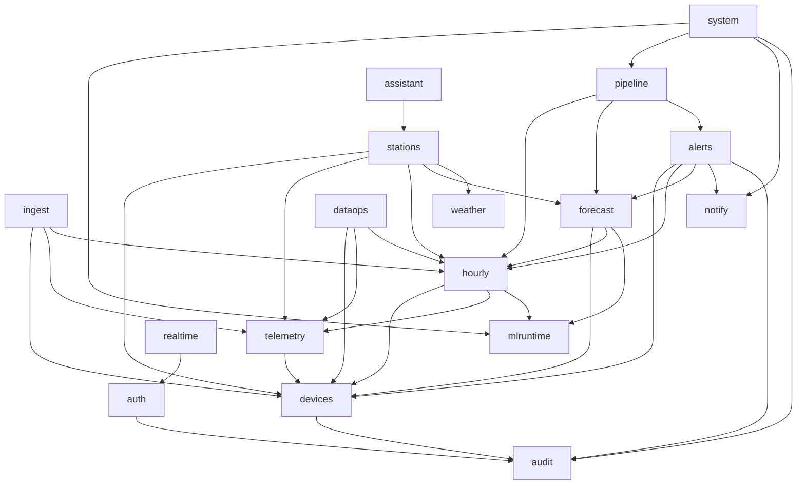

# Chia module backend

**Trạng thái:** dùng để code (04/10/2026).
**Phạm vi:** cách chia backend FastAPI thành module: trách nhiệm, bảng sở hữu, giao diện công khai, sự kiện, phụ thuộc, cấu trúc thư mục, quy tắc code, thứ tự phát triển.
**Liên quan:** [backend_design.md](backend_design.md) (nghiệp vụ, API), [database_design.md](database_design.md) (schema).

---

## 1. Nguyên tắc

1. **Modular monolith, chia theo nghiệp vụ.** Một codebase, một tiến trình mặc định (`APP_ROLE=all`). Mỗi module là một package dưới `app/modules/`, tự chứa model, schema, repository, service, router và job của nó.
2. **Mỗi bảng có đúng một module sở hữu.** Chỉ module đó được ghi vào bảng ([database_design.md](database_design.md) mục 3). Module khác đọc hoặc ghi qua **giao diện công khai** của module sở hữu, không import `repository` hay `models` của nhau.
3. **Phụ thuộc một chiều, không vòng.** Theo đồ thị ở mục 3; kiểm tra tự động bằng `import-linter` trong CI.
4. **Việc phát sinh từ dữ liệu đi qua outbox** (backend_design 6.9). Module ghi sự kiện cùng transaction; module khác đăng ký handler. Nhờ vậy module phát sự kiện không cần biết ai xử lý, nên không tạo phụ thuộc ngược.
5. **Transaction do tầng service quản lý.**
   - Router lấy `AsyncSession` qua dependency rồi gọi service.
   - Service nhận session và gọi service của module khác **trong cùng session**, nên một thao tác nghiệp vụ là một transaction.
   - Repository không commit.
6. **Lớp trong module:** `router` (HTTP, kiểm tra quyền) → `service` (nghiệp vụ) → `repository` (SQL). `schemas` (Pydantic) dùng ở router và giao diện công khai; `models` (SQLAlchemy) chỉ dùng trong module.
7. **`core` là phần dùng chung**, không chứa nghiệp vụ. Module nào cũng được import `core`; `core` không import module nào.

---

## 2. Danh sách module

### 2.1. Tổng quan

| Module | Trách nhiệm | Bảng sở hữu | Mốc |
|---|---|---|---|
| `core` | Cấu hình, DB, transaction + thử lại, khóa advisory, outbox, NOTIFY/LISTEN, rate limit, `app_settings`, lỗi, log, thời gian, i18n, bảo mật dùng chung | `app_settings`, `outbox_events`, `job_runs`, `security_events`, `rate_counters` | M0–M1 |
| `auth` | Người dùng, phiên đăng nhập (`sid`), refresh token xoay vòng, khóa tài khoản, vai trò | `users`, `auth_sessions`, `refresh_tokens` | M4 |
| `audit` | Ghi và tra nhật ký thao tác Admin | `audit_logs` | M4 |
| `devices` | Mạng LoRa, Gateway, node (trạm), cảm biến, liên kết node–Gateway; provisioning; duyệt, ngưng hoạt động; cấp địa chỉ và mã trạm; trạng thái kết nối; chu kỳ đo | `lora_networks`, `gateways`, `nodes`, `node_sensors`, `node_gateway_links` | M1, M4 |
| `telemetry` | Lưu và truy vấn dữ liệu thô, log ingest; định nghĩa cờ `qc_flags` | `measurements`, `ingest_batches` | M1 |
| `ingest` | Cổng thiết bị (`/telemetry`, `/telemetry/heartbeat`): chuẩn hóa, heartbeat, thời điểm đo, phát hiện batch cũ, chống trùng theo thứ hạng, thứ tự khóa, thử lại transaction | (không sở hữu bảng; ghi qua `telemetry`, `devices`) | M1 |
| `hourly` | Tổng hợp giờ, `hourly_as_of`, đóng giờ, hàng đợi tính lại | `node_hourly`, `hourly_recompute_queue` | M2 |
| `mlruntime` | Quét, kiểm tra, kích hoạt model theo thư mục phiên bản; adapter tới `ml/ml_xgb/src` | `ml_models` | M3 |
| `forecast` | Bước dự báo (`on_time`/`late`/`catchup`/`manual`), readiness, lưu đầu vào, đối chiếu, đánh giá lại, thống kê độ chính xác, tái hiện, `predict-csv` | `forecast_runs`, `forecast_attempts`, `forecasts`, `forecast_inputs`, `forecast_input_history`, `forecast_accuracy_daily` | M3 |
| `alerts` | Quy tắc nhiều mức, vòng đời cảnh báo, mốc đã xử lý và lịch sử, đánh giá theo mẫu/giờ/dự báo, offline/pin/cảm biến | `alert_rules`, `alerts`, `alert_states`, `alert_events` | M5 |
| `notify` | Hàng đợi tin và kênh Telegram | `notifications` | M5 |
| `pipeline` | Điều phối đường ống theo giờ (backend_design 7.1) | `hour_pipeline` | M2–M3 |
| `realtime` | SSE: kết nối LISTEN, chia sự kiện cho client, hàng đợi hữu hạn, giới hạn kết nối | — | M2 |
| `stations` | API công khai chỉ đọc: tổng quan, danh sách, GeoJSON, gần nhất, chi tiết, chuỗi, chu kỳ ngày, xếp hạng, thang AQI, dự báo hiện hành | — | M2–M3 |
| `weather` | Gọi OpenWeatherMap, cache | — | M2 |
| `assistant` | API trợ lý cho Xiaozhi, ghi `assistant_calls` | `assistant_calls` | M7 |
| `dataops` | Admin dữ liệu: heatmap độ phủ, xuất CSV, dữ liệu thô theo node | — | M6 |
| `system` | Sức khỏe, job, sự kiện bảo mật, tiến độ đường ống, outbox lỗi, cấu hình, dọn dữ liệu, tin Telegram thử | — (đọc và quản trị bảng của `core`) | M6 |

`ingest` tách khỏi `telemetry` để không có vòng phụ thuộc:
- `hourly` cần **đọc** dữ liệu thô (`telemetry`).
- `ingest` cần **xếp hàng tính lại giờ** (`hourly`).

### 2.2. Chi tiết

Giao diện công khai là các hàm được export ở `app/modules/<module>/__init__.py`. Mọi hàm nhận `session` làm tham số đầu.

#### `core`
- `config`: `Settings` (pydantic-settings, đọc `.env`), `APP_ROLE`.
- `db`: engine, `get_session()`, `run_in_transaction(fn, retries=3, on=(40P01, 40001, 55P03))`, reset kết nối khi trả về pool.
- `locks`: `job_lock(code)` (khóa phiên, context manager), `node_address_locks(session, keys)` (sắp xếp tăng dần rồi khóa), `pipeline_lock()`.
- `outbox`: `publish(session, kind, payload, partition_key)`, `register_handler(kind, fn)`, dispatcher (`LISTEN outbox` + quét). Sự kiện cùng `partition_key` chạy tuần tự theo id; sự kiện đầu hàng lỗi thì sự kiện sau cùng khóa phải chờ (backend_design 6.9).
- `events`: `notify(session, event)` (`pg_notify('aqi_events')`), `EventHub` (kết nối LISTEN, phát cho người đăng ký), danh mục loại sự kiện.
- `settings_store`: đọc `app_settings` có cache ngắn và làm mới khi có NOTIFY; ghi qua `system`.
- `ratelimit`: `RateLimiter` (`memory` / `postgres`).
- `security_events`: `record(session, kind, severity, **details)`.
- `security`: băm mật khẩu argon2id, JWT, so sánh thời gian hằng.
- `errors`: `AppError(code, http_status, message_key)`, handler trả `{"error": {...}}`; lỗi cổng thiết bị trả `{"success": false, "error": ...}`.
- `i18n`, `timeutil` (UTC ↔ `Asia/Ho_Chi_Minh`, `floor_hour`, `hour_end_of`), `logging`.

#### `auth`
- Giao diện: `authenticate()`, `create_session()`, `rotate_refresh()` (`FOR UPDATE`, khoảng ân hạn 30 giây), `revoke_session(sid, reason)`, `revoke_all_sessions(user_id, reason)`, `current_user` (dependency: kiểm tra JWT rồi tra `auth_sessions` theo `sid` ở mọi request Admin), `require_role("admin")`.
- Router: `/auth/login`, `/auth/refresh`, `/auth/logout`, `/auth/me`, `/auth/sessions*`, `/auth/change-password`; Admin `/admin/users*` (kể cả phiên của người dùng).
- Phụ thuộc: `core`, `audit`.

#### `audit`
- Giao diện: `record(session, user, action, entity_type, entity_id, changes, ip)`; Admin `/admin/audit-logs`.
- Phụ thuộc: `core`.

#### `devices`
- Giao diện:
  - `resolve_nodes(session, gateway, addrs) → {addr: Node | Rejected | ToCreate}` (theo mạng của Gateway, xét thời gian cách ly);
  - `create_discovered_node()`, `create_discovered_gateway()`;
  - `provision_gateway()`, `provision_node()` (cấp địa chỉ, `station_code`);
  - `mark_seen(...)`, `update_connectivity()`, `refresh_observed_intervals()`;
  - `approve_gateway()` (ghi outbox `gateway_approved`), `approve_node()`, `retire_node()`, `retire_gateway()`;
  - truy vấn: `get_node`, `list_nodes`, `effective_interval(node)`, `public_stations()`.
- Router: `/provision/*` (cổng thiết bị), `/admin/nodes*`, `/admin/gateways*`, `/admin/devices/pending`.
- Job: `interval_stats`.
- Phụ thuộc: `core`, `audit`.

#### `telemetry`
- Giao diện:
  - `insert_measurements()`, `find_matching_copies()` (chống trùng), `mark_superseded()` (đặt `superseded_at`), `trust_gateway_data(gateway_id, approved_at)` (bỏ cờ, đặt `trusted_at`);
  - `log_batch()`;
  - truy vấn: `samples_for_hours(node, from, to, cutoff=None)`, `latest_reliable(node_ids)`, `series_raw()`, `series_5min()`, `batches()`.
- `qc.py`: `QcFlag` (`IntFlag`), `EXCLUDE_MASK`, `is_state_trusted()`. Đây là điều kiện duy nhất quyết định bản ghi có được cập nhật trạng thái vận hành hay không (backend_design 6.4.1).
- `as_of_filter(cutoff)`: điều kiện chọn bản ghi theo `received_at`, `trusted_at`, `superseded_at` (backend_design 7).
- Router Admin: `/admin/ingest/batches*`, `/admin/nodes/{id}/readings`.
- Phụ thuộc: `core`, `devices` (chỉ kiểu dữ liệu).

#### `ingest`
- Router: `POST /telemetry`, `POST /telemetry/heartbeat`.
- Thành phần nội bộ:
  - `normalize.py`: mục 6.4;
  - `timing.py`: mục 6.6, thuần Python, không đụng DB, nên dễ unit test;
  - `staleness.py`: mục 6.6.3;
  - `dedup.py`: thứ hạng, mục 6.5;
  - `pipeline.py`: trình tự mục 6.7.
- Cập nhật trạng thái node và cảm biến **chỉ** từ bản ghi `is_state_trusted`, và chỉ khi bản ghi mới hơn giá trị đang có.
- Handler outbox: `gateway_approved` → `telemetry.trust_gateway_data()`, đối soát trùng, `hourly.enqueue_recompute()`.
- Phát: outbox `measurements_ingested` (một sự kiện mỗi node, `partition_key = node:<id>`); NOTIFY `measurement`, `device_discovered`, `ingest_batch`.
- Phụ thuộc: `core`, `devices`, `telemetry`, `hourly`.

#### `hourly`
- Giao diện:
  - `enqueue_recompute(session, node_id, hour_end)`;
  - `close_hour(session, hour_end)` (bước 1 của đường ống);
  - `rollup_open_hour()`, `process_recompute_queue()` (ghi outbox `hourly_revised`);
  - `hourly_as_of(session, node_id, hours, cutoff)` (dùng `telemetry.as_of_filter`);
  - truy vấn: `series_hour()`, `series_day()`, `profile()`, `completeness()`.
- Job: `hourly_rollup`.
- Phụ thuộc: `core`, `devices`, `telemetry`, `mlruntime` (chỉ `compute_aqi` qua adapter).

#### `mlruntime`
- Giao diện:
  - `registry.active()` trả bộ model đang dùng trong bộ nhớ;
  - `registry.rescan()`, `registry.activate(model_id)` (NOTIFY `model_changed`);
  - `adapter.compute_aqi()`, `adapter.build_features(history, meta, t, now)`, `adapter.predict(models, features)`.
- Router Admin: `/admin/models*`.
- Phụ thuộc: `core`; thư viện `ml/ml_xgb/src` (backend_design 8.2).

#### `forecast`
- Giao diện:
  - `run_for_hour(session, t)` (bước 4): tạo hoặc tiếp tục lần chạy, mỗi lần thực thi là một `forecast_attempts`; `effective_now = scheduled_for` khi chạy bù;
  - `evaluate_target_hour(session, h)` (bước 3);
  - `current_forecast(node_id)`: trả `latest_success`, `latest_attempt`, `status` (`ok`/`stale`/…) theo backend_design 11.5;
  - `accuracy(...)`, `reproduce(run_id)`, `predict_csv(file)`.
- Handler outbox: `hourly_revised` → đánh giá lại (chỉ khi `revision` mới hơn) và cập nhật `forecast_accuracy_daily`.
- Router: `/public/stations/{code}/forecast` (qua `stations`), `/admin/forecast/*`.
- Phát: NOTIFY `forecast`, `forecast_run`.
- Phụ thuộc: `core`, `devices`, `hourly`, `mlruntime`.

#### `alerts`
- Giao diện:
  - `evaluate_hourly(session, h)` (bước 2);
  - `evaluate_forecast(session, t)` (bước 5);
  - `evaluate_samples(node_id, measurement_ids)`: xét mẫu theo `(measured_at, id)`; so với mốc trong `alert_states`, mẫu cũ hơn mốc chỉ ghi `late_exceedance`;
  - `transition()`: mở, nâng mức, hạ mức, đóng theo `levels`; mỗi lần ghi `alert_events`;
  - `resolve()`, `acknowledge()`.
- Handler outbox: `measurements_ingested` → cảnh báo theo mẫu, đóng cảnh báo offline.
- Job: `device_status`. Gọi `devices.update_connectivity()` rồi đánh giá offline, pin, cảm biến.
- Với các sự kiện `opened`, `escalated`, `resolved`, gọi `notify.enqueue(...)` trong cùng transaction.
- Router Admin: `/admin/alerts*`, `/admin/alert-rules*`.
- Phát: NOTIFY `alert_opened`, `alert_updated`, `alert_resolved`.
- Phụ thuộc: `core`, `devices`, `hourly`, `forecast` (đọc dự báo), `notify`, `audit`.

#### `notify`
- Giao diện:
  - `enqueue(session, alert_event_id, message, severity)`: bỏ qua khi dưới `telegram_min_severity` hoặc trạm mô phỏng;
  - `send_pending()`: đặt `sending` trước khi gọi API rồi `sent` sau. Gửi **ít nhất một lần**; tin còn `sending` khi khởi động lại được gửi lại với tiền tố "[Gửi lại]".
- `TelegramNotifier`: Bot API `sendMessage`, giới hạn 20 tin/phút.
- Job: `notify_retry`.
- Phụ thuộc: `core`. Không đọc bảng `alerts`; nội dung tin do `alerts` dựng sẵn, để không tạo phụ thuộc ngược.

#### `pipeline`
- Job `hourly_pipeline`: giữ khóa `(3, 0)` và duyệt các giờ chưa xong. Mỗi giờ gọi lần lượt:
  1. `hourly.close_hour`;
  2. `alerts.evaluate_hourly`;
  3. `forecast.evaluate_target_hour`;
  4. `forecast.run_for_hour`;
  5. `alerts.evaluate_forecast`.

  Mỗi bước ghi vào `hour_pipeline`.
- Giao diện: `progress()` cho `system`.
- Phụ thuộc: `core`, `hourly`, `forecast`, `alerts`.

#### `realtime`
- Router: `/stream/public`, `/stream/admin`.
- `EventHub` (từ `core.events`) phát sự kiện cho client. Mỗi client có hàng đợi hữu hạn, gộp sự kiện theo trạm, gửi `resync` khi đầy, đóng kết nối khi quá `send_timeout`.
- Giới hạn số kết nối theo IP, tài khoản và toàn hệ thống.
- Phụ thuộc: `core`, `auth` (kênh Admin).

#### `stations`
- Router: `/public/*` (backend_design 11.3–11.5).
- Ghép dữ liệu đọc từ các module bên dưới, không sở hữu bảng.
- Phụ thuộc: `core`, `devices`, `telemetry`, `hourly`, `forecast`, `weather`.

#### `weather`
- Giao diện: `current(lat, lng, lang)`; cache theo `(tọa độ, ngôn ngữ)` trong `WEATHER_CACHE_TTL_S`.
- Phụ thuộc: `core`.

#### `assistant`
- Router: `/assistant/*` (token `assistant:read`). Dùng lại service của `stations`, luôn trả tiếng Việt, ghi `assistant_calls`.
- Phụ thuộc: `core`, `stations`.

#### `dataops`
- Router Admin: `/admin/data/completeness`, `/admin/data/export.csv`.
- Phụ thuộc: `core`, `devices`, `telemetry`, `hourly`.

#### `system`
- Router Admin `/admin/system/*`, `/admin/settings`:
  - sức khỏe (DB, extension, SHA model theo từng tiến trình, độ trễ outbox, dung lượng);
  - job, sự kiện bảo mật, tiến độ đường ống, outbox lỗi và chạy lại;
  - cấu hình, tin Telegram thử.
- Job: `cleanup`, `rate_counters_gc`.
- Phụ thuộc: `core`, `mlruntime`, `pipeline`, `notify`, `audit`.

---

## 3. Đồ thị phụ thuộc

Mũi tên `A --> B` nghĩa là A được import giao diện công khai của B. Mọi module đều phụ thuộc `core` (không vẽ).



Các tầng, từ thấp lên cao. Một module chỉ phụ thuộc module ở tầng thấp hơn:

| Tầng | Module |
|---|---|
| 0 | `core` |
| 1 | `audit`, `mlruntime`, `notify`, `weather` |
| 2 | `auth`, `devices` |
| 3 | `telemetry`, `realtime` |
| 4 | `hourly` |
| 5 | `ingest`, `forecast`, `dataops` |
| 6 | `alerts` |
| 7 | `pipeline`, `stations` |
| 8 | `assistant`, `system` |

Sự kiện đi "ngược tầng" chỉ qua outbox hoặc NOTIFY, không qua import:
- `devices` phát `gateway_approved` cho `ingest`;
- `hourly` phát `hourly_revised` cho `forecast`;
- `ingest` phát `measurements_ingested` cho `alerts`.

`import-linter` kiểm tra hai hợp đồng:
- **layers** theo bảng trên;
- **forbidden**: không module nào import `app.modules.*.repository` hay `app.modules.*.models` của module khác.

---

## 4. Cấu trúc thư mục

```text
backend/
├── requirements.txt             # phụ thuộc chạy, ghim xgboost 3.4.1, pandas 3.0.6, numpy 2.5.3 (Dockerfile dùng)
├── pyproject.toml               # cấu hình ruff, mypy, import-linter, pytest
├── Dockerfile                   # build context = gốc repo để copy ml/ml_xgb/src
├── alembic.ini
├── migrations/
│   ├── env.py                   # include_object bỏ bảng của extension; naming convention
│   └── versions/                # 0001_base … 0008_settings_seed (database_design 11)
├── app/
│   ├── main.py                  # create_app(); lifespan theo APP_ROLE: nạp model, EventHub, scheduler, dispatcher
│   ├── api.py                   # gắn router: /api/v1/{telemetry,provision,public,stream,auth,admin,assistant}
│   ├── worker.py                # điểm vào APP_ROLE=worker (không HTTP, trừ /healthz nội bộ)
│   ├── core/
│   │   ├── config.py  db.py  locks.py  outbox.py  events.py  settings_store.py
│   │   ├── ratelimit.py  security.py  security_events.py  errors.py  i18n.py  timeutil.py  logging.py
│   │   ├── scheduler.py         # APScheduler; đăng ký job từ các module; chỉ chạy ở all/worker
│   │   └── i18n/vi.json, en.json
│   └── modules/
│       ├── auth/        __init__.py models.py schemas.py repository.py service.py router.py
│       ├── audit/       __init__.py models.py repository.py service.py router.py
│       ├── devices/     __init__.py models.py schemas.py repository.py service.py provisioning.py
│       │                addressing.py (cấp địa chỉ, station_code, cách ly) router_device.py router_admin.py jobs.py
│       ├── telemetry/   __init__.py models.py qc.py repository.py service.py router_admin.py
│       ├── ingest/      __init__.py schemas.py normalize.py timing.py staleness.py dedup.py pipeline.py handlers.py router.py
│       ├── hourly/      __init__.py models.py aggregate.py repository.py service.py jobs.py handlers.py
│       ├── mlruntime/   __init__.py models.py registry.py adapter.py router_admin.py
│       ├── forecast/    __init__.py models.py repository.py service.py evaluate.py reproduce.py handlers.py router_admin.py
│       ├── alerts/      __init__.py models.py repository.py rules.py service.py handlers.py jobs.py router_admin.py
│       ├── notify/      __init__.py models.py service.py telegram.py jobs.py
│       ├── pipeline/    __init__.py models.py service.py jobs.py
│       ├── realtime/    __init__.py hub_client.py limits.py router.py
│       ├── stations/    __init__.py schemas.py service.py router.py
│       ├── weather/     __init__.py client.py service.py
│       ├── assistant/   __init__.py models.py schemas.py service.py router.py
│       ├── dataops/     __init__.py service.py export.py router_admin.py
│       └── system/      __init__.py service.py health.py jobs.py router_admin.py
├── scripts/
│   ├── create_admin.py
│   ├── simulate_gateway.py      # payload đúng định dạng firmware; kịch bản 30 phút / 15 giây / mất mạng / gửi lại
│   └── import_hourly_csv.py     # nạp CSV dạng dataset.csv vào trạm mô phỏng (P10)
└── tests/
    ├── conftest.py              # DB timescaledb-ha thật (Docker), transaction rollback mỗi test
    ├── unit/<module>/           # không DB: normalize, timing, staleness, dedup, rules, aggregate
    ├── contract/                # payload firmware thật → mã trả về, dữ liệu lưu
    ├── integration/<module>/    # service + DB thật
    ├── golden/                  # dự báo backend vs src.predict; ngưỡng AQI qua DB
    ├── schema/                  # database_design 13
    └── perf/                    # hiệu năng DB, tải HTTP (đánh dấu chạy riêng)

xiaozhi-bridge/                  # container riêng (09-xiaozhi-mcp)
docker/                          # đã dựng: compose (prod, dev), nginx/, certbot/, db/100_aqi_roles.sh, backup.sh, .env.example, README.md
```

Mỗi module theo cùng mẫu:
- `__init__.py` chỉ export giao diện công khai.
- `jobs.py` khai báo job và lịch; `core.scheduler` gom lại.
- `handlers.py` đăng ký handler outbox bằng `core.outbox.register_handler`.

---

## 5. Hợp đồng dùng chung

| Chủ đề | Quy định |
|---|---|
| Transaction | Một request là một transaction (`get_session` commit khi router trả về không lỗi). Ingest dùng `run_in_transaction` có thử lại. Job mở transaction theo từng đơn vị việc (một giờ, một node, một sự kiện) |
| Sự kiện outbox | Mỗi `kind` có schema Pydantic trong module phát (`events.py`). Handler idempotent, đánh giá theo trạng thái hiện tại |
| Sự kiện realtime | Danh mục loại và payload trong `core/events.py`; payload < 8000 byte |
| Lỗi | Mã lỗi `UPPER_SNAKE` ổn định (`STATION_NOT_FOUND`, `RANGE_TOO_LARGE`, `MODEL_SYNCING`, `SSE_LIMIT`, …), thông điệp lấy từ i18n |
| Cấu hình | Đọc qua `core.settings_store`; chỉ `system` được ghi `app_settings` |
| Thời gian | Hàm trong `core.timeutil`; không gọi `datetime.now()` trực tiếp mà qua `Clock` có thể giả lập trong test (cần cho test đường ống giờ, chạy bù, batch cũ) |
| Quyền | Router Admin khai báo `require_role(...)`; thao tác ghi gọi `audit.record` |
| Mã định danh | Trong code và DB dùng `nodes.id`; API công khai dùng `station_code`; cổng thiết bị dùng `NODE_%03d` (`device_code`) và chỉ `ingest`/`devices` chuyển đổi |
| Kiểu số | `float` Python ↔ `DOUBLE_PRECISION`; không dùng `Float()` mặc định hay `REAL` |

---

## 6. Quy tắc code và CI

| Mục | Quy định |
|---|---|
| Ngôn ngữ | Python 3.12, async toàn bộ đường I/O; tính toán pandas/xgboost chạy trong thread (`anyio.to_thread`) |
| Định dạng, lint | `ruff format`, `ruff check` |
| Kiểu | `mypy --strict` cho `app/core` và `app/modules/*/service.py`; nơi khác ở mức thường |
| Ranh giới module | `import-linter` (mục 3) |
| Test | `pytest`, `pytest-asyncio`. Module nào cũng có unit test cho phần thuần Python và integration test với DB thật |
| CI | Lint → mypy → import-linter → migration (`upgrade → downgrade → upgrade`) → unit → contract → integration → golden. `perf` chạy tay hoặc theo lịch |
| Phụ thuộc | Ghim phiên bản; `pip-audit` |
| Nhánh | Mỗi mốc một nhánh tính năng; merge khi đạt tiêu chí "Xong khi" ở mục 7 |

---

## 7. Thứ tự phát triển

Đường găng: **M0 → M1 → M2 → M3**, tức cảm biến → dữ liệu giờ → dự báo. M4 làm song song từ sau M1.

| Mốc | Module | Việc chính | Xong khi |
|---|---|---|---|
| **M0** Khung | `core` (config, db, errors, logging, timeutil, locks, outbox khung, events khung), `system` (`/healthz`, `/readyz`) | <ul><li>Cấu trúc thư mục, `pyproject`, Docker Compose dev (db + api), script vai trò DB.</li><li>Alembic `0001_base`.</li><li>CI đủ các bước ở mục 6.</li></ul> | `docker compose up` chạy; CI xanh; test schema `0001` đạt |
| **M1** Thiết bị + ingest | `devices` (provisioning, tra/tạo node, địa chỉ, `station_code`), `telemetry`, `ingest`, `core` (ratelimit, security_events, outbox dispatcher) | <ul><li>Migration `0002`, `0003`.</li><li>5 endpoint firmware; chuẩn hóa, thời điểm đo, batch cũ, chống trùng theo thứ hạng, thứ tự khóa, thử lại.</li><li>`simulate_gateway.py`.</li></ul> | Test hợp đồng firmware, thời điểm đo, trùng giữa Gateway, khóa, outbox, địa chỉ LoRa pass; Gateway thật gửi vào được |
| **M2** Dữ liệu giờ + API công khai | `hourly`, `pipeline` (bước 1), `stations`, `realtime`, `weather` | <ul><li>Migration `0004`, `0008`.</li><li>Đóng giờ, chạy bù, `hourly_as_of`.</li><li>`/public/*`, SSE, i18n.</li></ul> | Đủ API cho F1–F6; test đường ống (bước 1), ngưỡng AQI qua DB, SSE pass |
| **M3** Dự báo | `mlruntime`, `forecast`, `pipeline` (bước 3–4) | <ul><li>Sửa import matplotlib trong `ml/`.</li><li>Migration `0005`.</li><li>Registry theo thư mục phiên bản; bước dự báo; `forecast_inputs`; đối chiếu, đánh giá lại; trạm mô phỏng.</li></ul> | Golden test qua DB, test không rò rỉ, tái hiện pass; node có 73 giờ ra được dự báo |
| **M4** Xác thực + Admin thiết bị | `auth`, `audit`, `devices` (router Admin) | Đăng nhập, phiên (`sid`, kiểm tra mỗi request), refresh xoay vòng có khoảng ân hạn, vai trò; duyệt, ngưng hoạt động thiết bị (outbox `gateway_approved`) | Luồng A1, A3, A5 chạy được; test phiên đăng nhập pass |
| **M5** Cảnh báo | `alerts`, `notify`, `pipeline` (bước 2, 5) | Migration `0006`; quy tắc nhiều mức; `alert_states`, `alert_events`; outbox theo node; Telegram | Test thứ tự cảnh báo, vòng đời nhiều mức và Telegram pass; không có cảnh báo trùng |
| **M6** Admin dữ liệu + hệ thống | `dataops`, `system`, `forecast` (router Admin) | Độ phủ, xuất CSV, độ chính xác, sức khỏe, outbox lỗi, cấu hình | Mọi trang Admin ở backend_design mục 12 có API |
| **M7** Xiaozhi | `assistant` + `xiaozhi-bridge` | Migration `0007`; `/assistant/*` | Hỏi qua loa ra đúng số liệu như API web |
| **M8** Triển khai | — | Nginx + Certbot, sao lưu, test tải backend, test hệ thống với Gateway thật, test hiệu năng DB | Chạy trên VPS với thiết bị thật; có số đo mất mẫu và dung lượng |

**Việc làm song song** (một người làm mỗi lần một việc thì theo đúng thứ tự trên):
- `weather`, `notify` (phần Telegram) và `mlruntime.adapter` (kèm sửa matplotlib) không phụ thuộc ai, làm được từ M0.
- `auth` và `audit` làm được ngay sau M0.

**Việc đầu tiên của M0:**
1. Tạo `backend/` theo mục 4: `requirements.txt` với phiên bản ghim, `pyproject.toml` cho công cụ.
2. Hạ tầng Docker đã có sẵn ở `docker/` (chạy dev: `docker compose -f docker-compose.dev.yml up`).
3. `core/config.py`, `core/db.py` (engine, session, `run_in_transaction`), `core/errors.py`, `core/logging.py`, `core/timeutil.py` (có `Clock`).
4. Alembic: `env.py` (naming convention, `include_object`), `0001_base`.
5. `GET /healthz`, `GET /readyz`.
6. CI: ruff, mypy, import-linter, migration round-trip, pytest với DB thật.
