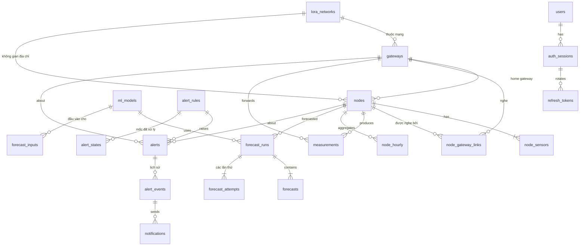

# Thiết kế cơ sở dữ liệu

**Trạng thái:** dùng để code (04/10/2026).
**Phạm vi:** schema PostgreSQL 16 + TimescaleDB + PostGIS cho backend: bảng, khóa, index, chính sách TimescaleDB, mã dùng chung, migration, vai trò DB, kiểm thử schema.
**Nguồn quyết định:** [backend_design.md](backend_design.md) mục 1, 21, 22. Module sở hữu từng bảng: [backend_modules.md](backend_modules.md).

---

## 1. Quyết định ảnh hưởng tới schema

| Mã | Ảnh hưởng |
|---|---|
| D1 | `node_hourly` do backend tính, không dùng continuous aggregate |
| D2 + **P15 = B** | Node là trạm. `nodes.id` là ID nội bộ (`integer`). Địa chỉ firmware `lora_addr` 1–255 chỉ duy nhất trong một `lora_networks` và trong các node chưa `retired`, nên tái sử dụng được. Mã trạm công khai `station_code` dạng `ST001`, không bao giờ tái sử dụng |
| D2b, P14 | Xóa = ngưng hoạt động, giữ dữ liệu; chỉ xóa hẳn thiết bị chưa có dữ liệu |
| D3, P13 | Thiết bị lạ hoặc đăng ký qua provisioning có trạng thái `pending` |
| D4 + R4 | Chống trùng theo `payload_hash` + cửa sổ thời gian; bản sao kém hơn gắn cờ `SUPERSEDED` |
| P1 | Nhãn giờ `hour_end` = cửa sổ `(h−1, h]` |
| P2 + R6 | `received_at` và `measured_at` lưu riêng; `measured_at ≤ received_at`; `max_age_s` ghi độ không chắc chắn |
| P8 | Thô 90 ngày, log ingest 14 ngày; dữ liệu giờ và dự báo giữ lâu dài |
| P11, P12 | `notifications` (Telegram), `refresh_tokens` |
| R1, R2 | `hour_pipeline` lưu tiến độ đường ống giờ |
| R3 | `outbox_events` ghi cùng transaction |
| R7 | Khóa đăng nhập trong `users`; `rate_counters` cho rate limit nhiều tiến trình |
| R8 | `forecast_inputs`, `forecasts.actual_revision`, `forecast_accuracy_daily`, model theo thư mục phiên bản |
| R9 | Số đo, AQI, đầu vào ML dùng `double precision` |
| R13 | `forecasts`, `forecast_inputs` là hypertable có nén |
| R16–R30 (rà soát đợt 2, backend_design 22.2) | `auth_sessions` (thu hồi access JWT theo `sid`); `measurements.trusted_at`, `superseded_at` (as-of đúng); `outbox_events.partition_key` (thứ tự theo node); `alert_states`, `alert_events` (mốc đã xử lý, lịch sử, nâng/hạ mức); `forecast_attempts` (lần chạy và lần thử); `forecast_input_history` (lịch sử đầu vào 90 ngày); `nodes.interval_locked`; `first_data_at` (điều kiện xóa hẳn) |

---

## 2. Quy ước

| Mục | Quy ước |
|---|---|
| Tên | `snake_case`; bảng số nhiều (trừ `node_hourly`, `hour_pipeline`); khóa chính `id`; khóa ngoại `<thực thể>_id`. Alembic đặt tên ràng buộc theo mẫu: `pk_%(table_name)s`, `fk_%(table_name)s_%(column_0_name)s`, `ix_%(table_name)s_%(column_0_N_name)s`, `ux_…` (unique), `ck_%(table_name)s_%(constraint_name)s` |
| Thời gian | `timestamptz`, lưu UTC; tên cột `*_at`. Nhãn giờ là `hour_end`, luôn tròn giờ |
| Số đo, AQI, đầu vào ML | `double precision` (R9). AQI đã làm tròn: `smallint`. Không dùng `real`, trừ các cột tỷ lệ chỉ để hiển thị (`coverage`, `input_t_coverage`, `observed_interval_iqr_ratio`) |
| Kiểu liệt kê | `text` + `CHECK`, không dùng `ENUM` để migration đơn giản |
| ID | `GENERATED ALWAYS AS IDENTITY`. Mã firmware (`gateways.id`, chuỗi `NODE_%03d`) chỉ dùng ở biên thiết bị |
| `created_at`, `updated_at` | Có ở mọi bảng danh mục; `updated_at` cập nhật bằng trigger `set_updated_at()` để đúng cả khi sửa bằng SQL tay |
| Hypertable | PK/UNIQUE phải chứa cột phân vùng. Không bảng nào có khóa ngoại trỏ **vào** hypertable; khóa ngoại từ hypertable ra bảng thường được phép |
| Xóa | Không `ON DELETE CASCADE` từ thiết bị sang dữ liệu đo (giữ dữ liệu, D2b). Chỉ cascade cho bảng phụ thuộc thuần (cảm biến, liên kết, token) |
| JSONB | Chỉ cho payload gốc, log, cấu hình, lịch sử đầu vào dự báo; không cho dữ liệu cần lọc hay tổng hợp |
| Bảng log | `security_events`, `assistant_calls`, `audit_logs` không đặt khóa ngoại tới thiết bị, để log vẫn ghi được khi thiết bị không tồn tại hoặc bị xóa |

---

## 3. Bảng theo module

32 bảng; 5 hypertable. Module sở hữu là module duy nhất được ghi vào bảng ([backend_modules.md](backend_modules.md) mục 2).

| Module | Bảng | Loại | Lưu trữ |
|---|---|---|---|
| `core` | `app_settings`, `outbox_events`, `job_runs`, `security_events`, `rate_counters` | Thường (`rate_counters` là `UNLOGGED`) | Mục 7 |
| `auth` | `users`, `auth_sessions`, `refresh_tokens` | Thường | Phiên và token hết hạn hoặc thu hồi quá 30 ngày thì xóa |
| `audit` | `audit_logs` | Thường | 1 năm |
| `devices` | `lora_networks`, `gateways`, `nodes`, `node_sensors`, `node_gateway_links` | Thường | Lâu dài |
| `telemetry` | `ingest_batches`, `measurements` | **Hypertable** | 14 ngày; 90 ngày |
| `hourly` | `node_hourly`, `hourly_recompute_queue` | Thường | Lâu dài; hàng đợi xóa khi xử lý xong |
| `pipeline` | `hour_pipeline` | Thường | Lâu dài (1 dòng/giờ) |
| `mlruntime` | `ml_models` | Thường | Lâu dài |
| `forecast` | `forecast_runs`, `forecast_attempts`, `forecast_accuracy_daily` | Thường | Lâu dài |
| `forecast` | `forecast_inputs`, `forecasts` | **Hypertable** | Lâu dài, nén sau 30 ngày |
| `forecast` | `forecast_input_history` | **Hypertable** | 90 ngày (R29) |
| `alerts` | `alert_rules`, `alerts`, `alert_states`, `alert_events` | Thường | Cảnh báo đã đóng và lịch sử: 1 năm; `alert_states` lâu dài |
| `notify` | `notifications` | Thường | 90 ngày |
| `assistant` | `assistant_calls` | Thường | 30 ngày |

---

## 4. Sơ đồ quan hệ



Không có trên sơ đồ (bảng hạ tầng hoặc log): `app_settings`, `outbox_events`, `job_runs`, `security_events`, `rate_counters`, `audit_logs`, `ingest_batches`, `hourly_recompute_queue`, `hour_pipeline`, `forecast_accuracy_daily`, `forecast_input_history`, `assistant_calls`.

---

## 5. DDL

Sắp theo thứ tự migration (mục 11). Mỗi bảng có `updated_at` kèm một trigger `trg_<bảng>_updated_at BEFORE UPDATE … EXECUTE FUNCTION set_updated_at()`; phần DDL dưới không lặp lại dòng trigger.

### 5.1. Nền tảng: `core`, `auth`, `audit` (migration 0001)

```sql
-- Extension do superuser tạo trong script khởi tạo DB (mục 12), migration chỉ kiểm tra.
CREATE EXTENSION IF NOT EXISTS timescaledb;
CREATE EXTENSION IF NOT EXISTS postgis;

CREATE FUNCTION set_updated_at() RETURNS trigger LANGUAGE plpgsql AS $$
BEGIN
  NEW.updated_at := now();
  RETURN NEW;
END $$;

-- ===== auth =====
CREATE TABLE users (
  id                  bigint GENERATED ALWAYS AS IDENTITY PRIMARY KEY,
  username            text NOT NULL UNIQUE CHECK (username ~ '^[a-z0-9_.-]{3,50}$'),
  full_name           text,
  password_hash       text NOT NULL,                     -- argon2id
  role                text NOT NULL CHECK (role IN ('admin','operator')),   -- P7
  is_active           boolean NOT NULL DEFAULT true,
  last_login_at       timestamptz,
  failed_login_count  smallint NOT NULL DEFAULT 0,       -- R7: đếm trong DB
  locked_until        timestamptz,
  password_changed_at timestamptz NOT NULL DEFAULT now(),
  created_at          timestamptz NOT NULL DEFAULT now(),
  updated_at          timestamptz NOT NULL DEFAULT now()
);

CREATE TABLE auth_sessions (                           -- R20: một lần đăng nhập; JWT mang sid, mỗi request Admin kiểm tra
  id             uuid PRIMARY KEY DEFAULT gen_random_uuid(),   -- sid
  user_id        bigint NOT NULL REFERENCES users(id) ON DELETE CASCADE,
  created_at     timestamptz NOT NULL DEFAULT now(),
  last_seen_at   timestamptz NOT NULL DEFAULT now(),
  expires_at     timestamptz NOT NULL,                 -- hạn tuyệt đối của phiên (14 ngày)
  revoked_at     timestamptz,
  revoke_reason  text CHECK (revoke_reason IN
                 ('logout','reuse_detected','password_changed','user_disabled','admin','expired')),
  user_agent     text,
  ip             inet
);
CREATE INDEX ix_auth_sessions_user_active ON auth_sessions (user_id) WHERE revoked_at IS NULL;

CREATE TABLE refresh_tokens (                          -- P12: xoay vòng trong một phiên
  id            bigint GENERATED ALWAYS AS IDENTITY PRIMARY KEY,
  session_id    uuid NOT NULL REFERENCES auth_sessions(id) ON DELETE CASCADE,
  token_hash    bytea NOT NULL UNIQUE,                 -- SHA-256 của token
  issued_at     timestamptz NOT NULL DEFAULT now(),
  expires_at    timestamptz NOT NULL,
  rotated_at    timestamptz,                           -- đã đổi lấy token mới (dùng cho khoảng ân hạn khi refresh đồng thời)
  replaced_by   bigint REFERENCES refresh_tokens(id)
);
CREATE INDEX ix_refresh_tokens_session ON refresh_tokens (session_id);
-- Phiên còn hiệu lực có đúng một token chưa xoay
CREATE UNIQUE INDEX ux_refresh_tokens_live ON refresh_tokens (session_id) WHERE rotated_at IS NULL;

-- ===== audit =====
CREATE TABLE audit_logs (
  id           bigint GENERATED ALWAYS AS IDENTITY PRIMARY KEY,
  occurred_at  timestamptz NOT NULL DEFAULT now(),
  user_id      bigint REFERENCES users(id) ON DELETE SET NULL,
  username     text,                                   -- giữ lại khi user bị xóa
  action       text NOT NULL,                          -- 'node.approve', 'node.update', 'auth.login_failed', ...
  entity_type  text,                                   -- 'node', 'gateway', 'user', 'alert_rule', 'setting', 'model'
  entity_id    text,
  changes      jsonb,                                  -- {"field": [cũ, mới]}
  ip           inet
);
CREATE INDEX ix_audit_logs_time   ON audit_logs (occurred_at DESC);
CREATE INDEX ix_audit_logs_entity ON audit_logs (entity_type, entity_id, occurred_at DESC);

-- ===== core =====
CREATE TABLE app_settings (                            -- cấu hình sửa trên Admin (backend_design 15.2)
  key         text PRIMARY KEY,
  value       jsonb NOT NULL,
  updated_by  bigint REFERENCES users(id) ON DELETE SET NULL,
  updated_at  timestamptz NOT NULL DEFAULT now()
);

CREATE TABLE job_runs (
  id           bigint GENERATED ALWAYS AS IDENTITY PRIMARY KEY,
  job          text NOT NULL,                          -- mã ở mục 8.4
  process_id   text,                                   -- host:pid, biết tiến trình nào chạy
  started_at   timestamptz NOT NULL DEFAULT now(),
  finished_at  timestamptz,
  status       text NOT NULL CHECK (status IN ('running','ok','error','skipped')),
  stats        jsonb,
  error        text
);
CREATE INDEX ix_job_runs_job_time ON job_runs (job, started_at DESC);

CREATE TABLE security_events (                         -- backend_design 14.3
  id           bigint GENERATED ALWAYS AS IDENTITY PRIMARY KEY,
  occurred_at  timestamptz NOT NULL DEFAULT now(),
  kind         text NOT NULL,                          -- 'device_auth_failed', 'rate_limited', 'node_unusual_gateway', ...
  severity     text NOT NULL CHECK (severity IN ('info','warning','critical')),
  source_ip    inet,
  gateway_id   text,                                   -- không FK (bảng log)
  node_id      integer,                                -- không FK (bảng log)
  user_id      bigint REFERENCES users(id) ON DELETE SET NULL,
  details      jsonb
);
CREATE INDEX ix_security_events_time ON security_events (occurred_at DESC);
CREATE INDEX ix_security_events_kind ON security_events (kind, occurred_at DESC);

CREATE TABLE outbox_events (                           -- R3, backend_design 6.9
  id            bigint GENERATED ALWAYS AS IDENTITY PRIMARY KEY,
  created_at    timestamptz NOT NULL DEFAULT now(),
  kind          text NOT NULL,                         -- mục 8.5
  partition_key text,                                  -- R17: 'node:42', 'gateway:GW_001'; cùng khóa thì xử lý đúng thứ tự id
  payload       jsonb NOT NULL,
  available_at  timestamptz NOT NULL DEFAULT now(),
  attempts      smallint NOT NULL DEFAULT 0,
  status        text NOT NULL DEFAULT 'pending' CHECK (status IN ('pending','done','failed')),
  processed_at  timestamptz,
  last_error    text
);
CREATE INDEX ix_outbox_events_pending   ON outbox_events (available_at, id) WHERE status = 'pending';
CREATE INDEX ix_outbox_events_partition ON outbox_events (partition_key, id) WHERE status = 'pending';
CREATE INDEX ix_outbox_events_failed  ON outbox_events (created_at DESC) WHERE status = 'failed';

CREATE UNLOGGED TABLE rate_counters (                  -- R7: chỉ dùng khi RATE_LIMIT_BACKEND=postgres
  key           text NOT NULL,                         -- 'telemetry:gw:GW_001', 'login:ip:203.0.113.5', ...
  window_start  timestamptz NOT NULL,
  count         integer NOT NULL,
  PRIMARY KEY (key, window_start)
);
```

### 5.2. Thiết bị: `devices` (migration 0002)

```sql
CREATE TABLE lora_networks (                           -- P15 = B: không gian địa chỉ 1–255 của node
  id          smallint GENERATED ALWAYS AS IDENTITY PRIMARY KEY,
  code        text NOT NULL UNIQUE CHECK (code ~ '^[a-z0-9_-]{1,30}$'),
  name        text NOT NULL,
  note        text,
  created_at  timestamptz NOT NULL DEFAULT now(),
  updated_at  timestamptz NOT NULL DEFAULT now()
);

CREATE TABLE gateways (
  id                       text PRIMARY KEY CHECK (id ~ '^[A-Za-z0-9_-]{1,15}$'),   -- mã firmware (char[16])
  lora_network_id          smallint NOT NULL REFERENCES lora_networks(id),
  name                     text NOT NULL,
  location_desc            text,
  geom                     geometry(Point, 4326),
  status                   text NOT NULL DEFAULT 'pending'
                           CHECK (status IN ('pending','active','disabled','retired')),
  registered_via           text NOT NULL CHECK (registered_via IN ('provision','auto_discovered','admin')),
  connectivity             text NOT NULL DEFAULT 'unknown' CHECK (connectivity IN ('online','offline','unknown')),
  sends_msg_id             boolean,                    -- biết bản firmware gateway / gateway-30pin
  last_seen_at             timestamptz,                -- mọi request có secret đúng
  last_heartbeat_at        timestamptz,
  last_telemetry_at        timestamptz,                -- batch telemetry được nhận (200) gần nhất
  telemetry_rejected_since timestamptz,                -- backend_design 6.6.3
  last_ip                  inet,
  approved_at              timestamptz,
  approved_by              bigint REFERENCES users(id) ON DELETE SET NULL,
  first_data_at            timestamptz,                -- R30: lần đầu có bản ghi được nhận; không bao giờ xóa
  retired_at               timestamptz,                -- P14
  created_at               timestamptz NOT NULL DEFAULT now(),
  updated_at               timestamptz NOT NULL DEFAULT now(),
  CHECK ((status = 'retired') = (retired_at IS NOT NULL))
);
CREATE INDEX ix_gateways_geom    ON gateways USING gist (geom);
CREATE INDEX ix_gateways_network ON gateways (lora_network_id);

CREATE SEQUENCE station_code_seq;                      -- số của mã trạm; ứng dụng định dạng 'ST' + số (≥ 3 chữ số)

CREATE TABLE nodes (                                   -- node = trạm (D2); ID nội bộ tách khỏi địa chỉ firmware (P15 = B)
  id                   integer GENERATED ALWAYS AS IDENTITY PRIMARY KEY,   -- dùng cho mọi khóa ngoại
  station_code         text NOT NULL UNIQUE CHECK (station_code ~ '^ST[0-9]{3,}$'),   -- mã công khai, không tái sử dụng
  lora_network_id      smallint NOT NULL REFERENCES lora_networks(id),
  lora_addr            smallint NOT NULL CHECK (lora_addr BETWEEN 1 AND 255),          -- nodeId 1 byte của firmware
  device_code          text GENERATED ALWAYS AS ('NODE_' || lpad(lora_addr::text, 3, '0')) STORED,  -- chuỗi firmware gửi
  name                 text NOT NULL,
  address              text,
  district             text,
  geom                 geometry(Point, 4326),          -- NULL với node tự phát hiện, Admin nhập khi duyệt
  environment          text NOT NULL DEFAULT 'outdoor'
                       CHECK (environment IN ('outdoor','roadside','indoor','other')),
  home_gateway_id      text REFERENCES gateways(id) ON DELETE SET NULL,
  status               text NOT NULL DEFAULT 'pending'
                       CHECK (status IN ('pending','active','maintenance','retired')),
  registered_via       text NOT NULL CHECK (registered_via IN ('provision','auto_discovered','admin')),
  is_public            boolean NOT NULL DEFAULT true,
  forecast_enabled     boolean NOT NULL DEFAULT true,
  is_simulated         boolean NOT NULL DEFAULT false, -- P10
  power_source         text NOT NULL DEFAULT 'unknown' CHECK (power_source IN ('battery','external','unknown')),
  expected_interval_s  integer CHECK (expected_interval_s BETWEEN 5 AND 86400),   -- NULL = Admin chưa nhập
  interval_locked      boolean NOT NULL DEFAULT false, -- R24: true = luôn dùng expected_interval_s, không để chu kỳ đo được ghi đè
  observed_interval_s  integer,                        -- backend_design 6.6.5; NULL khi chưa đủ hoặc không ổn định
  observed_interval_iqr_ratio real,                    -- độ phân tán (IQR / trung vị) của các khoảng đo được
  offline_after_s      integer CHECK (offline_after_s > 0),
  connectivity         text NOT NULL DEFAULT 'unknown' CHECK (connectivity IN ('online','offline','unknown')),
  last_seen_at         timestamptz,                    -- bản ghi có thời điểm tin cậy
  last_heard_at        timestamptz,                    -- mọi bản ghi, kể cả TIME_UNRELIABLE
  last_measurement_at  timestamptz,
  last_msg_id          smallint CHECK (last_msg_id BETWEEN 0 AND 255),
  lost_packets_24h     integer,
  last_gateway_id      text,
  battery_pct          smallint CHECK (battery_pct BETWEEN 0 AND 100),
  approved_at          timestamptz,
  approved_by          bigint REFERENCES users(id) ON DELETE SET NULL,
  first_data_at        timestamptz,                    -- R30: lần đầu có số đo được nhận; không bao giờ xóa
  retired_at           timestamptz,                    -- D2b
  created_at           timestamptz NOT NULL DEFAULT now(),
  updated_at           timestamptz NOT NULL DEFAULT now(),
  CHECK ((status = 'retired') = (retired_at IS NOT NULL)),
  CHECK (NOT interval_locked OR expected_interval_s IS NOT NULL)
);
-- Một địa chỉ chỉ thuộc một node chưa retired trong mỗi mạng; node retired nhả địa chỉ (mục 9)
CREATE UNIQUE INDEX ux_nodes_network_addr_live ON nodes (lora_network_id, lora_addr) WHERE status <> 'retired';
CREATE INDEX ix_nodes_network_addr ON nodes (lora_network_id, lora_addr, retired_at DESC);   -- tra địa chỉ đang cách ly
CREATE INDEX ix_nodes_geom         ON nodes USING gist (geom);
CREATE INDEX ix_nodes_status       ON nodes (status);
CREATE INDEX ix_nodes_home_gateway ON nodes (home_gateway_id);

CREATE TABLE node_sensors (
  node_id        integer NOT NULL REFERENCES nodes(id) ON DELETE CASCADE,
  sensor         text NOT NULL CHECK (sensor IN ('pms7003','aht10','ccs811')),
  enabled        boolean NOT NULL DEFAULT true,
  health         text NOT NULL DEFAULT 'unknown' CHECK (health IN ('ok','warming_up','error','unknown')),
  last_ok_at     timestamptz,
  last_error_at  timestamptz,
  error_streak   integer NOT NULL DEFAULT 0,
  note           text,
  updated_at     timestamptz NOT NULL DEFAULT now(),
  PRIMARY KEY (node_id, sensor)
);

CREATE TABLE node_gateway_links (                      -- Gateway nào từng chuyển tiếp cho node nào (S1, vùng phủ)
  node_id        integer NOT NULL REFERENCES nodes(id) ON DELETE CASCADE,
  gateway_id     text NOT NULL REFERENCES gateways(id) ON DELETE CASCADE,
  first_seen_at  timestamptz NOT NULL DEFAULT now(),
  last_seen_at   timestamptz NOT NULL DEFAULT now(),
  packet_count   bigint NOT NULL DEFAULT 0,
  PRIMARY KEY (node_id, gateway_id)
);
CREATE INDEX ix_node_gateway_links_gateway ON node_gateway_links (gateway_id);
```

### 5.3. Dữ liệu thô: `telemetry` (migration 0003)

```sql
CREATE TABLE ingest_batches (                          -- log mọi request từ thiết bị
  id              bigint GENERATED ALWAYS AS IDENTITY,
  received_at     timestamptz NOT NULL DEFAULT now(),
  kind            text NOT NULL CHECK (kind IN ('telemetry','heartbeat','provision')),
  gateway_id      text,                                -- không FK: vẫn log khi Gateway không hợp lệ
  remote_ip       inet,
  http_status     smallint NOT NULL,
  item_count      smallint NOT NULL DEFAULT 0,
  accepted        smallint NOT NULL DEFAULT 0,
  duplicates      smallint NOT NULL DEFAULT 0,
  superseded      smallint NOT NULL DEFAULT 0,         -- R4: số bản cũ bị thay
  heartbeats      smallint NOT NULL DEFAULT 0,
  rejected        smallint NOT NULL DEFAULT 0,
  has_msg_id      boolean,
  stale_suspected boolean NOT NULL DEFAULT false,      -- backend_design 6.6.3
  stale_reason    text CHECK (stale_reason IN ('gateway_silent','after_rejection')),
  possible_age_s  integer,
  error           text,
  payload         jsonb,                               -- body gốc đã bỏ 'secret'/'provision_key'; NULL với heartbeat
  processing_ms   integer,
  attempts        smallint NOT NULL DEFAULT 1,         -- R10: số lần thử transaction
  PRIMARY KEY (id, received_at)
);
CREATE INDEX ix_ingest_batches_gateway ON ingest_batches (gateway_id, received_at DESC);
CREATE INDEX ix_ingest_batches_stale   ON ingest_batches (received_at DESC) WHERE stale_suspected;
SELECT create_hypertable('ingest_batches', by_range('received_at', INTERVAL '1 day'));
ALTER TABLE ingest_batches SET (timescaledb.compress,
  timescaledb.compress_segmentby = 'gateway_id', timescaledb.compress_orderby = 'received_at DESC');
SELECT add_compression_policy('ingest_batches', INTERVAL '2 days');      -- R13
SELECT add_retention_policy('ingest_batches', INTERVAL '14 days');       -- P8

CREATE TABLE measurements (
  id            bigint GENERATED ALWAYS AS IDENTITY,
  node_id       integer NOT NULL REFERENCES nodes(id),
  measured_at   timestamptz NOT NULL,                  -- ≤ received_at; được phép trùng (P2a)
  received_at   timestamptz NOT NULL,                  -- không bao giờ sửa
  max_age_s     integer CHECK (max_age_s >= 0),        -- R6: đo thật trong [received_at − max_age_s, received_at]
  trusted_at    timestamptz,                           -- R21: lúc bản ghi được phép dùng (Gateway active lúc nhận → received_at; duyệt sau → lúc duyệt); NULL = đang cách ly
  superseded_at timestamptz,                           -- R21: lúc bị bản sao tốt hơn thay; NULL = còn hiệu lực
  gateway_id    text NOT NULL REFERENCES gateways(id),
  batch_id      bigint,                                -- tham chiếu mềm tới ingest_batches
  seq           smallint NOT NULL,                     -- vị trí trong batch
  msg_id        smallint CHECK (msg_id BETWEEN 0 AND 255),
  time_source   text NOT NULL CHECK (time_source IN ('device','received','estimated','unreliable')),
  pm25          double precision,                      -- R9
  pm10          double precision,
  co2           smallint,
  tvoc          smallint,
  temperature   double precision,
  humidity      double precision,
  battery_pct   smallint,
  aqi_instant   smallint,
  qc_flags      integer NOT NULL DEFAULT 0,            -- mục 8.1
  payload_hash  bigint NOT NULL,                       -- D4
  PRIMARY KEY (id, measured_at),
  CHECK (measured_at <= received_at),                  -- R6
  CHECK (((qc_flags & 256) <> 0) = (trusted_at IS NULL)),       -- bit 8 UNTRUSTED_GATEWAY ⇔ chưa tin cậy
  CHECK (((qc_flags & 4096) <> 0) = (superseded_at IS NOT NULL)), -- bit 12 SUPERSEDED ⇔ đã bị thay
  CHECK (trusted_at IS NULL OR trusted_at >= received_at)
);
CREATE INDEX ix_measurements_node_time     ON measurements (node_id, measured_at DESC);
CREATE INDEX ix_measurements_node_received ON measurements (node_id, received_at DESC);
SELECT create_hypertable('measurements', by_range('measured_at', INTERVAL '7 days'));
ALTER TABLE measurements SET (timescaledb.compress,
  timescaledb.compress_segmentby = 'node_id', timescaledb.compress_orderby = 'measured_at DESC');
SELECT add_compression_policy('measurements', INTERVAL '14 days');       -- P8
SELECT add_retention_policy('measurements', INTERVAL '90 days');         -- P8
```

### 5.4. Dữ liệu giờ và đường ống: `hourly`, `pipeline` (migration 0004)

```sql
CREATE TABLE hourly_recompute_queue (                  -- giờ đã đóng nhận thêm dữ liệu muộn
  node_id     integer NOT NULL REFERENCES nodes(id) ON DELETE CASCADE,
  hour_end    timestamptz NOT NULL,
  queued_at   timestamptz NOT NULL DEFAULT now(),
  PRIMARY KEY (node_id, hour_end)
);

CREATE TABLE node_hourly (
  node_id           integer NOT NULL REFERENCES nodes(id),
  hour_end          timestamptz NOT NULL CHECK (extract(epoch FROM hour_end)::bigint % 3600 = 0),  -- nhãn h, cửa sổ (h−1, h]
  n_samples         smallint NOT NULL,
  n_excluded        smallint NOT NULL DEFAULT 0,       -- TIME_UNRELIABLE, UNTRUSTED_GATEWAY
  n_time_estimated  smallint NOT NULL DEFAULT 0,       -- R6
  n_time_ambiguous  smallint NOT NULL DEFAULT 0,       -- R6
  expected_samples  double precision,                  -- 3600 / chu kỳ, không làm tròn (R27); NULL khi chu kỳ chưa xác định
  coverage          real CHECK (coverage BETWEEN 0 AND 1),   -- least(1, n_samples / expected_samples); chỉ để hiển thị
  n_pm25            smallint NOT NULL, n_pm10 smallint NOT NULL,
  n_temperature     smallint NOT NULL, n_humidity smallint NOT NULL,
  n_co2             smallint NOT NULL,
  pm25_avg          double precision, pm10_avg double precision,          -- R9
  temperature_avg   double precision, humidity_avg double precision,
  co2_avg           double precision, tvoc_avg double precision,
  pm25_max          double precision, pm10_max double precision,
  aqi               smallint,                          -- compute_aqi(pm25_avg, pm10_avg)
  aqi_pm25          smallint,
  aqi_pm10          smallint,
  qc_flags          integer NOT NULL DEFAULT 0,        -- OR các cờ của mẫu được dùng
  is_closed         boolean NOT NULL DEFAULT false,
  revision          smallint NOT NULL DEFAULT 0,
  computed_at       timestamptz NOT NULL DEFAULT now(),
  PRIMARY KEY (node_id, hour_end)
);
CREATE INDEX ix_node_hourly_hour ON node_hourly (hour_end);   -- đóng giờ, heatmap độ phủ theo giờ cho mọi node

CREATE TABLE hour_pipeline (                           -- R1, R2: backend_design 7.1
  hour_end                 timestamptz PRIMARY KEY CHECK (extract(epoch FROM hour_end)::bigint % 3600 = 0),
  closed_at                timestamptz,
  alerts_done_at           timestamptz,
  alerts_skipped           boolean NOT NULL DEFAULT false,
  eval_done_at             timestamptz,
  forecast_done_at         timestamptz,
  forecast_kind            text CHECK (forecast_kind IN ('on_time','late','catchup','skipped')),
  forecast_alerts_done_at  timestamptz,
  attempts                 smallint NOT NULL DEFAULT 0,
  last_error               text,
  updated_at               timestamptz NOT NULL DEFAULT now()
);
CREATE INDEX ix_hour_pipeline_open ON hour_pipeline (hour_end) WHERE forecast_alerts_done_at IS NULL;
```

### 5.5. Model và dự báo: `mlruntime`, `forecast` (migration 0005)

```sql
CREATE TABLE ml_models (
  id                      integer GENERATED ALWAYS AS IDENTITY PRIMARY KEY,
  dir_name                text NOT NULL UNIQUE,        -- thư mục phiên bản trong MODEL_DIR, không ghi đè (R8)
  model_version           text NOT NULL,               -- meta.model_version
  bundle_sha256           text NOT NULL UNIQUE,
  algorithm               text NOT NULL DEFAULT 'xgboost',
  horizons                smallint[] NOT NULL,
  nan_policy              text NOT NULL CHECK (nan_policy IN ('no_fill','ffill3h','xgb_native_nan')),
  required_history_hours  smallint NOT NULL,
  feature_count           smallint NOT NULL,
  feature_columns_sha256  text NOT NULL,
  dataset_sha256          text,
  library_versions        jsonb,
  summary                 jsonb NOT NULL,              -- theo horizon: n_trees, MAE/RMSE val/test lúc train
  status                  text NOT NULL DEFAULT 'available' CHECK (status IN ('available','invalid','missing')),
  status_reason           text,
  is_active               boolean NOT NULL DEFAULT false,
  activated_at            timestamptz,
  activated_by            bigint REFERENCES users(id) ON DELETE SET NULL,
  first_loaded_at         timestamptz NOT NULL DEFAULT now(),
  last_loaded_at          timestamptz NOT NULL DEFAULT now(),
  CHECK (NOT is_active OR status = 'available')
);
CREATE UNIQUE INDEX ux_ml_models_one_active ON ml_models (is_active) WHERE is_active;

CREATE TABLE forecast_runs (                           -- lần chạy logic; R22
  id                bigint GENERATED ALWAYS AS IDENTITY PRIMARY KEY,
  node_id           integer NOT NULL REFERENCES nodes(id),
  model_id          integer NOT NULL REFERENCES ml_models(id),
  trigger           text NOT NULL CHECK (trigger IN ('schedule','manual')),
  issue_kind        text NOT NULL CHECK (issue_kind IN ('on_time','late','catchup','manual')),   -- R2
  triggered_by      bigint REFERENCES users(id) ON DELETE SET NULL,   -- với manual
  input_hour        timestamptz NOT NULL,              -- t
  scheduled_for     timestamptz NOT NULL,              -- t + grace + 120 s
  input_cutoff_at   timestamptz NOT NULL,              -- chỉ dùng bản ghi received_at ≤ mốc này
  input_convention  text NOT NULL DEFAULT 'end_label_provisional',   -- ⏳ P1b
  input_t_samples   smallint,
  input_t_coverage  real,
  input_t_revision  smallint,
  started_at        timestamptz NOT NULL DEFAULT now(),
  issued_at         timestamptz,                       -- ghi xong forecasts
  status            text NOT NULL CHECK (status IN ('running','ok','insufficient_history','no_data','error')),   -- theo lần thử cuối
  reason            text,
  missing_hours     smallint,
  eta_hours         smallint,
  attempt_count     smallint NOT NULL DEFAULT 0,
  next_attempt_at   timestamptz,                       -- chỉ với status = 'error' còn lượt thử
  duration_ms       integer,
  CHECK (status <> 'ok' OR issued_at IS NOT NULL)
);
-- Mỗi (node, model, giờ) chỉ có một lần chạy theo lịch; chạy tay (manual) được tạo nhiều lần
CREATE UNIQUE INDEX ux_forecast_runs_schedule ON forecast_runs (node_id, model_id, input_hour) WHERE trigger = 'schedule';

CREATE TABLE forecast_attempts (                       -- R22: từng lần thử của một lần chạy
  id               bigint GENERATED ALWAYS AS IDENTITY PRIMARY KEY,
  run_id           bigint NOT NULL REFERENCES forecast_runs(id) ON DELETE CASCADE,
  attempt_no       smallint NOT NULL,
  started_at       timestamptz NOT NULL DEFAULT now(),  -- thời điểm thực thi thực tế
  finished_at      timestamptz,
  effective_now    timestamptz NOT NULL,               -- R16: "now" đưa vào kiểm tra độ mới (= scheduled_for khi chạy bù)
  input_cutoff_at  timestamptz NOT NULL,
  status           text NOT NULL CHECK (status IN ('running','ok','insufficient_history','no_data','error')),
  reason           text,
  process_id       text,
  UNIQUE (run_id, attempt_no)
);
CREATE INDEX ix_forecast_runs_node_time ON forecast_runs (node_id, input_hour DESC);
CREATE INDEX ix_forecast_runs_published ON forecast_runs (node_id, input_hour DESC, issued_at DESC)
  WHERE status = 'ok' AND issue_kind IN ('on_time','late','manual');   -- latest_success (R23)
CREATE INDEX ix_forecast_runs_model ON forecast_runs (model_id);

CREATE TABLE forecast_inputs (                         -- R8: tái hiện kết quả model; giữ lâu dài
  run_id                  bigint NOT NULL,             -- tham chiếu mềm tới forecast_runs (hypertable không có FK vào)
  issued_at               timestamptz NOT NULL,
  model_id                integer NOT NULL REFERENCES ml_models(id),
  feature_columns_sha256  text NOT NULL,
  features                double precision[] NOT NULL CHECK (cardinality(features) > 0),
  history_sha256          text NOT NULL,               -- băm các dòng giờ đã dùng (gồm revision); còn lại sau khi lịch sử bị xóa
  PRIMARY KEY (run_id, issued_at)
);
SELECT create_hypertable('forecast_inputs', by_range('issued_at', INTERVAL '30 days'));
ALTER TABLE forecast_inputs SET (timescaledb.compress, timescaledb.compress_orderby = 'issued_at DESC');
SELECT add_compression_policy('forecast_inputs', INTERVAL '30 days');

CREATE TABLE forecast_input_history (                  -- R29: dòng giờ đã dùng, để dựng lại feature từ đầu; giữ 90 ngày
  run_id     bigint NOT NULL,
  issued_at  timestamptz NOT NULL,
  history    jsonb NOT NULL,                           -- [{time, AQI, pm10, pm2_5, Humidity, Temperature, revision}, ...]
  PRIMARY KEY (run_id, issued_at)
);
SELECT create_hypertable('forecast_input_history', by_range('issued_at', INTERVAL '7 days'));
SELECT add_retention_policy('forecast_input_history', INTERVAL '90 days');

CREATE TABLE forecasts (
  run_id           bigint NOT NULL REFERENCES forecast_runs(id) ON DELETE CASCADE,
  horizon_h        smallint NOT NULL CHECK (horizon_h > 0),
  node_id          integer NOT NULL,                   -- chép từ run để lọc nhanh
  input_hour       timestamptz NOT NULL,
  target_hour      timestamptz NOT NULL,               -- input_hour + horizon_h
  predicted_aqi    double precision NOT NULL,          -- R9: giá trị gốc của model
  persistence_aqi  smallint,                           -- R34: cột AQI của hàng feature tại t (sau nan_policy); NULL chỉ với xgb_native_nan
  actual_aqi       smallint,
  actual_revision  smallint,                           -- R8
  evaluated_at     timestamptz,
  PRIMARY KEY (run_id, horizon_h, target_hour),
  CHECK (target_hour = input_hour + make_interval(hours => horizon_h))
);
CREATE INDEX ix_forecasts_node_target  ON forecasts (node_id, target_hour);
CREATE INDEX ix_forecasts_pending_eval ON forecasts (target_hour) WHERE evaluated_at IS NULL;
SELECT create_hypertable('forecasts', by_range('target_hour', INTERVAL '30 days'));
ALTER TABLE forecasts SET (timescaledb.compress,
  timescaledb.compress_segmentby = 'node_id', timescaledb.compress_orderby = 'target_hour DESC');
SELECT add_compression_policy('forecasts', INTERVAL '30 days');

CREATE TABLE forecast_accuracy_daily (                 -- R8, R13
  node_id                  integer NOT NULL REFERENCES nodes(id),
  model_id                 integer NOT NULL REFERENCES ml_models(id),
  horizon_h                smallint NOT NULL,
  day                      date NOT NULL,              -- ngày (giờ địa phương) của target_hour
  issue_kind               text NOT NULL,
  n                        integer NOT NULL,
  sum_abs_err              double precision NOT NULL,
  sum_sq_err               double precision NOT NULL,
  sum_err                  double precision NOT NULL,
  sum_abs_err_persistence  double precision NOT NULL,
  n_persistence            integer NOT NULL,           -- R34: số cặp có persistence_aqi (≤ n); MAE persistence = sum / n_persistence
  updated_at               timestamptz NOT NULL DEFAULT now(),
  PRIMARY KEY (node_id, model_id, horizon_h, day, issue_kind)
);
CREATE INDEX ix_forecast_accuracy_daily_day ON forecast_accuracy_daily (day, horizon_h);
```

### 5.6. Cảnh báo và thông báo: `alerts`, `notify` (migration 0006)

```sql
CREATE TABLE alert_rules (
  id               integer GENERATED ALWAYS AS IDENTITY PRIMARY KEY,
  name             text NOT NULL,
  kind             text NOT NULL CHECK (kind IN
                   ('threshold','node_offline','gateway_offline','battery_low','sensor_error','forecast')),
  metric           text CHECK (metric IN ('aqi','pm25','pm10','co2','tvoc','temperature','humidity')),
  basis            text CHECK (basis IN ('sample','hourly','forecast')),
  operator         text CHECK (operator IN ('>','>=','<','<=')),
  levels           jsonb NOT NULL DEFAULT '[]',        -- R26: [{"severity","threshold","clear_threshold"}], tăng dần theo mức
  severity         text CHECK (severity IN ('info','warning','critical')),   -- cho quy tắc không có levels
  max_horizon_h    smallint,
  node_id          integer REFERENCES nodes(id) ON DELETE CASCADE,   -- NULL = mọi node
  enabled          boolean NOT NULL DEFAULT true,
  created_at       timestamptz NOT NULL DEFAULT now(),
  updated_at       timestamptz NOT NULL DEFAULT now(),
  CHECK (kind NOT IN ('threshold','forecast')
         OR (metric IS NOT NULL AND basis IS NOT NULL AND operator IS NOT NULL AND jsonb_array_length(levels) >= 1)),
  CHECK (kind IN ('threshold','forecast') OR severity IS NOT NULL)
);

CREATE TABLE alerts (                                  -- một sự cố; mức có thể nâng/hạ (R26)
  id                 bigint GENERATED ALWAYS AS IDENTITY PRIMARY KEY,
  rule_id            integer REFERENCES alert_rules(id) ON DELETE SET NULL,
  kind               text NOT NULL,
  severity           text NOT NULL CHECK (severity IN ('info','warning','critical')),        -- mức hiện tại
  peak_severity      text NOT NULL CHECK (peak_severity IN ('info','warning','critical')),   -- mức cao nhất đã đạt
  subject_type       text NOT NULL CHECK (subject_type IN ('node','gateway')),
  node_id            integer REFERENCES nodes(id),
  gateway_id         text REFERENCES gateways(id),
  subject_key        text GENERATED ALWAYS AS (subject_type || ':' || coalesce(node_id::text, gateway_id)) STORED,
  metric             text,
  first_value        double precision,
  peak_value         double precision,
  last_value         double precision,
  status             text NOT NULL DEFAULT 'open' CHECK (status IN ('open','acknowledged','resolved')),
  message            text NOT NULL,
  opened_at          timestamptz NOT NULL,             -- thời điểm của mẫu/giờ gây ra sự cố
  last_triggered_at  timestamptz NOT NULL,
  trigger_count      integer NOT NULL DEFAULT 1,
  acknowledged_at    timestamptz,
  acknowledged_by    bigint REFERENCES users(id) ON DELETE SET NULL,
  resolved_at        timestamptz,
  resolved_by        bigint REFERENCES users(id) ON DELETE SET NULL,
  resolution         text CHECK (resolution IN ('auto','manual')),
  note               text,
  CHECK ((subject_type = 'node') = (node_id IS NOT NULL)),
  CHECK ((subject_type = 'gateway') = (gateway_id IS NOT NULL))
);
-- Một sự cố đang hoạt động chỉ có một bản ghi
CREATE UNIQUE INDEX ux_alerts_active ON alerts (rule_id, subject_key) WHERE status <> 'resolved';
CREATE INDEX ix_alerts_status_time ON alerts (status, opened_at DESC);
CREATE INDEX ix_alerts_node        ON alerts (node_id, opened_at DESC) WHERE node_id IS NOT NULL;
CREATE INDEX ix_alerts_gateway     ON alerts (gateway_id, opened_at DESC) WHERE gateway_id IS NOT NULL;

CREATE TABLE alert_states (                            -- R17: trạng thái hiện tại + mốc đã xử lý theo (quy tắc, đối tượng)
  rule_id           integer NOT NULL REFERENCES alert_rules(id) ON DELETE CASCADE,
  subject_key       text NOT NULL,                     -- 'node:42', 'gateway:GW_001'
  level             text CHECK (level IN ('info','warning','critical')),   -- NULL = bình thường
  current_alert_id  bigint REFERENCES alerts(id) ON DELETE SET NULL,
  watermark_at      timestamptz NOT NULL,              -- measured_at (hoặc hour_end) của mẫu mới nhất đã dùng để đổi trạng thái
  watermark_id      bigint NOT NULL DEFAULT 0,         -- measurements.id để phân định khi trùng thời điểm
  updated_at        timestamptz NOT NULL DEFAULT now(),
  PRIMARY KEY (rule_id, subject_key)
);

CREATE TABLE alert_events (                            -- R17, R26: lịch sử sự cố, kể cả sự cố phát hiện muộn
  id           bigint GENERATED ALWAYS AS IDENTITY PRIMARY KEY,
  alert_id     bigint REFERENCES alerts(id) ON DELETE CASCADE,   -- NULL với sự cố muộn không gắn với cảnh báo hiện tại
  rule_id      integer REFERENCES alert_rules(id) ON DELETE SET NULL,
  subject_key  text NOT NULL,
  event        text NOT NULL CHECK (event IN
               ('opened','escalated','deescalated','resolved','acknowledged','late_exceedance')),
  severity     text CHECK (severity IN ('info','warning','critical')),
  value        double precision,
  occurred_at  timestamptz NOT NULL,                   -- thời điểm của dữ liệu
  recorded_at  timestamptz NOT NULL DEFAULT now(),
  details      jsonb
);
CREATE INDEX ix_alert_events_alert   ON alert_events (alert_id, id);
CREATE INDEX ix_alert_events_subject ON alert_events (subject_key, occurred_at DESC);

CREATE TABLE notifications (                           -- P11; gửi ít nhất một lần (R28)
  id              bigint GENERATED ALWAYS AS IDENTITY PRIMARY KEY,
  alert_event_id  bigint NOT NULL REFERENCES alert_events(id) ON DELETE CASCADE,
  channel         text NOT NULL CHECK (channel IN ('telegram')),
  status          text NOT NULL DEFAULT 'pending' CHECK (status IN ('pending','sending','sent','failed','skipped')),
  attempts        smallint NOT NULL DEFAULT 0,
  next_try_at     timestamptz NOT NULL DEFAULT now(),
  sending_at      timestamptz,                         -- bắt đầu gọi Telegram; còn 'sending' sau khi khởi động lại = có thể đã gửi
  last_error      text,
  message         text NOT NULL,
  created_at      timestamptz NOT NULL DEFAULT now(),
  sent_at         timestamptz,
  UNIQUE (alert_event_id, channel)
);
CREATE INDEX ix_notifications_pending ON notifications (next_try_at) WHERE status IN ('pending','sending');
```

### 5.7. Trợ lý: `assistant` (migration 0007)

```sql
CREATE TABLE assistant_calls (
  id            bigint GENERATED ALWAYS AS IDENTITY PRIMARY KEY,
  called_at     timestamptz NOT NULL DEFAULT now(),
  tool          text NOT NULL,
  params        jsonb,
  station_code  text,
  node_id       integer,                               -- không FK (bảng log)
  status        text NOT NULL CHECK (status IN ('ok','error')),
  error_code    text,
  duration_ms   integer
);
CREATE INDEX ix_assistant_calls_time ON assistant_calls (called_at DESC);
```

---

## 6. Truy vấn chính và index dùng

| Truy vấn | Module | Index | Ghi chú |
|---|---|---|---|
| Tra node từ batch: `lora_network_id = $1 AND lora_addr = ANY($2) AND status <> 'retired'` | ingest | `ux_nodes_network_addr_live` | Không thấy thì xét địa chỉ đang cách ly (mục 9) bằng `ix_nodes_network_addr` |
| Chống trùng: `node_id = $1 AND payload_hash = $2 AND received_at >= $T − W AND measured_at >= $T − W − 1 day` | ingest | `ix_measurements_node_received` | Điều kiện `measured_at` giúp TimescaleDB chỉ quét chunk gần (hypertable phân vùng theo `measured_at`) |
| Số đo mới nhất mỗi trạm: `LATERAL (… WHERE node_id = n.id AND qc_flags & EXCLUDE_MASK = 0 ORDER BY measured_at DESC LIMIT 1)` | stations | `ix_measurements_node_time` | 255 lần tra index, < 50 ms |
| Chuỗi giờ: `node_hourly WHERE node_id = $1 AND hour_end BETWEEN …` | stations | PK | |
| Chuỗi 5 phút: `time_bucket('5 minutes', measured_at)` | stations | `ix_measurements_node_time` | Tối đa 7 ngày |
| Trạm gần nhất: `ORDER BY ST_Distance(geom::geography, p::geography) LIMIT k` (R35) | stations | — | Quét trạm công khai; `<->` trên geometry 4326 xếp theo độ nên không dùng |
| Dự báo hiện hành: `latest_success` theo `ix_forecast_runs_published` (`input_hour DESC, issued_at DESC`), `latest_attempt` theo `ix_forecast_runs_node_time`; rồi `forecasts WHERE run_id = $1 AND target_hour > now()` | stations, assistant | `ix_forecast_runs_published`, PK `forecasts` | Tuổi và trạng thái `stale` ở backend_design 11.5 |
| Đối chiếu khi đóng giờ `h`: `forecasts WHERE target_hour = $h AND evaluated_at IS NULL` | forecast | `ix_forecasts_pending_eval` | |
| Độ chính xác: `forecast_accuracy_daily WHERE day BETWEEN …` | forecast | PK, `ix_forecast_accuracy_daily_day` | Không quét `forecasts` |
| Outbox: sự kiện `pending` **đầu hàng** của mỗi `partition_key` (không có sự kiện `pending` nào id nhỏ hơn cùng khóa), `available_at <= now()`, `FOR UPDATE SKIP LOCKED LIMIT 100` | core | `ix_outbox_events_partition`, `ix_outbox_events_pending` | R17 |
| As-of: `received_at <= c AND trusted_at <= c AND (superseded_at IS NULL OR superseded_at > c) AND qc_flags & 512 = 0` | hourly | `ix_measurements_node_time` | R21 |
| Kiểm tra phiên mỗi request Admin: `auth_sessions JOIN users WHERE auth_sessions.id = $sid` | auth | PK | R20 |
| Thông báo cần gửi: `status = 'pending' AND next_try_at <= now()` | notify | `ix_notifications_pending` | |
| Nhật ký ingest theo Gateway | telemetry | `ix_ingest_batches_gateway` | |
| Heatmap độ phủ: `node_hourly WHERE hour_end BETWEEN …` | dataops | `ix_node_hourly_hour` | |

`EXCLUDE_MASK` = bit 8 (`UNTRUSTED_GATEWAY`) + bit 9 (`TIME_UNRELIABLE`) + bit 12 (`SUPERSEDED`) = 4864. Đây là các bản ghi không dùng cho tổng hợp, ML, số đo hiện tại, cảnh báo, và **không được cập nhật trạng thái vận hành** (backend_design 6.4.1).

---

## 7. Chính sách TimescaleDB và dọn dữ liệu

| Bảng | Chunk | Nén | Xóa |
|---|---|---|---|
| `measurements` | 7 ngày | Sau 14 ngày, `segmentby node_id` | Retention 90 ngày (P8) |
| `ingest_batches` | 1 ngày | Sau 2 ngày, `segmentby gateway_id` | Retention 14 ngày (P8) |
| `forecasts` | 30 ngày | Sau 30 ngày, `segmentby node_id` | Không (lâu dài) |
| `forecast_inputs` | 30 ngày | Sau 30 ngày | Không (lâu dài) |
| `forecast_input_history` | 7 ngày | Không | Retention 90 ngày (R29) |
| `outbox_events` | — | — | Job `cleanup`: `done` quá 7 ngày |
| `job_runs`, `assistant_calls` | — | — | 30 ngày |
| `security_events`, `notifications` | — | — | 90 ngày |
| `audit_logs`, `alerts` đã `resolved`, `alert_events` | — | — | 1 năm |
| `auth_sessions`, `refresh_tokens` | — | — | Phiên hết hạn hoặc thu hồi quá 30 ngày (token xóa theo cascade) |
| `rate_counters` | — | — | Cửa sổ cũ hơn 1 giờ, job `rate_counters_gc` mỗi 10 phút (chỉ khi dùng backend `postgres`) |

- TimescaleDB ≥ 2.11 cho phép `UPDATE` trên chunk đã nén nhưng chậm. Đánh giá lại dự báo (R8) chủ yếu xảy ra trong vài ngày sau giờ đích, nên nén sau 30 ngày là an toàn.
- Dữ liệu muộn có thể rơi vào chunk `measurements` đã nén nếu `measured_at` cũ hơn 14 ngày. Trường hợp này hiếm, và TimescaleDB vẫn ghi được; test ở mục 13.

---

## 8. Mã dùng chung

### 8.1. Cờ chất lượng `qc_flags` (`measurements`)

| Bit | Tên | Ý nghĩa | Loại khỏi tổng hợp |
|---|---|---|---|
| 0 | `PM_OUT_OF_RANGE` | PM ngoài `[0, 1000]` → `null` | — |
| 1 | `PM10_LT_PM25` | PM10 < PM2.5 (giữ nguyên) | — |
| 2 | `GAS_NOT_READY` | CO2 = 0 | — |
| 3 | `GAS_INVALID` | CO2/TVOC lỗi | — |
| 4 | `TH_OUT_OF_RANGE` | Nhiệt độ/độ ẩm ngoài khoảng | — |
| 5 | `HIGH_HUMIDITY` | Độ ẩm > 95% | — |
| 6 | `TIME_ESTIMATED` | Thời điểm ước lượng | — |
| 7 | `PM_SPIKE` | PM2.5 tăng đột ngột | — |
| 8 | `UNTRUSTED_GATEWAY` | Qua Gateway `pending` | **Có** |
| 9 | `TIME_UNRELIABLE` | Batch nghi chứa dữ liệu cũ | **Có** |
| 10 | `INTERVAL_UNKNOWN` | Chu kỳ chưa xác định | — |
| 11 | `TIME_FROM_MSG_ID` | Lùi thời gian theo `msg_id` | — |
| 12 | `SUPERSEDED` | Bị thay bằng bản sao tốt hơn | **Có** |
| 13 | `DEVICE_CLOCK_AHEAD` | Thời điểm firmware vượt thời điểm nhận | — |

Định nghĩa duy nhất trong `app/modules/telemetry/qc.py` (enum `IntFlag`), cùng hàm `is_state_trusted(flags)` = `flags & EXCLUDE_MASK == 0` dùng cho mọi nơi (R18). `node_hourly.qc_flags` là OR các cờ của mẫu được dùng.

### 8.2. Trạng thái

| Bảng | Cột | Giá trị |
|---|---|---|
| `gateways` | `status` | `pending`, `active`, `disabled`, `retired` |
| `nodes` | `status` | `pending`, `active`, `maintenance`, `retired` |
| `gateways`, `nodes` | `connectivity` | `online`, `offline`, `unknown` |
| `measurements` | `time_source` | `device`, `received`, `estimated`, `unreliable` |
| `forecast_runs`, `forecast_attempts` | `status` / `issue_kind` | `running`, `ok`, `insufficient_history`, `no_data`, `error` / `on_time`, `late`, `catchup`, `manual` |
| `alert_states` | `level` | `NULL` (bình thường), `info`, `warning`, `critical` |
| `alert_events` | `event` | `opened`, `escalated`, `deescalated`, `resolved`, `acknowledged`, `late_exceedance` |
| `alerts` | `status` | `open`, `acknowledged`, `resolved` |
| `outbox_events` | `status` | `pending`, `done`, `failed` |
| `notifications` | `status` | `pending`, `sending`, `sent`, `failed`, `skipped` |
| `auth_sessions` | `revoke_reason` | `logout`, `reuse_detected`, `password_changed`, `user_disabled`, `admin`, `expired` |
| `ml_models` | `status` | `available`, `invalid`, `missing` |

### 8.3. Khóa advisory (dạng hai số `(lớp, khóa)`)

| Lớp | Khóa | Dùng cho | Loại |
|---|---|---|---|
| 1 | Mã job (mục 8.4) | Không chạy chồng job | Khóa phiên, trên kết nối riêng, nhả trong `finally` |
| 2 | `lora_network_id × 256 + lora_addr` | Ingest, tự tạo node, duyệt/ngưng node. Khóa theo **địa chỉ** nên khóa được cả node chưa tồn tại | Khóa transaction; lấy theo thứ tự khóa tăng dần (R10) |
| 3 | 0 | Đường ống giờ | Khóa phiên |

### 8.4. Mã job

| Mã | Job | | Mã | Job |
|---|---|---|---|---|
| 1 | `hourly_pipeline` | | 5 | `interval_stats` |
| 2 | `hourly_rollup` | | 6 | `notify_retry` |
| 3 | `outbox_dispatcher` | | 7 | `cleanup` |
| 4 | `device_status` | | 8 | `rate_counters_gc` |

### 8.5. Outbox và kênh NOTIFY

| Tên | Loại | Payload | Ghi bởi → xử lý bởi |
|---|---|---|---|
| `measurements_ingested` | outbox, `partition_key = node:<id>` (một sự kiện cho mỗi node trong batch) | `{batch_id, node_id, measurement_ids[], has_trusted}` | ingest → alerts |
| `hourly_revised` | outbox, `partition_key = node:<id>` | `{node_id, hour_end, revision}` | hourly → forecast (chỉ áp dụng khi `revision` lớn hơn `actual_revision`) |
| `gateway_approved` | outbox, `partition_key = gateway:<id>` | `{gateway_id, approved_at}` | devices → ingest (bỏ cờ, đối soát trùng, xếp hàng tính lại giờ qua `hourly`) |
| `aqi_events` | NOTIFY | `{type, station_code?, node_id?, gateway_id?, data}` < 8000 byte | Mọi module → realtime |
| `outbox` | NOTIFY | rỗng | core → dispatcher (đánh thức) |
| `model_changed` | NOTIFY | `{model_id, bundle_sha256}` | mlruntime → mọi tiến trình |

---

## 9. Địa chỉ LoRa, xóa và ngưng hoạt động

| Việc | Quy tắc |
|---|---|
| Tra node từ firmware | `node_id = "NODE_%03d"` → `lora_addr`; mạng lấy từ `gateways.lora_network_id`; tìm node chưa `retired` có `(mạng, địa chỉ)` |
| Không có node đang dùng địa chỉ | Có node `retired` cùng địa chỉ trong `address_quarantine_days` (mặc định 30 ngày) gần đây thì bỏ bản ghi (`rejected`, lý do `retired_address`), vì thiết bị cũ có thể vẫn đang phát. Không có thì tự tạo node `pending` (D3) với `station_code` mới |
| Provisioning node | Cấp địa chỉ nhỏ nhất trong 1–255 không thuộc node chưa `retired` và không đang cách ly. Hết địa chỉ thì 409. Trả `{"id": device_code, "node_numeric_id": lora_addr}` đúng hợp đồng firmware |
| `station_code` | Ứng dụng cấp khi tạo node: `ST` + số từ `station_code_seq`, ít nhất 3 chữ số (`f"ST{n:03d}"`). Không tạo bằng `lpad(…, 3)` vì hàm này cắt chuỗi khi số vượt 999. Không bao giờ tái sử dụng, kể cả khi node bị xóa hẳn |
| Ngưng hoạt động node (D2b) | `status = 'retired'`, `retired_at = now()`. Địa chỉ được nhả sau thời gian cách ly; dữ liệu cũ vẫn gắn với `nodes.id` cũ, nên không lẫn với node mới dùng lại địa chỉ |
| Xóa hẳn node | Chỉ khi `nodes.first_data_at IS NULL`, tức chưa từng có số đo nào được nhận (R30). Không dựa vào việc bảng thô còn dữ liệu, vì retention 90 ngày xóa dữ liệu thô nhưng dữ liệu giờ và dự báo vẫn còn |
| Ngưng hoạt động Gateway (P14) | `status = 'retired'`; bản ghi gửi qua bị `rejected` (vẫn trả 200) |
| Xóa hẳn Gateway | Chỉ khi `gateways.first_data_at IS NULL` (R30) |
| Người dùng | Xóa hẳn được; `audit_logs` giữ `username`. Không xóa hay hạ quyền `admin` cuối cùng |

---

## 10. Dung lượng (R13)

Giả định (ước tính, đo lại ở M8):
- Kích thước một dòng kể cả index, chưa nén: `measurements` khoảng 290 byte (thêm `trusted_at`, `superseded_at`), `forecasts` 120 byte, `ingest_batches` 1,5 KB.
- `forecast_inputs` (R29, tính lại): 184 số double = 1.472 byte, cộng header mảng, khóa, mã băm và index, tổng khoảng 1,7 KB/lần dự báo. Mảng số thực gần như không nén được, nên tính bằng kích thước chưa nén.
- `forecast_input_history`: 97 dòng giờ × 7 trường ở dạng JSON khoảng 11 KB; TOAST nén còn khoảng 4–5 KB/lần dự báo. Chỉ giữ 90 ngày.
- Nén giảm khoảng 10 lần.
- Chu kỳ node 300 giây khi chạy thật, 15 giây ở chế độ thử.
- Ở chu kỳ 15 giây mỗi Gateway chịu khoảng 5 node.

| Kịch bản | Bản ghi thô/ngày | Thô 90 ngày | `ingest_batches` 14 ngày | `forecasts`/năm (sau nén) | `forecast_inputs`/năm | `forecast_input_history` (ổn định, 90 ngày) | `node_hourly`/năm |
|---|---|---|---|---|---|---|---|
| 50 node, 300 giây, 5 Gateway | 14.400 | ≈ 90 MB | ≈ 0,3 GB | ≈ 0,25 GB | ≈ 0,75 GB | ≈ 0,5 GB | ≈ 90 MB |
| 255 node, 300 giây, 26 Gateway | 73.440 | ≈ 0,46 GB | ≈ 1,6 GB | ≈ 1,2 GB | ≈ 3,8 GB | ≈ 2,5 GB | ≈ 0,45 GB |
| 50 node, 15 giây, 10 Gateway | 288.000 | ≈ 1,8 GB | ≈ 0,6 GB | ≈ 0,25 GB | ≈ 0,75 GB | ≈ 0,5 GB | ≈ 90 MB |
| 255 node, 15 giây, 51 Gateway | 1.468.800 | ≈ 9,2 GB | ≈ 3,1 GB | ≈ 1,2 GB | ≈ 3,8 GB | ≈ 2,5 GB | ≈ 0,45 GB |

- Kịch bản lớn nhất: năm đầu khoảng 20 GB, mỗi năm sau tăng khoảng 5,5 GB (dự báo, feature, dữ liệu giờ giữ lâu dài); vừa ổ 80 GB trong vài năm.
- `ingest_batches` đã nén sau 2 ngày nên dung lượng thực thấp hơn bảng trên.
- `/system/health` cảnh báo khi ổ dùng > 70% (`warning`) và > 85% (`critical`).

---

## 11. Migration (Alembic)

| Revision | Nội dung | Mốc code |
|---|---|---|
| `0001_base` | Kiểm tra extension; `set_updated_at()`; `users`, `auth_sessions`, `refresh_tokens`, `audit_logs`, `app_settings`, `job_runs`, `security_events`, `outbox_events`, `rate_counters` | M0 |
| `0002_devices` | `lora_networks` + mạng `default`; `gateways`, `station_code_seq`, `nodes`, `node_sensors`, `node_gateway_links` | M1 |
| `0003_telemetry` | `ingest_batches`, `measurements` + hypertable, nén, retention | M1 |
| `0004_hourly` | `hourly_recompute_queue`, `node_hourly`, `hour_pipeline` | M2 |
| `0005_forecast` | `ml_models`, `forecast_runs`, `forecast_attempts`, `forecast_inputs`, `forecast_input_history`, `forecasts`, `forecast_accuracy_daily` + hypertable, nén, retention | M3 |
| `0006_alerts` | `alert_rules` + quy tắc mặc định P9 (AQI một quy tắc nhiều mức), `alerts`, `alert_states`, `alert_events`, `notifications` | M5 |
| `0007_assistant` | `assistant_calls` | M7 |
| `0008_settings_seed` | Giá trị mặc định của `app_settings` (backend_design 15.2), chỉ chèn khóa chưa có | M2 |

Quy tắc:
- Hypertable, nén, retention, partial index, trigger, cột generated viết bằng `op.execute` hoặc `op.create_index(..., postgresql_where=...)`; không dựa vào autogenerate.
- Autogenerate chỉ dùng để phát hiện lệch giữa model SQLAlchemy và DB. `include_object` bỏ qua `spatial_ref_sys`, schema `_timescaledb_*`, `timescaledb_*`, `topology`.
- Mỗi revision có `downgrade` (trừ revision chỉ chèn dữ liệu, ghi rõ). CI chạy `upgrade head → downgrade base → upgrade head` trên `timescaledb-ha:pg16`.
- Không sửa revision đã chạy ở môi trường thật; đổi schema bằng revision mới.
- Đổi chính sách TimescaleDB (P8) bằng revision mới gọi `remove_*_policy` rồi `add_*_policy`.
- Kiểu cột trong model SQLAlchemy dùng `sqlalchemy.dialects.postgresql.DOUBLE_PRECISION` cho số đo, không dùng `Float()` mặc định hay `REAL`.

---

## 12. Vai trò DB, kết nối, phiên

| Vai trò | Quyền | Dùng bởi |
|---|---|---|
| `postgres` (superuser của image) | Toàn quyền | Chỉ dùng trong script khởi tạo: tạo extension, tạo hai vai trò dưới |
| `aqi_migrator` | Sở hữu mọi bảng, sequence, policy TimescaleDB | Alembic (`MIGRATION_DATABASE_URL`) |
| `aqi_app` | `SELECT, INSERT, UPDATE, DELETE` trên bảng; `USAGE, SELECT` trên sequence (cấp bằng `ALTER DEFAULT PRIVILEGES FOR ROLE aqi_migrator`); không `TRUNCATE`, không DDL | Ứng dụng (`DATABASE_URL`) |

- Script khởi tạo: `docker/db/100_aqi_roles.sh`, mount vào `/docker-entrypoint-initdb.d`. Image `timescaledb-ha` chạy các script trong thư mục này ở lần khởi tạo đầu (đã kiểm chứng). Script của dự án chạy sau script cài TimescaleDB có sẵn của image; DB được đổi chủ thành `aqi_migrator`.
- Job nền của TimescaleDB (nén, retention) chạy dưới quyền chủ bảng là `aqi_migrator`.

| Kết nối | Cấu hình |
|---|---|
| Driver | `postgresql+psycopg://` (psycopg 3), `connect_args={"options": "-c timezone=UTC -c application_name=aqi-<role>"}` |
| Pool `api` | `pool_size=10`, `max_overflow=5`, `pool_pre_ping=True`; mặc định `statement_timeout = 15s`. Request Admin thêm một truy vấn PK vào `auth_sessions` (R20) |
| Pool `worker` | `pool_size=5`, `max_overflow=2`; job đặt `statement_timeout = 120s` |
| Kết nối riêng | Mỗi tiến trình `api` có 1 kết nối `LISTEN aqi_events`; dispatcher có 1 kết nối `LISTEN outbox`; không lấy từ pool |
| Trả kết nối về pool | Rollback (mặc định của SQLAlchemy) và gọi `pg_advisory_unlock_all()` |
| Ingest | Mỗi batch một transaction; `SET LOCAL lock_timeout = '2s'`, `statement_timeout = '5s'`; thử lại khi `40P01`/`40001`/`55P03` (backend_design 6.5) |
| Tổng số kết nối | Khoảng 25 ở cấu hình một tiến trình, dưới `max_connections = 40` (backend_design 17.1) |

---

## 13. Kiểm thử schema

| Kiểm tra | Cách làm | Đạt khi |
|---|---|---|
| Migration | `upgrade head → downgrade base → upgrade head` trên `timescaledb-ha:pg16` | Không lỗi |
| Không có `real` | Truy vấn `information_schema.columns` | Chỉ `node_hourly.coverage`, `forecast_runs.input_t_coverage`, `nodes.observed_interval_iqr_ratio` là `real` |
| Khóa ngoại có index | So `pg_constraint` với `pg_index` | Mọi FK trên bảng lớn có index đầu tiên là cột FK |
| Hypertable | `timescaledb_information.hypertables`, `jobs` | Đủ 4 hypertable; chính sách nén/retention đúng mục 7 |
| `measured_at ≤ received_at` | Chèn bản ghi vi phạm | Bị CHECK chặn |
| Địa chỉ LoRa | Hai node chưa `retired` cùng `(mạng, địa chỉ)` → lỗi unique; `retired` một node rồi tạo node mới cùng địa chỉ sau thời gian cách ly → được; trong thời gian cách ly → bản ghi bị `rejected` | Đúng mục 9 |
| `station_code` | Tạo, xóa hẳn, tạo lại | Mã mới khác mã cũ; tạo node thứ 1000 ra `ST1000` |
| `ux_alerts_active` | Mở cùng quy tắc cho cùng node hai lần | Lần hai bị chặn; đóng rồi mở lại được |
| `ux_ml_models_one_active` | Kích hoạt hai model | Chỉ một bản active |
| Cờ và thời điểm tin cậy (R21) | Đặt bit 8 mà `trusted_at` khác NULL, bit 12 mà `superseded_at` NULL | Bị CHECK chặn |
| `ux_forecast_runs_schedule` | Hai lần chạy `schedule` cùng (node, model, giờ) → lỗi; hai lần `manual` → được | Đúng R22 |
| `ux_refresh_tokens_live` | Hai token chưa xoay trong cùng phiên | Bị chặn |
| Xóa hẳn (R30) | Node có `first_data_at` nhưng dữ liệu thô đã hết hạn → không xóa được | Đúng mục 9 |
| `coverage` | Chu kỳ 86.400 giây | `expected_samples = 0,0417`, `coverage = 1`, không chia cho 0 |
| Dữ liệu muộn vào chunk nén | Chèn `measurements` có `measured_at` 20 ngày trước | Ghi được |
| Quyền | Kết nối bằng `aqi_app`, thử `CREATE TABLE`, `TRUNCATE` | Bị từ chối |

---

## 14. Còn chờ

| Mã | Ảnh hưởng tới schema |
|---|---|
| P1b | Chỉ đổi giá trị `forecast_runs.input_convention` và adapter ML; schema giữ nguyên |
| P16 | Nếu chọn khoảng dự báo hiệu chỉnh: thêm bảng `forecast_residual_quantiles (model_id, horizon_h, q10, q90, n, source, computed_at)` và cột khoảng trong response; chưa tạo ở bản đầu |
